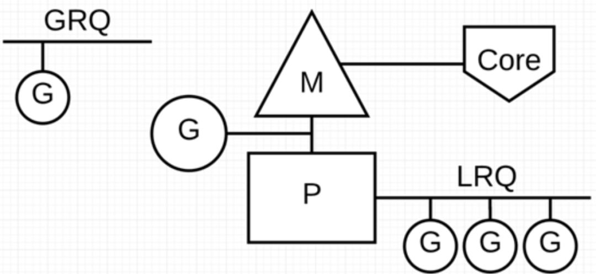
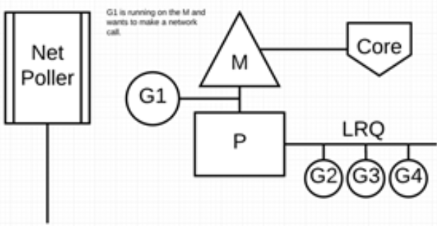
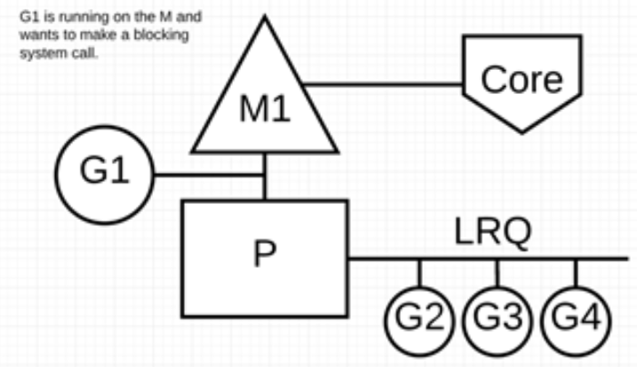
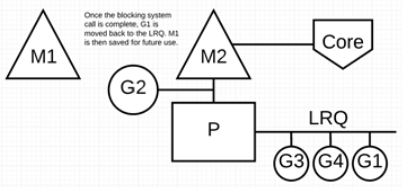

> Golang 从语言级别支持并发，通过轻量级协程 Goroutine 来实现程序并发运行。下面将从 Go 调度器架构层面上介绍了 G-P-M 模型。

> 带着问题去思考🤔：
> - Go是怎样实现少量内核线程支撑大量 Goroutine 的并发运行？
> - 为了最大限度利用计算资源，Go 调度器是如何处理线程阻塞的场景？【通过 NetPoller、sysmon 等帮助 Go 程序减少线程阻塞】

#### Goroutine
Goroutine 非常轻量，主要体现在两个方面：
- 上下文切换代价小， Goroutine 上下文切换只涉及到
**三个寄存器PC、SP、DX**的值修改；而对比线程的上下文切换则需要涉及模式切换（从用户态切换到内核态）、以及 16 个寄存器、PC、SP…等寄存器的刷新；

- 内存占用少：线程栈空间通常是 2M，Goroutine 栈空间最小 2K；Golang 程序中可以轻松支持10w 级别的 Goroutine 运行，而线程数量达到 1k 时，内存占用就已经达到 2G。
注：但是大量的 Goroutine 也会带来额外的问题，比如栈内存增加和调度器负担加重

#### G-P-M 模型的组成
内部调度器的架构是 G-P-M 模型。
G-P-M 模型包括 4 个重要结构，分别是G、P、M、Sched；
- G:Goroutine，每个 Goroutine 对应一个 G 结构体，G 存储 Goroutine 的运行堆栈、状态以及任务函数，可重用。
> G 并非执行体，每个 G 需要绑定到 P 才能被调度执行。

- P: Processor，表示逻辑处理器，对 G 来说，**P 相当于 CPU 核，G 只有绑定到 P 才能被调度**，对 M 来说，P 提供了相关的执行环境(Context)，如内存分配状态(mcache)，任务队列(G)等。
> P 的数量决定了系统内最大可并行的 G 的数量（前提：物理 CPU 核数  >= P 的数量）。P 的数量由用户设置的 GoMAXPROCS 决定，但是不论 GoMAXPROCS 设置为多大，P 的数量最大为 256。

- M: Machine，**OS 内核线程抽象**，代表着真正执行计算的资源，在绑定有效的 P 后，进入 schedule 循环；而 schedule 循环的机制大致是从 Global 队列、P 的 Local 队列以及 wait 队列中获取。
> M 的数量是不定的，由 Go Runtime 调整，为了防止创建过多 OS 线程导致系统调度不过来，目前默认最大限制为 10000 个。
M 并不保留 G 状态，这是 G 可以跨 M 调度的基础。

- Sched：Go 调度器，它维护有存储 M 和 G 的队列以及调度器的一些状态信息等。
> 调度器循环的机制大致是从各种队列、P 的本地队列中获取 G，切换到 G 的执行栈上并执行 G 的函数，调用 Goexit 做清理工作并回到 M，如此反复。

通过经典的地鼠推车搬砖的模型来说明M、P、G 其三者关系：
> 地鼠(Gopher)的工作任务是：工地上有若干砖头，地鼠借助小车把砖头运送到火种上去烧制。M 就可以看作图中的地鼠，P 就是小车，G 就是小车里装的砖。

Processor（P）：
根据用户设置的  GoMAXPROCS 值来创建一批小车(P)。

Goroutine(G)：
通过 Go 关键字就是用来创建一个  Goroutine，也就相当于制造一块砖(G)，然后将这块砖(G)放入当前这辆小车(P)中。

Machine (M)：
地鼠(M)不能通过外部创建出来，只能砖(G)太多了，地鼠(M)又太少了，实在忙不过来，刚好还有空闲的小车(P)没有使用，那就从别处再借些地鼠(M)过来直到把小车(P)用完为止。
其中这里有一个地鼠(M)不够用，从别处借地鼠(M)的过程，这个过程就是创建一个内核线程(M)。
注意：地鼠(M) 如果没有小车(P)是没办法运砖的，小车(P)的数量决定了能够干活的地鼠(M)数量，在 Go 程序里面对应的是活动线程数；

#### G-P-M 模型图示
在 Go 程序里我们通过下面的图示来展示 G-P-M 模型：

Go 调度器中有两个不同的运行队列：全局运行队列(GRQ)和本地运行队列(LRQ)。
P 代表可以“并行”运行的逻辑处理器，每个 P 都被分配到一个系统线程 M，G 代表 Go 协程。
每个 P 都有一个 LRQ，用于管理分配给在 P 的上下文中执行的 Goroutines，这些 Goroutine 轮流被和 P 绑定的 M 进行上下文切换。GRQ 适用于尚未分配给 P 的 Goroutines。

> 从上图可以看出，G 的数量可以远远大于 M 的数量，换句话说，Go 程序可以利用少量的内核级线程来支撑大量 Goroutine 的并发。多个 Goroutine 通过用户级别的上下文切换来共享内核线程 M 的计算资源，但对于操作系统来说并没有线程上下文切换产生的性能损耗。

#### Go 调度器的调度策略
为了更加充分利用线程的计算资源，Go 调度器采取了以下几种调度策略。
##### 任务窃取（work-stealing）
我们知道，现实情况有的 Goroutine 运行的快，有的慢，那么势必肯定会带来的问题就是，忙的忙死，闲的闲死，Go 肯定不允许摸鱼的 P 存在，势必要充分利用好计算资源。

为了提高 Go 并行处理能力，调高整体处理效率，当每个 P 之间的 G 任务不均衡时，**调度器允许从 GRQ，或者其他 P 的 LRQ 中获取 G 执行**。

减少阻塞
> 如果正在执行的 Goroutine 阻塞了线程 M 怎么办？P 上 LRQ 中的 Goroutine 会获取不到调度么？

主要的 4 种阻塞场景：

- 场景 1：**由于原子、互斥量或通道操作调用导致  Goroutine  阻塞。**
解决方式：调度器将把当前阻塞的 Goroutine 切换出去，重新调度 LRQ 上的其他 Goroutine；

- 场景 2：**由于网络请求和 IO 操作导致  Goroutine  阻塞。
Go 程序提供了网络轮询器（NetPoller）来处理网络请求和 IO 操作的问题，**
解决方式：Go通过使用**网络轮询器(NetPoller)**进行网络系统调用，
防止 Goroutine 在进行这些系统调用时阻塞 M。这可以让 M 执行 P 的 LRQ 中其他的 Goroutines，而不需要创建新的 M。从而减少操作系统上的调度负载。
网络轮询器通过 kqueue（MacOS），epoll（Linux）或  iocp（Windows）来实现 IO 多路复用。

下面展示它的工作原理：
G1 正在 M 上执行，还有 3 个 Goroutine 在 LRQ 上等待执行。网络轮询器空闲着，什么都没干。

接下来，G1 想要进行网络系统调用，因此它被移动到网络轮询器并且处理异步网络系统调用。然后，M 可以从 LRQ 执行另外的 Goroutine。此时，G2 就被上下文切换到 M 上了。

最后，异步网络系统调用由网络轮询器完成，G1 被移回到 P 的 LRQ 中。一旦 G1 可以在 M 上进行上下文切换，它负责的 Go 相关代码就可以再次执行。这里的最大优势是，执行网络系统调用不需要额外的 M。网络轮询器使用系统线程，它时刻处理一个有效的事件循环。

> 用户层眼中看到的 Goroutine 中的“block socket”，实际上是通过 Go runtime 中的 netpoller 通过 Non-block socket + I/O 多路复用机制“模拟”出来的。Go 中的 net 库正是按照这方式实现的。

- 场景 3：**当调用一些系统方法时发生阻塞**
解决方案：这种情况下，网络轮询器（NetPoller）无法使用，而进行系统调用的 Goroutine  将阻塞当前 M。此时需要调度器的介入。
例如：同步系统调用（如文件 I/O）会导致 M 阻塞的情况，G1 将进行同步系统调用以阻塞 M1。

调度器介入后：识别出 G1 已导致 M1 阻塞，此时，调度器将 M1 与 P 分离，同时也将 G1 带走。然后调度器引入新的 M2 来服务 P。此时，可以从 LRQ 中选择 G2 并在 M2 上进行上下文切换。

阻塞的系统调用完成后：G1 可以移回 LRQ 并再次由 P 执行。为防止这种情况再次发生，M1 将被放在旁边以备将来重复使用。

场景 4：**在 Goroutine 去执行一个 sleep 操作，导致 M 被阻塞了。**
解决方案：Go 程序后台有一个**监控线程 sysmon**，它监控那些长时间运行的 G 任务然后设置可以强占的标识符，别的 Goroutine 就可以抢先进来执行。
只要下次这个 Goroutine 进行函数调用，那么就会被强占，同时也会保护现场，然后重新放入 P 的本地队列里面等待下次执行。

参考文章：
[Go 为什么这么“快”](https://mp.weixin.qq.com/s/2Q_o8NLidMXc-DtoinPwSQ)
