[TOC]
### 导读
> 调度在计算机中是分配工作所需资源的方法. linux的调度为CPU找到可运行的线程. 而Go的调度是为M(线程)找到P(内存, 执行票据)和可运行的G.


带着问题去思考🤔：
- Go的调度为什么说是轻量的?
- Go调度都发生了啥?
- Go的网络和锁会不会阻塞线程?
- 什么时候会阻塞线程?
- Go是怎样实现少量内核线程支撑大量 Goroutine 的并发运行？
- 为了最大限度利用计算资源，Go 调度器是如何处理线程阻塞的场景？

读完下面👇的文章，这些通通都不是问题，follow me!!


### 基础常识
> 调度的进化：Process -> Thread(LWP, lightweight process) -> Goroutine (一种lightweight userspace thread)其实是一个` 不断共享, 不断减少切换成本的过程`.


理解调度, 首先要理解两个概念: 运行和阻塞
- 线程其实并不是真正运行的实体, 线程只是代表一个执行流和其状态。真正运行驱动流程往前的其实是 CPU。
- `线程的运行, 其实是被运行。其阻塞, 其实是切换出调度队列, 不再去调度执行这个执行流。` 其他执行流满足其条件, 便会把被移出调度队列的执行流重新放回调度队列。协程也同理。注意goroutine的形式只是协程的一种形式
- `线程、协程只是一个执行流, 并不是运行实体.`
>小知识点： 操作系统: Linux 下的线程其实只是 task_struct 结构, CPU 在时钟的驱动下, 根据 PC 寄存器从程序中取指令和操作数, 从 RAM 中取数据, 进行计算, 处理, 跳转, 驱动执行流往前. CPU 并不关注处理的是线程还是协程, 只需要设置 PC 寄存器, 设置栈指针等(这些称为上下文), 那么 CPU 就可以欢快的运行这个线程或者这个协程了.


### 调度模型
#### GM 模型（1.0版本）
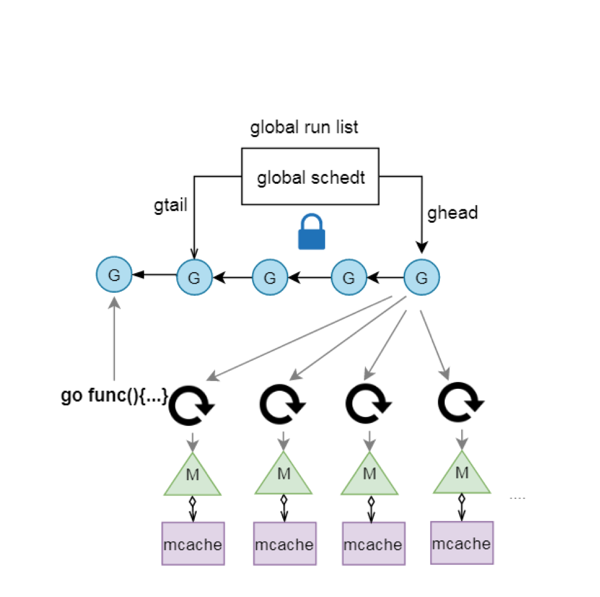
一个全局队列放待运行的g,新生成G, 阻塞的G变为待运行, M寻找可运行的G等操作都在全局队列中操作, 需要加线程级别的锁.
调度锁问题：单一的全局调度锁(Sched.Lock)和集中的状态, 导致伸缩性下降. 
G传递问题： 在工作线程M之间需要经常传递runnable的G, 会加大调度延迟, 并带来额外的性能损耗.
Per-M的内存问题： 类似TCMalloc结构的内存结构, 每个M都需要memory cache和其他类型的cache(比如stack alloc), 然而实际上只有M在运行Go代码时才需要这些Per-M Cache, 阻塞在系统调用的M并不需要这些cache. 正在运行Go代码的M与进行系统调用的M的比例可能高达1:100, 这造成了很大的内存消耗.
等

- 是不是可以给运行的M加个本地队列?  
- 是不是可以剥夺阻塞的M的mcache给其他M使用?


#### GPM 模型（1.1版本+）
- GPM 模型的简图：
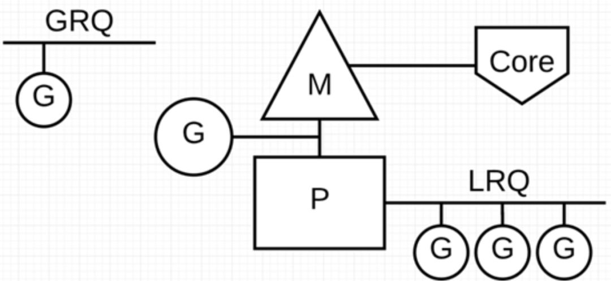
Go 调度器中有两个不同的运行队列：全局运行队列(GRQ)和本地运行队列(LRQ)。
P 代表可以“并行”运行的逻辑处理器，每个 P 都被分配到一个系统线程 M，G 代表 Go 协程。每个 P 都有一个 LRQ，用于管理分配给在 P 的上下文中执行的 Goroutines，这些 Goroutine 轮流被和 P 绑定的 M 进行上下文切换。GRQ 适用于尚未分配给 P 的 Goroutines。


##### 举例说明
通过经典的地鼠推车搬砖的模型来说明M、P、G 其三者关系：
> 地鼠(Gopher)的工作任务是：工地上有若干砖头，地鼠借助小车把砖头运送到火种上去烧制。M 就可以看作图中的地鼠，P 就是小车，G 就是小车里装的砖。


Processor（P）：
根据用户设置的  GoMAXPROCS 值来创建一批小车(P)。

Goroutine(G)：
通过 Go 关键字就是用来创建一个  Goroutine，也就相当于制造一块砖(G)，然后将这块砖(G)放入当前这辆小车(P)中。

Machine (M)：
地鼠(M)不能通过外部创建出来，只能砖(G)太多了，地鼠(M)又太少了，实在忙不过来，刚好还有空闲的小车(P)没有使用，那就从别处再借些地鼠(M)过来直到把小车(P)用完为止。
其中这里有一个地鼠(M)不够用，从别处借地鼠(M)的过程，这个过程就是创建一个内核线程(M)。
注意：地鼠(M) 如果没有小车(P)是没办法运砖的，小车(P)的数量决定了能够干活的地鼠(M)数量，在 Go 程序里面对应的是活动线程数；

##### 模型详情

- GPM 模型的详图：
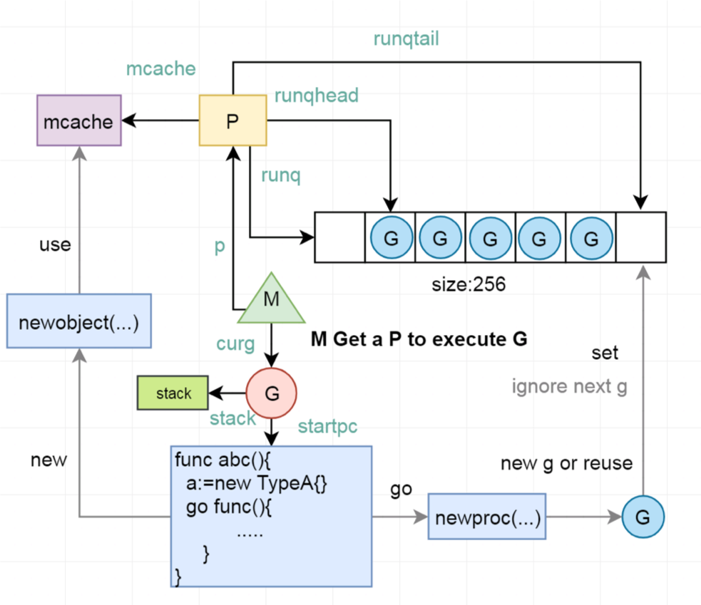
GPM 模型包括 4 个重要结构，分别是G、P、M、Sched；
- G:Goroutine，每个 Goroutine 对应一个 G 结构体，G 存储 Goroutine 的运行堆栈、状态以及任务函数，可重用。用户协程无优先级, 基本遵循FIFO.
> G 并非执行体，每个 G 需要绑定到 P 才能被调度执行。

- P: Processor，表示逻辑处理器，对 G 来说，**P 相当于 CPU 核，G 只有绑定到 P 才能被调度**，对 M 来说，P 提供了相关的执行环境(Context)，如内存分配状态(mcache)，任务队列(G)等。
每个p均有local runq, 大多数时间仅与local runq无锁交互，新生成的g, 放入到local runq中. 
> P 的数量决定了系统内最大可并行的 G 的数量（前提：物理 CPU 核数  >= P 的数量）。P 的数量由用户设置的 GoMAXPROCS 决定。

- M: Machine，**OS 内核线程抽象**，代表着真正执行计算的资源，在绑定有效的 P 后，进入 schedule 循环；而 schedule 循环的机制大致是从 Global 队列、P 的 Local 队列以及 wait 队列中获取。
> M 的数量是不定的，由 Go Runtime 调整，为了防止创建过多 OS 线程导致系统调度不过来，目前默认最大限制为 10000 个。
M 并不保留 G 状态，这是 G 可以跨 M 调度的基础。

- Sched：Go 调度器，它维护有存储 M 和 G 的队列以及调度器的一些状态信息等。

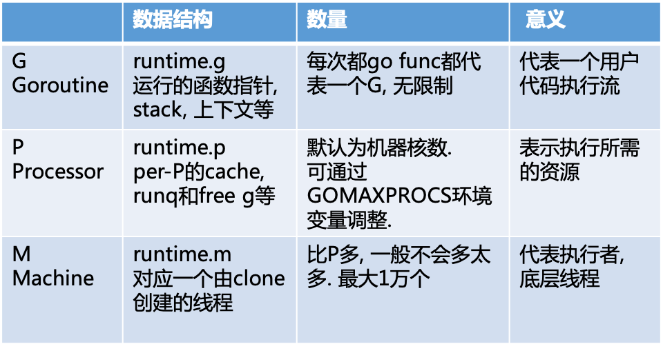

#### 模型对比
- mcache从M中移到P中.
- 不再是单独的全局runq. 每个P拥有自己的runq. 新的g放入自己的runq.  满了后再批量放入全局runq中. 优先从自己的runq获取g执行


#### G状态流转
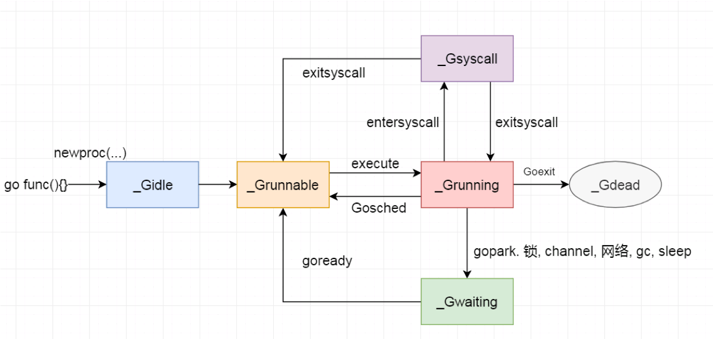

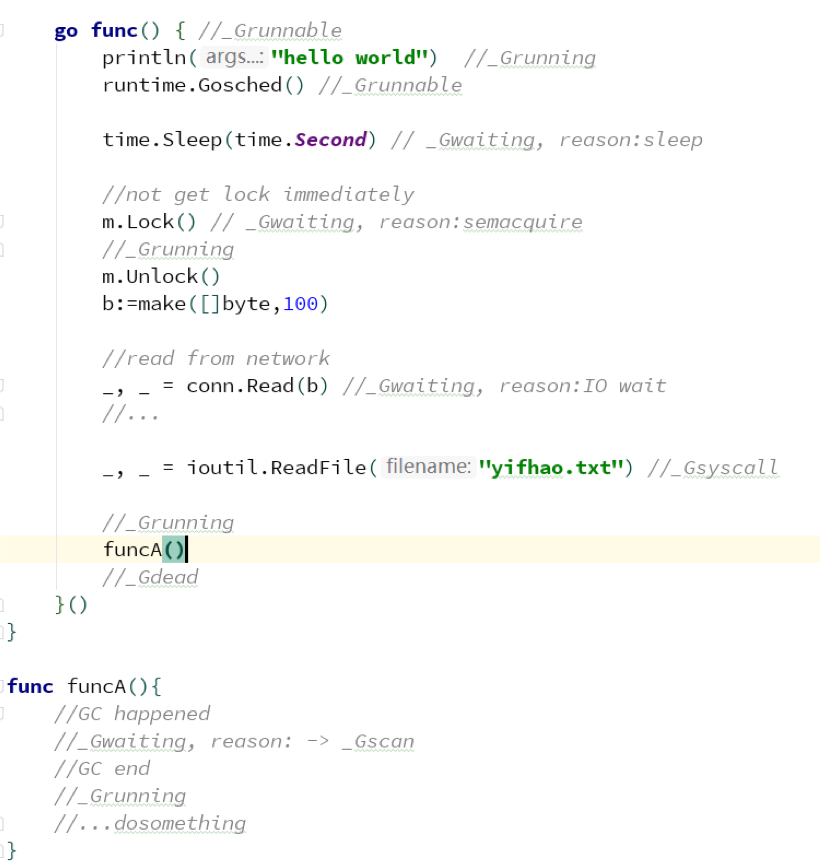

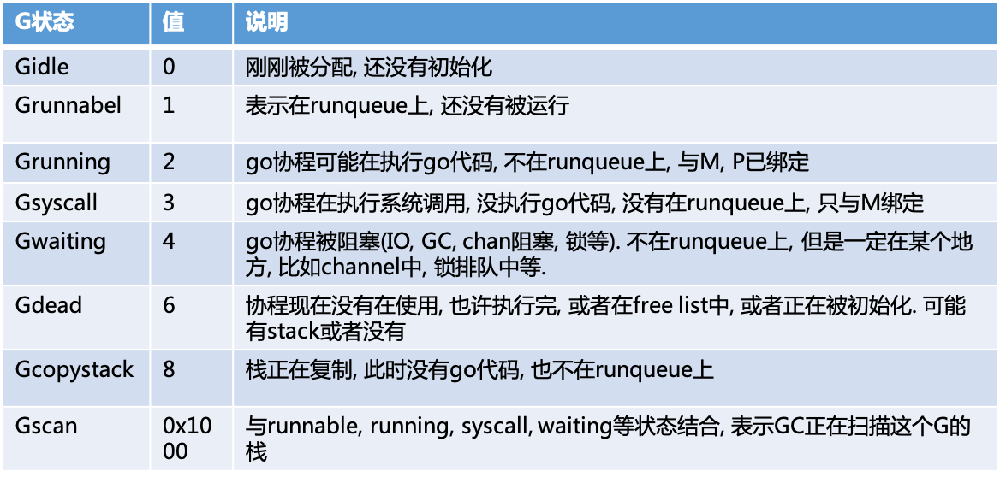

#### Go 调度器
`并没有一个调度器的实体, 调度是通过线程(m)执行 runtime.schedule 函数来完成的.`
调度器的职责就是为需要执行的Go代码(G)寻找执行者(M)以及执行的准许和资源(P),大致是从各种队列、P 的本地队列中获取 G，切换到 G 的执行栈上并执行 G 的函数，调用 Goexit 做清理工作并回到 M，如此反复。

调度时机:
- channel, mutex等sync操作发生了协程阻塞
- time.sleep
- 网络操作暂时未ready
- gc
- 主动yield
- 运行过久或系统调用过久
- 等等


#### 调度策略
为了更加充分利用线程的计算资源，Go 调度器采取了以下几种调度策略。
##### 任务窃取（work-stealing）
我们知道，现实情况有的 Goroutine 运行的快，有的慢，那么势必肯定会带来的问题就是，忙的忙死，闲的闲死，Go 肯定不允许摸鱼的 P 存在，势必要充分利用好计算资源。

为了提高 Go 并行处理能力，调高整体处理效率，当每个 P 之间的 G 任务不均衡时，**调度器允许从 GRQ，或者其他 P 的 LRQ 中获取 G 执行**。

##### 减少阻塞
> 如果正在执行的 Goroutine 阻塞了线程 M 怎么办？P 上 LRQ 中的 Goroutine 会获取不到调度么？


主要的 4 种阻塞场景：

- 场景 1：**由于原子、互斥量或通道操作调用导致  Goroutine  阻塞。**
解决方式：调度器将把当前阻塞的 Goroutine 切换出去，重新调度 LRQ 上的其他 Goroutine；
`用户代码中的协程同步造成的阻塞, 仅仅是切换协程, 而不阻塞线程.`

- 场景 2：**由于网络IO请求操作导致  Goroutine  阻塞。
Go 程序提供了网络轮询器（NetPoller）来处理网络请求和 IO 操作的问题，**
解决方式：Go通过使用**网络轮询器(NetPoller)**进行网络系统调用，
防止 Goroutine 在进行这些系统调用时阻塞 M。这可以让 M 执行 P 的 LRQ 中其他的 Goroutines，而不需要创建新的 M。从而减少操作系统上的调度负载。

下面展示它的工作原理：
G1 正在 M 上执行，还有 3 个 Goroutine 在 LRQ 上等待执行。网络轮询器空闲着，什么都没干。

接下来，G1 想要进行网络系统调用，因此它被移动到网络轮询器并且处理异步网络系统调用。然后，M 可以从 LRQ 执行另外的 Goroutine。此时，G2 就被上下文切换到 M 上了。
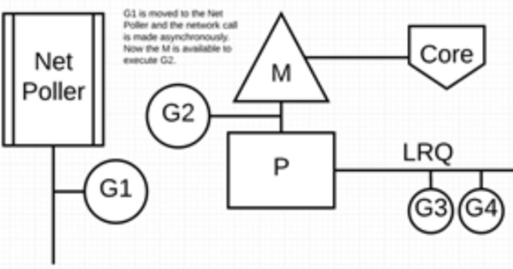
最后，异步网络系统调用由网络轮询器完成，G1 被移回到 P 的 LRQ 中。一旦 G1 可以在 M 上进行上下文切换，它负责的 Go 相关代码就可以再次执行。这里的最大优势是，执行网络系统调用不需要额外的 M。网络轮询器使用系统线程，它时刻处理一个有效的事件循环。
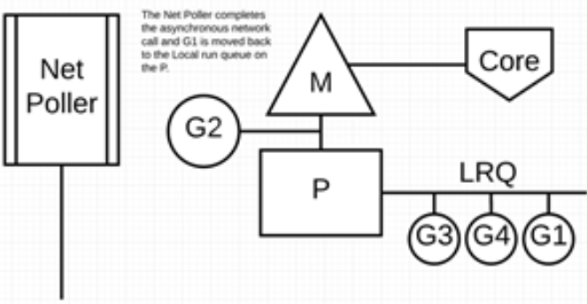


- 场景 3：**当调用一些系统方法时发生阻塞**
解决方案：这种情况下，网络轮询器（NetPoller）无法使用，而进行系统调用的 Goroutine  将阻塞当前 M。此时需要调度器的介入。
例如：同步系统调用（如文件 I/O）会导致 M 阻塞的情况，G1 将进行同步系统调用以阻塞 M1。

调度器介入后：监控线程 sysmon 识别出 G1 已导致 M1 阻塞，会将 M1 与 P 分离，同时也将 G1 带走。然后调度器引入新的 M2 来服务 P。此时，可以从 LRQ 中选择 G2 并在 M2 上进行上下文切换。
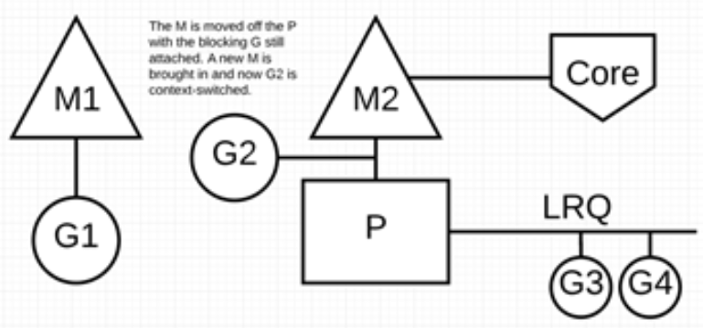
阻塞的系统调用完成后：G1 可以移回 LRQ 并再次由 P 执行。为防止这种情况再次发生，M1 将被放在旁边以备将来重复使用。


场景 4：**在 Goroutine 去执行一个 sleep 操作，导致 M 被阻塞了。**
解决方案：Go 程序后台有一个**监控线程 sysmon**，它监控那些长时间运行的 G 任务然后设置可以抢占的标识符，别的 Goroutine 就可以抢先进来执行。只要下次这个 Goroutine 进行函数调用，那么就会被强占，同时也会保护现场，然后重新放入 P 的本地队列里面等待下次执行。

#### 小结 
- 实现work stealing, 当某个P的runq中没有可运行G时, 可以从全局获取或从其他P获取
- 当G因为网络或者锁切换, 那么G和M分离, M通过调度执行新的G
- 当M因为系统调用阻塞或cgo运行一段时间后, sysmon协程会将P与M分离. 由其他的M来结合P进行调度.

#### 调度流程
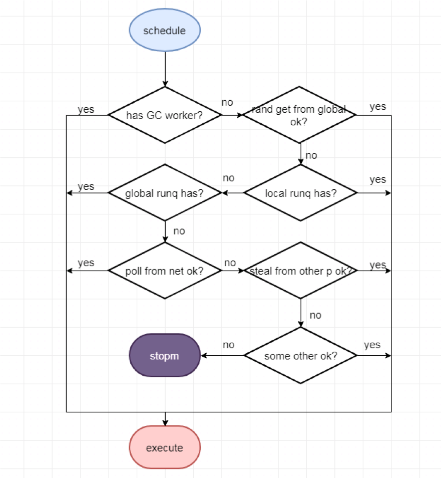
1. 有分配到gc mark的工作需要做gc mark.
2. 没有会随机从全局runq取g.  
2. 没有再看local runq是否有,
3. 没有再看global runq是否有,
4. 没有再看能否从net中poll出来, 
5. 还没有再看从其他P steal一部分过来.
....
实在没有就stopm。实际调度代码复杂很多。


#### 相关源码结构体
编译器将go关键字编译为生成一个协程结构体
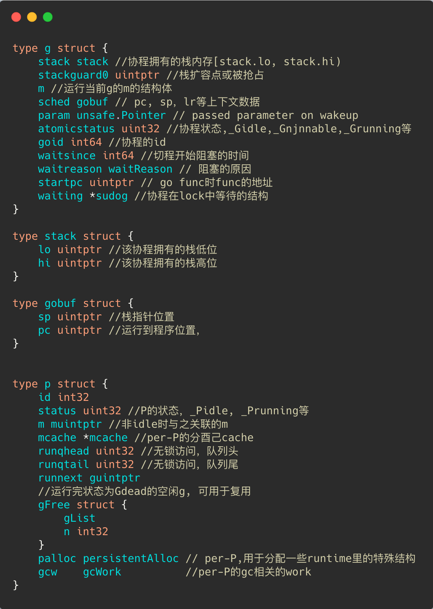
.png)

``` go
type g struct {
	stack stack //协程拥有的栈内存[stack.lo, stack.hi)
	stackguard0 uintptr //栈扩容点或被抢占
	m //运行当前g的m的结构体
	sched gobuf // pc, sp，lr等上下文数据
	param unsafe.Pointer // passed parameter on wakeup
	atomicstatus uint32 //协程状态,_Gidle,_Gnjnnable,_Grunning等
	goid int64 //协程的id
	waitsince int64 //切程开始阻塞的时间
	waitreason waitReason // 阻塞的原因
	startpc uintptr // go func时func的地址
	waiting *sudog //协程在lock中等待的结构
}

type stack struct {
	lo uintptr //该协程拥有的栈低位
	hi uintptr //该协程拥有的栈高位
}

type gobuf struct {
	sp uintptr //栈指针位置
	pc uintptr //运行到程序位置，
}


type p struct {
	id int32
	status uint32 //P的状态，_Pidle, _Prunning等
	m muintptr //非idle时与之关联的m
	mcache *mcache //per-P的分酉己cache
	runqhead uint32 //无锁访问，队列头
	runqtail uint32 //无锁访问，队列尾
	runnext guintptr
	//运行完状态为Gdead的空闲g, 可用于复用
	gFree struct {
		gList
		n int32
	}
	palloc persistentAlloc // per-P,用于分配一些runtime里的特殊结构
	gcw    gcWork          //per-P的gc相关的work
}

type m struct {
	g0       *g         //每个m绑定的g,用于专门执行调度
	procid   uint64     //底层的线程id
	tls      [6]uintptr //传给FS寄存器的线程局部变量
	mstartfn func()     //m启动时的函数，传给clone
	curg     *g         //在运行go代码时的g
	p        puintptr   //在运行go代码时绑定的p
	id       int64
	spinning bool     //m找不到可运行的g, spin
	mcache   *mcache  //运行go代码时绑定的p中mcache
	lockedg  guintptr //是否与某个g_直绑定
}
type schedt struct {
	lock       mutex    //调度如果需要涉及全局的队列时，需要获取的锁
	midle      muintptr //空闲的m歹1J表
	pidle      puintptr //空闲的p列表
	nmspinning uint32   //在spin状态的m数量
	runq       gQueue   //全局的可运行的队列
	runqsize   int32
	gFree      struct { //全局空余的g
		lock    mutex
		stack   gList //空余g中有栈的
		noStack gList //空余g中无枝的
		n       int32
	}
	gcwaiting uint32 // gc is waiting to run
}

```


#### sysmon协程
> P的数量影响了同时运行go代码的协程数. 如果P被占用很久, 就会影响调度. 
sysmon协程的一个功能就是进行抢占.

##### 启动
sysmon协程是在go runtime初始化之后, 执行用户编写的代码之前, 由runtime启动的不与任何P绑定, 直接由一个M执行的协程, 类似于linux中的执行一些系统任务的内核线程.

##### 运行间隔
sysmon协程是在go runtime初始化之后, 执行用户编写的代码之前, 由runtime启动的不与任何P绑定, 直接由一个M执行的协程. 类似于linux中的执行一些系统任务的内核线程.  
可认为是`10ms执行一次`. (初始运行间隔为20us, sysmon运行1ms后逐渐翻倍, 最终每10ms运行一次. 如果有发生过抢占成功, 则又恢复成初始20us的运行间隔, 如此循环)


##### 执行工作
- 打印调度信息：如果开启schdule trace的debug信息(例如GODEBUG=schedtrace=5000,scheddetail=1), 则按照给定的间隔打印调度信息
- 通知进行GC：每2分钟如果没有执行过GC, 则通知gchelper协程执行一次GC
- 归还内存：每5分钟归还GC后不再使用的span给操作系统(scavenge)
- 定时从 netpoll 中获取 ready 的协程: 每sysmon tick进行一次netpoll(在STW结束和M执行查找可运行的G时也会执行netpoll)获取fd事件, 将与之相关的G放入全局runqueue
- 进行抢占：每次sysmon运行都执行一次抢占, 如果某个P的G执行超过1个sysmon tick, 则执行抢占. 正在执行系统调用的话, 将P与M脱离(handoffp); 正在执行Go代码, 则通知抢占(preemptone).
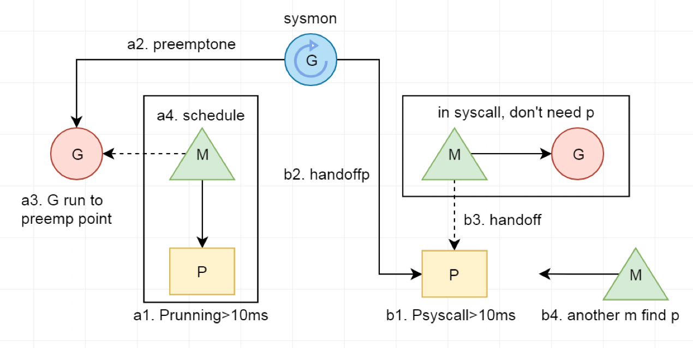


##### 协作式抢占
目前(1.12), go支持协作的抢占调度, 还不支持非协作的抢占调度.
go 目前(1.12)还没有实现非协作的抢占. 基本流程是 sysmon 协程标记某个协程运行过久, 需要切换出去, 该协程在运行函数时会检查栈标记, 然后进行切换.

> 内部调用：
retake()调用preemptone()将被抢占的G的stackguard0设为stackPreempt, 
被设置抢占标记的G进行下一次函数调用时, 检查栈空间失败. 进而触发morestack()（汇编代码，位于asm_XXX.s中）然后进行一连串的函数调用，主要的调用过程如下：
morestack()（汇编代码）-> newstack() -> gopreempt_m() -> goschedImpl() -> schedule()

#### 网络操作
- 用户层眼中看到的 Goroutine 中的“block socket”，实际上是Go runtime 中的 netpoller 通过 `NonBlocking socket + I/O 多路复用机制“模拟”出来的`。使网络操作达到既不阻塞线程, 又是同步执行流的效果。网络轮询器通过 kqueue（MacOS），epoll（Linux）或  iocp（Windows）来实现 IO 多路复用。
- 封装了epoll, 网络fd会设置成NonBlocking模式, 网络fd的read, write, accept操作, 会以NonBlocking模式操作, 返回EAGAIN则gopark当前协程. 在m调度、 sysmon、 gc STW结束等阶段均会poll出ready的协程进行运行或者添加到global runq中。

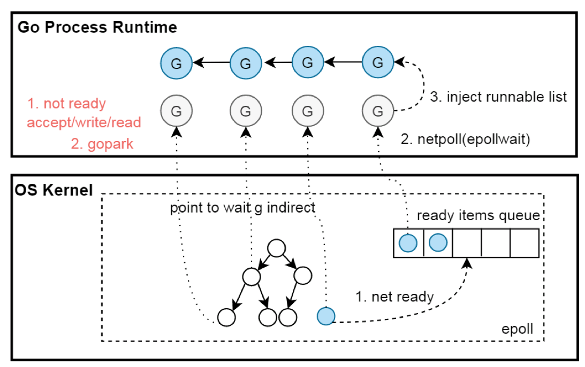

1. 封装epoll, 有网络操作时会epollcreate一个epfd.
2. 所有网络fd均通过fcntl设置为NONBLOCK模式, 以边缘触发模式放入epoll节点中.
3. 对网络fd执行Accept(syscall.accept4), Read(syscall.read), Write(syscall.write)操作时, 相关操作未ready, 则系统调用会立即返回EAGAIN;  使用gopark切换该协程
4. 在不同的时机, 通过epollwait来获取ready的epollevents, 通过其中data指针可获取对应的g,  将其置为待运行状态, 添加到runq


### 总结
- 轻量级的协程, 栈初始2KB, 调度不涉及系统调用. 
- 用户函数调用前会检查栈空间是否足够, 不够的话, 会进行*2 栈扩容. 最大栈1G, 超出panic.
- 用户代码中的协程同步造成的阻塞, 仅仅是切换(gopark)协程, 而不阻塞线程, m和p仍结合, 去寻找新的可执行的g.
- 调度时会随机从全局runq取g.  然后local runq, global runq... 均没有g的话, work stealing从其他P中取.
- sysmon: 对于运行过久的g设置抢占标识; 对于过久syscall, 进行m和p的分离. 防止p被占用过久影响调度.
- 网络：实现同步执行流不阻塞线程的网络，网络操作未ready时的切换协程，ready后把相关协程添加到待运行队列. 网络操作达到既不阻塞线程, 又是同步执行流的效果.


### 回答疑问
**Go是怎样实现少量内核线程支撑大量 Goroutine 的并发运行？**
解：多个 Goroutine 通过用户级别的上下文切换来共享内核线程 M 的计算资源，但对于操作系统来说并没有线程上下文切换产生的性能损耗。因此，Go 程序可以利用少量的内核级线程来支撑大量 Goroutine 的并发。

**为了最大限度利用计算资源，Go 调度器是如何处理线程阻塞的场景？**
解：通过 netpoller、sysmon 等帮助 Go 程序减少线程阻塞


**Go的调度为什么说是轻量的?**
解：Goroutine 非常轻量，主要体现在两个方面：
- 上下文切换代价小， Goroutine 上下文切换只涉及到
**三个寄存器PC、SP、DX**的值修改；而对比线程的上下文切换则需要涉及模式切换（从用户态切换到内核态）、以及 16 个寄存器、PC、SP…等寄存器的刷新；
- 内存占用少：线程栈空间通常是 2M，Goroutine 栈空间最小 2K；Golang 程序中可以轻松支持10w 级别的 Goroutine 运行，而线程数量达到 1k 时，内存占用就已经达到 2G。
注：但是大量的 Goroutine 也会带来额外的问题，比如栈内存增加和调度器负担加重


参考文章：
[Go 为什么这么“快”](https://mp.weixin.qq.com/s/2Q_o8NLidMXc-DtoinPwSQ)

[Golang 的 goroutine 是如何实现的？](https://www.zhihu.com/question/20862617)


推荐阅读：
https://learnku.com/articles/41728