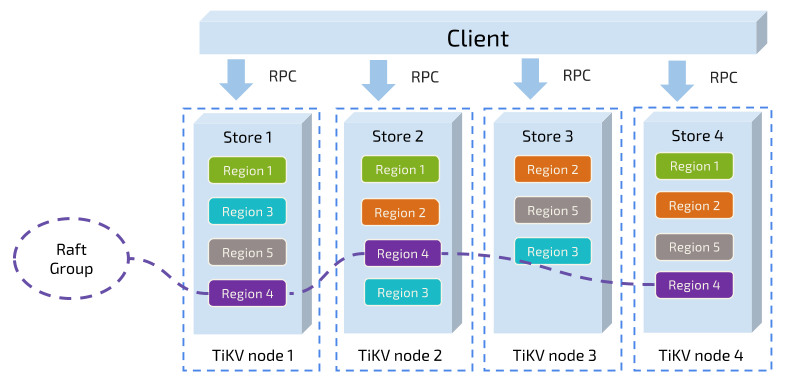
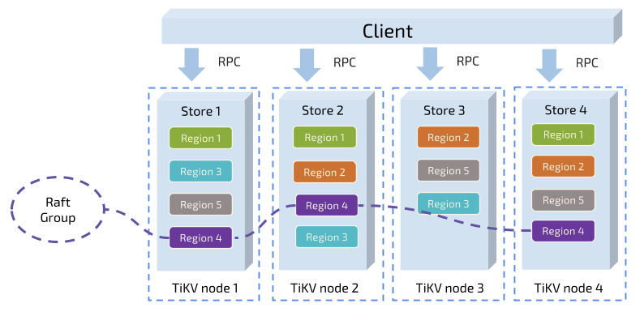

## [我的思路](https://www.processon.com/mindmap/615077c207912903eff79705)
## 引言
> 为什么不能在传统模型上去实现分布式的MySQL？

实现 MySQL 分布式的方案
1. 通过 MySQL 的 server 把 InnoDB 变成一个分布式数据库
- MySQL 生成的执行计划是个单机的，它认为整个计划的 cost 也是单机的，
- 把数据都拿回来计算这个太慢了
2. MySQL Sharding Proxy
- 它不支持分布式事务，不支持跨节点的 join，它无法理解复杂的 plan，一个复杂的 plan 打到 Proxy 上面，Proxy 就傻了，我到底应该往哪一个节点上转发呢，如果我涉及到 subquery sql 怎么办？

注: MySQL Sharding 的方案很典型的就是解决基本问题以后，业务稍微复杂一点，在 sharding 这一层根本搞不定。它永远需要一个 sharding key，你必须要告诉我的 proxy，我的数据要到哪里找，对用户来说是极不友好的.

因此，在传统模型下面的修改，天花板马上到了，基本上不可能解决这个问题。
另外就是高可用和自动恢复，国内目前普遍做法叫做同城两地三中心或者异地多活，但现在基本上都不能自动切换。多数据中心的复制和数据中心的容灾，因为MySQL 支持的复制方式是半同步或者是异步，（半同步可以降级成异步），可能出现数据不一致，MySQL 在这上面是做不好的。

VS
TiKV 很好的支持 transaction，刚才提到的 Raft 除了增加副本之外，还有 leader transfer，这是一个传统的方案都无法提供的特性。

> 为什么要开发TiDB

NewSQL 这个理论基础，模型的建立
谷歌的 Spanner论文，是在 2013 年初发布的
Raft论文， 是在 2014 年上半年发布的
Google Spanner的事务支持里面 Google 有点黑科技 ，就是它有 GPS 时钟和原子钟。它实际上是在一批 GPS 时钟上去拿了能够满足 majority 的精度，再用时间的算法，得到一个比较精确的时间。还用原子钟去校正 GPS，避免GPS受到干扰。


## 系统架构


- TiDB 对应的是 Google F1。TiDB 里面更强调上层的分布式的 SQL 层到底怎么做，分布式的 Plan 应该怎么做，应该怎么去做优化。并且它兼容了 MySQL 协议，使用户的使用成本大大降低。TiDB 是用 Go 写的， 有用到了 etcd。
- TiKV 对应的是 Google Spanner。 TiDB 是用 Rust 写的，TiKV 有使用 RocksDB。
- 路由：TiDB 有一个 TiKV driver ， 另外 TiKV 对外使用的是 Google Protocol Buffer 来作为通讯的编码格式

### 系统协议栈

整个系统是高度分层的。用 Raft 构建一层可以被复制的 RocksDB，保证写入的数据一定复制了足够多的副本，也就保证了数据的安全性。 在一个比较安全的 Key-value store 上面，再去构建它的多版本，再去构建它的分布式事务，然后在分布式事务构建完成之后，就可以轻松的加上 SQL 层，再轻松的加上 MySQL 协议的支持。协议这一层是高度可插拔的。

> 为什么 TiKV 用 Raft 能实现所有这些重要的特性，以及 scale，MVCC 和事务模型?

### TiKV 的架构图


整个集群里面有很多 Node，比如这里画了四个 Node，分别对应了四个机器。每一个 Node 上可以有多个 Store，每个 Store 里面又会有很多小的 Region，就是说一小片数据，就是一个 Region 。从全局来看所有的数据被划分成很多小片，每个小片默认配置是 64M，它已经足够小，可以很轻松的从一个节点移到另外一个节点，Region 1 有三个副本，它分别在 Node1、Node 2 和 Node4 上面， 类似的Region 2，Region 3 也是有三个副本。每个 Region 的所有副本组成一个 Raft Group, 整个系统可以看到很多这样的 Raft groups。

group commit 机制： 不同 Raft group 之间的通讯都是有开销的。会有一个类似于 MySQL 的 group commit 机制 ，你发消息的时候实际上可以 share 同一个 connection ， 然后 pipeline + batch 发送, 很大程度上可以省掉大量 syscall 的开销。


#### Placement Driver
它负责监控整个系统。控制整个集群的调度，它和 k8s 或者是 Mesos 的调度算法是不一样的，因为它调度的维度实际上比那个要更多。比如说磁盘的容量，你的 leader 的数量，你的网络当前的使用情况，你的 IO 的负载和 CPU 的负载都可以放进去。同时你还可以让它调度不要跨一个机房里面建多个副本。

主要功能：
- 自动发现，补充新的副本，维持整个系统的副本数。(这是很重要的 ，为了避免数据丢失，必须维持足够的副本数)
- 根据性能负载，不断去 move data 。


#### SQL layer
#### 怎么做 DDL？
面临的问题： 因为在分布式系统里面，所有的系统对于 schema 的视野不是一致的，比如说我现在改了一个值，有一部分人发现这个值被改了，但是还有一部分人还没有开始访问这个，所以根本不知道它被改了。然后在一个分布系统里，你也不可能实时通知到所有人在同一时刻发现它改变了。比如说从有索引到没有索引，你不能一步切过去，因为有的人认为它有索引，所以他给它建了一个索引，但是另外一个机器他认为它没有索引，所以他就把数据给删了，索引就留在里面了。这样遇到一个问题，我通过索引找的时候告诉我有， 实际数据却没有了，这个时候一致性出了问题。比如说我 count 一个 email 等于多少的，我通过 email 建了一个索引，我认为它是在，但是 UID 再转过去的时候可能已经不存在了。


如果这个表非常大的话，比如说我们有一百亿吧，横跨了四台机器，这个时候你要给它做一个新的 Index，就是我要添加一个新的索引，这个时候你必须要不影响任何现有的业务，实际上这是多阶段提交的算法。

简单来讲是这样的，先把状态标记成 delete only，即：删除数据的时候不管它现在有没有索引，我都会尝试删除索引，所以我的数据是干净的。
后面再类似于前面，先标记成 write only 这种方式, 连续再迭代这个状态，就可以迭代到一个最终可以对外公开的状态。比如说为一百亿数据建index，后台不断的跑 map-reduce 去 build index ，直到整个都 build 完成之后，再对外 public ，就是说我这个索引已经可用了。


## 说存储

> `TiKV一个全局有序的分布式 Key-Value 引擎。`

### 数据的存储模型 

TiKV 的选择是 Key-Value 模型，并且提供有序遍历方法。

- TiKV 是一个巨大的 Map，其中 Key 和 Value 都是原始的 Byte 数组。
- 这个 Map 中的 Key-Value 键值对，按照 Key 的二进制顺序有序，也就是我们可以 Seek 到某一个 Key 的位置，然后不断的调用 Next 方法以递增的顺序获取比这个 Key 大的 Key-Value.

注：这里的存储模型和 SQL 中表没有关系。


### 本地存储方案（RocksDB）
> 为数据找到一个高效可靠的本地存储方案。
- TiKV 没有选择直接向磁盘上写数据，而是把数据保存在 RocksDB 中，具体的数据落地由 RocksDB 负责。

注： RocksDB 是一个非常优秀的开源的单机存储引擎。

### 数据复制方案
> 想办法把数据复制到多台机器上.还需要这个复制方案是可靠、高效并且能处理副本失效的情况。

#### Raft 实现
> TiKV 的 Raft 实现是从 etcd 里面 port 过来的，是用 Rust 写的。 它把所有 Raft 的 feature 都实现了。

Raft 是一个一致性算法/一致性协议，它和 Paxos 等价，但是更加易于理解。它提供几个重要的功能：
- Leader 选举  Leader Election)
- 成员变更 (Membership Changes)
- 日志复制(Log Compaction)


Raft特性扩展：
-  Raft 本身有一个特点，如果一个 leader down 掉之后，其它的节点会选一个新的 leader，那么这个新的 leader 会把它还没有 commit 但已经 reply 过去的 log 做一个 commit ，然后会再做 apply。
- Raft 协议还提供一个很高级的特性叫 leader transfer。leader transfer 就是说在我不移动数据的时候，我把我的 leadership 给你，相当于从这个角度来讲，我把流量分给你，因为我是 leader，所以数据会到我这来，但我现在把 leader 给你，我让你来当 leader，原来打给我的请求会被打给你，这样我的负载就降下来。这就可以很好的动态调整整个系统的负载，同时又不搬移数据。不搬移数据的好处就是，不会形成一个抖动

TiKV 利用 Raft 来做数据复制，每个数据变更都会落地为一条 Raft 日志，通过 Raft 的日志复制功能，将数据安全可靠地同步到 Group 的多数节点中。


必须遵从的原则：
1. 永远不丢失数据，无论如何我保证我的复制一定是复制到大多数的。
2. 恢复的过程一定要是自动化的。
默认的时候，我们都是推荐 3 个副本或者 5 个副本的配置。

### 数据分散方案
> 将数据分散在多台机器上和 Raft 的数据复制不是一个概念
> 这里的 Region 还是和 SQL 中的表没什么关系！ 

对于一个 KV 系统，将数据分散在多台机器上有两种比较典型的方案：
- 一种按照 Key 做 Hash，根据 Hash 值选择对应的存储节点；
- 另一种是分 Range，某一段连续的 Key 都保存在一个存储节点上。（TiKV 选择了第二种方式）

#### 划分Region
将整个 Key-Value 空间分成很多段，每一段是一系列连续的 Key， 每一段就是一个 Region，并且我们会尽量保持每个 Region 中保存的数据不超过一定的大小(这个大小可以配置，目前默认是 64mb)。
每一个 Region 都可以用 StartKey 到 EndKey 这样一个左闭右开区间来描述。

#### Region的作用
- 以 Region 为单位，将数据分散在集群中所有的节点上，并且尽量保证每个节点上服务的 Region 数量差不多
- 以 Region 为单位做 Raft 的复制和成员管理


有一个组件来负责将 Region 尽可能均匀的散布在集群中所有的节点上，实现了存储容量的水平扩展（增加新的结点后，会自动将其他节点上的 Region 调度过来））和负载均衡（不会出现某个节点有很多数据，其他节点上没什么数据的情况）

有一个组件记录 Region 在节点上面的分布情况，也就是通过任意一个 Key 就能查询到这个 Key 在哪个 Region 中，以及这个 Region 目前在哪个节点上。


TiKV 是以 Region 为单位做数据的复制，

一个 Region 的数据会保存多个副本，我们将每一个副本叫做一个 Replica。Replica 之间是通过 Raft 来保持数据的一致，一个 Region 的多个 Replica 会保存在不同的节点上，构成一个 Raft Group。其中一个 Replica 会作为这个 Group 的 Leader，其他的 Replica 作为 Follower。所有的读和写都是通过 Leader 进行，再由 Leader 复制给 Follower。



### 版本控制(MVCC)
> 场景：两个 Client 同时去修改一个 Key 的 Value，如果没有 MVCC，就需要对数据上锁，在分布式场景下，可能会带来性能以及死锁问题。 

TiKV 的 MVCC 实现是通过在 Key 后面添加 Version 来实现，

数据分成两块，一个是 meta，一个是 data。
meta 里面描述，就是当前数据有多少个版本，整个key相对应哪个版本，我想找到那个版本。其中我能找到那个版本，就需要隔离级别决定的

比如说我们的 meta key 是 A，keyA 有三个版本，是 A1、A2、A3，我们把 key 自己和 version 拼到一起，分别描述 A 的三个版本，也就是 version 1/2/3。

注意: 因为Key 是有序的排列，对于同一个 Key 的多个版本，我们把版本号较大的放在前面，版本号小的放在后面

#### MVCC的好处
它很好支持 Lock-free 的 snapshot read。
隔离级别上，TiKV 有 SI，还有 SI+lock，默认是支持 SI 的这种隔离级别，然后你写一个 select for update 语句，这个会自动的调整到 SI 加上 lock 这个隔离级别。这个隔离级别基本上和 SSI 是一致的。

扩展： 数据GC问题，如果你的系统里面的数据产生了很多版本，你需要把这个比较老的数据给 GC 掉


### 事务
> TiKV 的事务基于 Google Percolator(2006年Google发表的论文) 模型，并且做了大量的优化。

TiKV 的事务本质上还是二阶段提交的，采用乐观锁，事务的执行过程中，不会检测写写冲突，只有在提交过程中，才会做冲突检测，冲突的双方中比较早完成提交的会写入成功，另一方会尝试重新执行整个事务。
乐观锁的好处就是当你冲突很小的时候可以得到非常好的性能
- 当业务的写入冲突不严重的情况下，这种模型性能会很好，比如随机更新表中某一行的数据，并且表很大。
- 当业务的写入冲突严重，性能就会很差，会造成大量的无效重试。比如计数器，多个客户端同时修改少量行，导致冲突严重的，

扩展：本质上分布式事务就是 2PC 或者是 2+xPC，基本上没有 1PC，除非你在别人的级别上做弱化。


### 小结
- 通过单机的 RocksDB，我们可以将数据快速地存储在磁盘上；
- 通过 Raft协议，我们可以将数据复制到多台机器上，以防单机失效。
- 通过以 Region 为单位做数据的分散和复制，不用再担心数据存不下，或者是磁盘故障丢失数据的问题。
这样就有了一个分布式的具备一定容灾能力的 KeyValue 系统，


## 说计算
> 关系模型到 Key-Value 模型的映射，如何在 KV 结构上保存 Table 以及如何在 KV 结构上运行 SQL 语句?

### 存储数据特点
对于一个 Table 来说，需要存储的数据包括三部分：
- 表的元信息
- Table 中的 Row
- 索引数据

#### 表的元信息

Table 中的 Row
TiDB 面向的首要目标是 OLTP 业务，这类业务需要支持快速地读取、保存、修改、删除一行数据，所以采用行存是比较合适的。

#### 索引数据
Index 还分为 Unique Index 和 非 Unique Index，这两种都需要支持。

### 数据操作
主要考虑 Insert/Update/Delete/Select 这四种语句。
对于 Insert 语句，需要将 Row 写入 KV，并且建立好索引数据。
对于 Update 语句，需要将 Row 更新的同时，更新索引数据（如果有必要）。
对于 Delete 语句，需要在删除 Row 的同时，将索引也删除。
查询的时候有两种模式，一种是点查，另一种是范围查询

TiKV是一个全局有序的分布式 Key-Value 引擎。全局有序意味着，假设我们能够构造出某一个或者某几个 Key，定位到这一行，我们就能利用 TiKV 提供的 Seek 方法快速定位到这一行数据所在位置。


TiDB 对每个表分配一个 TableID，
每一个索引都会分配一个 IndexID，
每一行分配一个 RowID（如果表有整数型的 Primary Key，那么会用 Primary Key 的值当做 RowID），
注：其中 TableID 在整个集群内唯一，IndexID/RowID 在表内唯一，这些 ID 都是 int64 类型。

#### 编码格式
> 一个 Table 内部所有的 Row 都有相同的前缀，一个 Index 的数据也都有相同的前缀。
> 将 Row 或者 Index 数据有序地保存在 TiKV 中。即：在 TiKV 的 Key 空间内，是排列在一起。

设计后缀部分的编码方案，保证编码前和编码后的比较关系不变


保证编码前和编码后的比较关系不变 的方案我们称为 Memcomparable

对于任何类型的值，两个对象编码前的原始类型比较结果，和编码成 byte 数组后（注意，TiKV 中的 Key 和 Value 都是原始的 byte 数组）的比较结果保持一致

每行数据
```
Key: tablePrefix{tableID}_recordPrefixSep{rowID}
Value: [col1, col2, col3, col4]
```

Unique Index
```
Key: tablePrefix{tableID}_indexPrefixSep{indexID}_indexedColumnsValue
Value: rowID
```

非 Unique Index
```
Key: tablePrefix{tableID}_indexPrefixSep{indexID}_indexedColumnsValue_rowID
Value: null
```


## 与MySQL对比 

一主多从架构

master单点故障，程序手动将从升主切换，一般需要10s-30s

### 锁表情况

tidb 对修改列或增加新的列不阻塞， 加索引会锁表;

mysql里都加锁

### 排序问题

id 不是纯有序递增，应使用ct排序，不建议使用id排序


##  参考
[How do we build TiDB](https://pingcap.com/blog-cn/how-do-we-build-tidb/)


