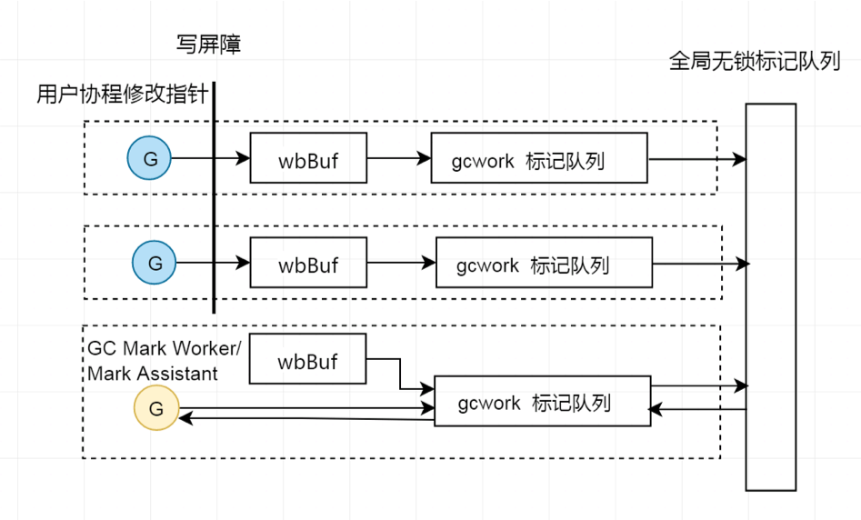

脑图：https://www.processon.com/mindmap/60fbe47a637689719d24c16b

### 导读
>  1959年,  GC由 John McCarthy发明,  用于简化Lisp中的手动内存管理. 到现在很多语言都提供了GC.  不过GC的原理和基本算法都没有太大的改变.

> Garbage Collection (GC)是一种自动管理内存的方式.  支持GC的语言无需手动管理内存,  程序后台自动判断对象是否存活并回收其内存空间,  使开发人员从内存管理上解脱出来.

带着问题去思考🤔：
- GC是怎样的?
- GC怎么帮我们回收对象?
- Go的GC会不会漏掉对象或者回收还在用的对象?
- Go GC什么时候开始?
- Go GC啥时候结束?
- Go GC会不会太慢, 跟不上内存分配的速度?
- Go GC会不会暂停我们的应用? 暂停多久? 影不影响我的请求?

### GC相关术语
- **并发和并行**: 通常在GC领域中,  并发收集器则指垃圾回收的同时应用程序也在执行; 并行收集器指垃圾回收采取多个线程利用多个CPU一起进行GC.  不过一般我们说并发回收器, 就包含了这两层意思.
- **Safepoint**: 安全点(Safepoint)是收集器能够识别出线程执行栈上的所有引用的一点或一段时间.
- **Stop The World(STW)**: 某些垃圾回收算法或者某个阶段进行时需要将应用程序完全暂停.
- **准确式GC和保守式GC**: 准确式(precise或exact) GC指GC能够知道一块内存区域是引用还是非引用,  如一个64位的区域可以是一个int64整形数字也可以是一个对象引用,  当一个对象进行执行时,  需要修改指向这个内存的引用的指,  非准确式GC也就是保守式GC不能完成这个任务.
- **Mark**: 从Root对象开始扫描, 标记出其引用的对象, 及这些对象引用的对象, 如此循环, 标记所有可达的对象.
- **Sweep**: Sweep清除阶段扫描堆区域, 回收在标记阶段标记为Dead的对象, 通常通过空闲链表(free list)的方式.需要的工作量和堆大小成正比.
- **Compact**: 压缩的方式是将存活对象移动到一起来获得一段连续的空闲空间, 也叫做重定位.这样需要将所有对象的引用指向新的位置.工作量和存活对象量成正比.
- **Copy**: 复制算法将所有存活对象从一个From区域移动到一个To区域, 然后回收From区域. 之后From和To交换角色, 由于From和To是对等的, 所以需要两块大小相同的区域, 而同一时间只能利用其中一块来存放对象.工作量和存活对象量成正比.

### Golang GC发展
> - 1.5版本是Go转为并发三色标记清除法的版本, 大部分情况下能够将STW控制在10ms以下, 已经能满足大部分大部分生产环境使用要求.  
 > - 1.5之后Golang Runtime中调整最多的就是GC的部分.因此Go的GC并不是完美的。

下面列出一些GC方面比较重大的改动:

- 分布式检测 
1.5中GC流程及状态的转换由一个协程集中式控制, 容易导致调度延迟.  
1.6中采用了分布式检测, 其他协程也可以进行检测并状态转换.
- 栈收缩
1.5中栈收缩在Mark Termination(STW), 如果协程很多, 会导致STW时间暴增. 
1.7将栈收缩移入并发Mark阶段. 
- 写屏障
1.5只采用了Dijkstra写屏障, 在Mark Termination(STW)阶段需要重新扫描栈, 这个是STW最大的来源.
1.8采用了混合写屏障hybrid write barrier, 消除了重新扫描栈, 使得STW降到了sub ms.  
- 结束标记阶段
1.12对Mark Terminiation阶段进行了优化

### 三色标记

1. 有黑白灰三个集合. 初始时所有对象都是白色
2. 从Root对象开始标记, 将所有可达对象标记为灰色
3. 从灰色对象集合取出对象, 将其引用的对象标记为灰色, 放入灰色集合,  并将自己标记为黑色
4. 重复第三步, 直到灰色集合为空, 即所有可达对象都被标记
5. 标记结束后, 不可达的白色对象即为垃圾. 对内存进行迭代清扫, 回收白色对象.
6. 重置GC状态

#### 标记和程序并发, 会漏标记对象吗? 如何解决的?
> - 三色标记需要维护(弱)不变性条件: 黑色对象不能引用无法被灰色对象可达的白色对象.
> - 并发标记时, 如果没有做正确性保障措施, 可能会导致漏标记对象, 导致实际上可达的对象被清扫掉。
> - go使用写屏障(和内存写屏障不是同一个概念),来解决这个问题, 

- 写屏障是在写入指针前执行的一小段代码, 用以防止并发标记时指针丢失, 这一小段代码Go是在编译时加入的.
Golang写屏障在mark和marktermination阶段处于开启状态. 下图, 第3步,A.obj=C时, 会将C进行标记, 加入写屏障buf, 最终会flush到待扫描队列, 这样就不会丢失C及C引用的对象.

- 栈中指针slot的操作没有写屏障.

1. Dijkstra写屏障是对被写入的指针进行grey操作, 不能防止指针从heap被隐藏到黑色的栈中, 需要STW重扫描栈.
2. Yuasa写屏障是对将被覆盖的指针进行grey操作, 不能防止指针从栈被隐藏到黑色的heap对象中, 需要在GC开始时保存栈的快照.
3. go 1.8写屏障混合了两者, 既不需要GC开始时保存栈快照, 也不需要STW重扫描栈, 原型如下:

#### 哪里记录了对象的三色标记状态?
没有真正的三个集合来分别装三色对象。go的对象是分配在span中, span里还有一个字段是**gcmarkBits**, mark阶段里面每个bit代表一个slot已被标记. 白色对象该bit为0, 灰色或黑色为1(runtime.markBits). 

 

每个p中都有wbBuf和gcw gcWork, 以及全局的workbuf标记队列, 实现生产者-消费者模型, 在这些队列中的指针为灰色对象, 表示已标记, 待扫描. 从队列中出来并把其引用对象入队的为黑色对象, 表示已标记, 已扫描(runtime.scanobject).

#### 标记时, 拿到一个指针, 怎么知道它是哪个对象? 也许是某个对象的内部指针? 这个对象的内存哪些地方代表了它引用的对象呢?
内存结构图. go的gc heap通过arenas进行划分, 每个heapArena管理了64M内存. heapArena存储着pointer, span, bitmap的索引关系.

#### Go何时开始GC, 何时结束GC? 分配太快怎么办? 
Go GC Pacer机制决定这些阈值, GC Pacer基于Go程序大致稳定的假定, 并且有负反馈机制.
Go的GC触发与Java不同, Java是当内存某个具体值时(比如2G)触发GC. 而Go与上一次GC之后存活的对象占用的内存Hm(n-1)成一个比例.

比如Hm(n-1)为1000M, default GOGC=100, 那么大概会在小于但比较接近2000M(比如1850, 1900M) Ht的时候开始GC; 
结束GC时, 使得GC堆大小Ha(比如1990, 2010M)趋向于等于目标值Hg 2000M.
GC结束后, 会根据当前数据计算下一次GC触发值Hm(n+1).

#### 如何保证GC按时开始?
在GC结束后, 下一次GC开始前, 需要sweep完所有的span.
有一个后台清扫协程, 同时用户协程也需要辅助sweep.
假设有k page的span需要sweep, 那么距离下一次GC开始还有Ht-Hm(n-1)的内存可分配, 那么平均分配1bytes内存需要sweep   k/(Ht-Hm(n-1))  page的span (会根据sweep进度进行比例更改)

#### 如何保证GC按时结束?
GC在Ht开始, 到达到目标堆大小Hg时, 尽量mark完所有待mark的对象.
除了后台并发的标记协程, 程序分配内存时也需要辅助mark.
从Ht到Hg还有Hg-Ht的内存可分配, 这个时候还有scanWorkExpected的对象需要scan, 那么平均分配1byte内存, 需要辅助mark  scanWorkExpected/(Hg-Ht)的对象(会根据mark进度进行比例更改)

#### 下一次GC啥时候开始?
下一次GC的触发值由反馈公式计算. 定性如下:
如果本次GC mark消耗的CPU高于目标值(30%), 则下次GC提前一点.
如果本次GC的Ha高于Hg, 则下次GC提前一点.

### 观察一下GC
这是一个服务通过调用debug.SetGCPercent设置GOGC, 分别是100, 550, 1650时的表现. 
GOGC越大, GC频次越低, 但是触发GC的堆内存也越大. 

### 一些优化建议(写业务时用不到就算了)

> GODEBUG, GOMAXPROCS, GOGC

**涉及文件, CGO较多的程序, 可以将P增大几个**
runtime.GOMAXPROCS(GOMAXPROCS(0)+1)

**协程池的重要性远没有Java, CPP中线程池那么重要.**
协程的生成不涉及系统调用, 需要的栈资源也很少. 同时P和全局都做了dead G的缓存. 协程池实现的不好, 反而因为协程池里的一把锁影响了扩展性.  至于并发控制, 保护其他资源, 可以选用其他方式.
**什么时候需要协程池?**
主要还是隔离减少栈扩容和缩容. 有些场景下栈扩容和缩容消耗CPU(可结合pprof查看morestack)的确比较多. 比如长连接, 大量维持连接的协程可以不用扩容栈, 复杂任务交给任务协程处理, 此类协程的数量比较少.

**GOGC=200或更多**
GC Pacer会根据GC情况和GOGC参数来计算gc trigger, 增大GOGC, 可降低GC频率, 注意, 会增加触发GC的堆大小.

**sync.Pool**
对于频繁分配的对象, 可以使用sync.Pool, 减少分配频次, 进而降低GC频率 (1.13对sync.Pool进行了优化)

**全局缓存对象有大量的key的情况, value少用指针**
GC并发Mark需要mark存活的对象, 如果value里指针多, 导致mark消耗的CPU很大, 使用一个struct内嵌数据消除指针.

**一点点拷贝胜过传指针**
对象在栈上分配, 减少GC频率.

**[]byte和string的magic**
慎用, 仅用在不会修改的地方

**slice和map的容量初始化**
减少不断加元素时的扩容

**json-iterator替换encoding/json**

### 框架或模板集成gops及默认开启pprof
> 往往有问题才想起没引入pprof,  无法查看stack, 又需要保留现场.

- 服务模板代码默认引入一个库开启pprof, 集成到服务列表页. 有问题, 点一点, 通过一个agent, 直接获取idc机器上服务的pprof图.

- 服务模板默认引入一个库封装gops
gops:=golang版( jps + jstack + jstat + jinfo )
https://github.com/google/gops

### 问题排查的一点思路
和Runtime相关的几类问题

1. 内存慢慢增长OOM: 结合memory inuse_space的pprof和list, 加上源码流程即可定位出. 一直把新对象放到全局对象或者长生命周期对象中. 比如长连接, 连接池应用或者忘记close http resp body, sql Stmt等.

2. 内存突增OOM:  如果多次分配才OOM, 可使用方法1排查. 对于一次就OOM的, 比较难抓, 可结合go无法分配内存时throw输出的协程栈排查. 
比如没有校验参数, 调用者填错或恶意, 使用传过来的length来进行make([]byte, length)用于编解码

3. 性能问题: 结合火焰图, 查看影响性能的热点部分, 进行优化: GC频繁, 编解码效率低等.

### 小结
- GC是一种自动内存管理方式
- GC三大基础算法: Mark-Sweep, Mark-Sweep-Compact, Mark-Copy. 这三个基础算法GC时需要一直STW(stop the world)
- GC算法是一个综合的考虑: 程序吞吐量, GC吞吐量, STW时间, STW的频率, 压缩, 分配性能, 并发, 伸缩, 调优复杂度等等.
- 当前Go GC特征: **三色标记, 并发标记和清扫, 非分代, 非紧缩, 混合写屏障**.
- 1.5之后Go的GC是**基于三色标记法的Concurrent Mark-Sweep(并发标记-清扫)算法**. 生产上基本没什么问题。
- 1.8之后Go的GC STW可以比较稳定在sub ms

