### SpringBoot是如何实现自动配置功能的？

所谓自动配置，就是通过预先定义了很多个配置类(带@Configuration注解的类)，并将这些类装载到Spring容器中去。具体实现在AutoConfigurationImportSelector类中。

#### 怎样开启自动配置功能？

SpringBoot项目启动类

```java
@SpringBootApplication //声明SpringBoot启动类
public class SpringSoucreCodeApplication {

    public static void main(String[] args) {
        SpringApplication.run(SpringSoucreCodeApplication.class, args);
    }

}
```

- @SpringBootApplication

```java
@Target({ElementType.TYPE})
@Retention(RetentionPolicy.RUNTIME)
@Documented
@Inherited
@SpringBootConfiguration //声明配置类接口SpringBootConfiguration，用于自定义配置
@EnableAutoConfiguration //自动配置声明
@ComponentScan(
   excludeFilters = {@Filter(
   type = FilterType.CUSTOM,
   classes = {TypeExcludeFilter.class}
), @Filter(
   type = FilterType.CUSTOM,
   classes = {AutoConfigurationExcludeFilter.class}
)}
)
public @interface SpringBootApplication {
 ……
}
```

- @EnableAutoConfiguration

```java
@Target({ElementType.TYPE})
@Retention(RetentionPolicy.RUNTIME)
@Documented
@Inherited
@AutoConfigurationPackage  //通过该注解，会自动扫描当前类(即：SpringBootApplication类)所在的目录及其子目录下的类;相当于 @ComponentScan("{目录名}")
@Import({AutoConfigurationImportSelector.class}) // 将AutoConfigurationImportSelector类注入到Spring容器中
public @interface EnableAutoConfiguration {
    String ENABLED_OVERRIDE_PROPERTY = "spring.boot.enableautoconfiguration";

    Class<?>[] exclude() default {};

    String[] excludeName() default {};
}
```

- AutoConfigurationImportSelector ：这才是真正实现自动配置的核心代码

  它实现了Spring框架ImportSelector接口的selectImports()；

  selectImports()方法：需要返回一个类名形式的字符串数组【配置类集合】，后期Spring会将返回的所有类加载到Spring容器中。

```java
public class AutoConfigurationImportSelector implements DeferredImportSelector, BeanClassLoaderAware, ResourceLoaderAware, BeanFactoryAware, EnvironmentAware, Ordered {
  ……
    //返回配置文件类名称的集合
    @Override
    public String[] selectImports(AnnotationMetadata annotationMetadata) {
        if (!this.isEnabled(annotationMetadata)) {
            return NO_IMPORTS;
        } else {
            AutoConfigurationMetadata autoConfigurationMetadata = AutoConfigurationMetadataLoader.loadMetadata(this.beanClassLoader);
            AutoConfigurationImportSelector.AutoConfigurationEntry autoConfigurationEntry = this.getAutoConfigurationEntry(autoConfigurationMetadata, annotationMetadata);
            return StringUtils.toStringArray(autoConfigurationEntry.getConfigurations());
        }
    }

    //获取配置文件类名称的集合
      protected AutoConfigurationImportSelector.AutoConfigurationEntry getAutoConfigurationEntry(AutoConfigurationMetadata autoConfigurationMetadata, AnnotationMetadata annotationMetadata) {
        if (!this.isEnabled(annotationMetadata)) {
            return EMPTY_ENTRY;
        } else {
            AnnotationAttributes attributes = this.getAttributes(annotationMetadata);
            List<String> configurations = this.getCandidateConfigurations(annotationMetadata, attributes); //读取
            configurations = this.removeDuplicates(configurations); //去重
            Set<String> exclusions = this.getExclusions(annotationMetadata, attributes);
            this.checkExcludedClasses(configurations, exclusions);//排除
            configurations.removeAll(exclusions);
            configurations = this.filter(configurations, autoConfigurationMetadata);
            this.fireAutoConfigurationImportEvents(configurations, exclusions);
            return new AutoConfigurationImportSelector.AutoConfigurationEntry(configurations, exclusions);
        }
    }

  ……
}

```

#### 配置类是在哪里定义的呢？ 又是如何获取的呢？

配置类定义位置：使用该K-V的文本形式
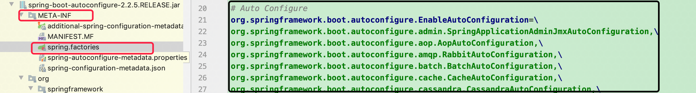

获取机制：是由Spring框架提供的

```java
public final class SpringFactoriesLoader {
    public static final String FACTORIES_RESOURCE_LOCATION = "META-INF/spring.factories";
    ……
    //加载扫描Spring的配置文件
    private static Map<String, List<String>> loadSpringFactories(@Nullable ClassLoader classLoader) {
        //说明有缓存机制
        MultiValueMap<String, String> result = (MultiValueMap)cache.get(classLoader);
        if (result != null) {
            return result;
        } else {
            try {
               //说明配置文件不止一个
                Enumeration<URL> urls = classLoader != null ? classLoader.getResources("META-INF/spring.factories") : ClassLoader.getSystemResources("META-INF/spring.factories");
                LinkedMultiValueMap result = new LinkedMultiValueMap();

                while(urls.hasMoreElements()) {
                    URL url = (URL)urls.nextElement();
                    UrlResource resource = new UrlResource(url);
                    Properties properties = PropertiesLoaderUtils.loadProperties(resource);
                    Iterator var6 = properties.entrySet().iterator();

                    while(var6.hasNext()) {
                        Entry<?, ?> entry = (Entry)var6.next();
                        String factoryTypeName = ((String)entry.getKey()).trim();
                        String[] var9 = StringUtils.commaDelimitedListToStringArray((String)entry.getValue());
                        int var10 = var9.length;

                        for(int var11 = 0; var11 < var10; ++var11) {
                            String factoryImplementationName = var9[var11];
                            result.add(factoryTypeName, factoryImplementationName.trim());
                        }
                    }
                }

                cache.put(classLoader, result);
                return result;
            } catch (IOException var13) {
                throw new IllegalArgumentException("Unable to load factories from location [META-INF/spring.factories]", var13);
            }
        }
    }
 }
```

#### Spring如何将配置类加载到Spring容器中？

从Spring3.0开始，就支持利用`JavaConfig技术`通过Java类的方式来实现0xml的Spring项目的配置；

去官网找找答案 -> https://docs.spring.io/spring/docs/5.2.4.RELEASE/spring-framework-reference/web.html#spring-web

1. 定义配置类：
   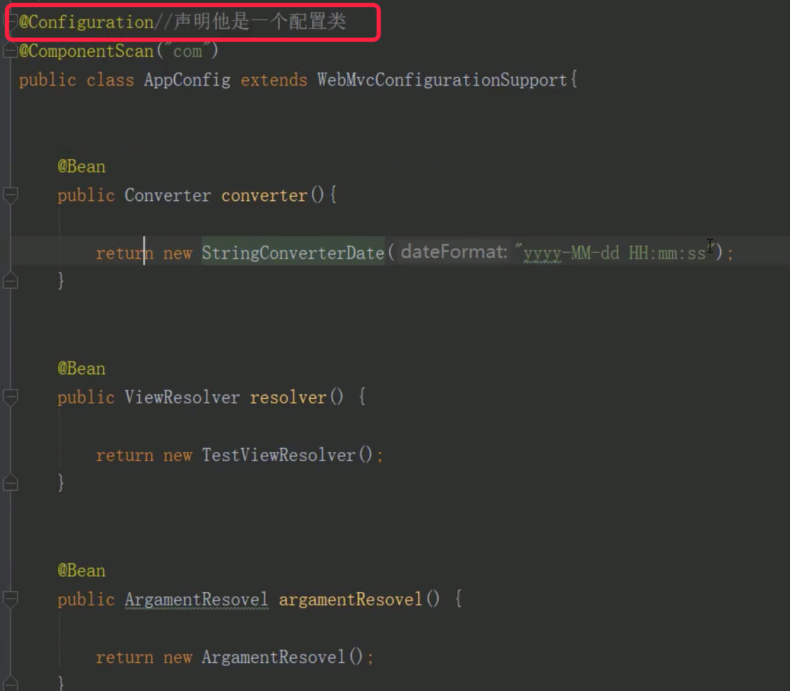

2. 通过实现Spring的接口，来注册配置类；
   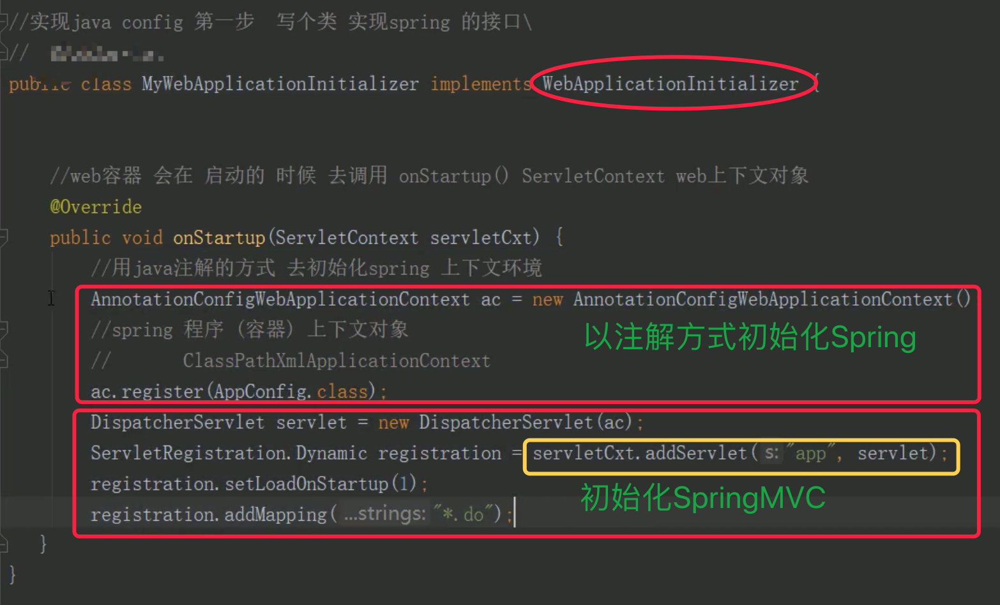

#### Web容器启动时为何会初始化Spring容器？

即：Web容器为什么要调用Spring框架中定义的onStartup()方法 ？

servlet3.0版本以后，提出新一个规范SPI; Tomat和Spring都遵循了这个规范；

SPI规范：如果项目中有某些类或者某些方法需要被Web容器调用，需要在项目的根目录META-INF/services下建立一个文件，指定需要调用的类；

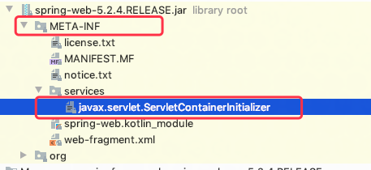

文件中的内容：org.springframework.web.SpringServletContainerInitializer //指定了SpringServletContainerInitialize类

```java
//实现了Servlet接口
@HandlesTypes({WebApplicationInitializer.class})  // 指定WebApplicationInitializer接口
public class SpringServletContainerInitializer implements ServletContainerInitializer {
    public SpringServletContainerInitializer() {
    }

    // 参数webAppInitializerClasses为实现WebApplicationInitializer接口的实现类集合。
    public void onStartup(@Nullable Set<Class<?>> webAppInitializerClasses, ServletContext servletContext) throws ServletException {
        List<WebApplicationInitializer> initializers = new LinkedList();
        Iterator var4;

        //通过Class集合利用反射机制创建实例集合
        if (webAppInitializerClasses != null) {
            var4 = webAppInitializerClasses.iterator();

            while(var4.hasNext()) {
                Class<?> waiClass = (Class)var4.next();
                if (!waiClass.isInterface() && !Modifier.isAbstract(waiClass.getModifiers()) && WebApplicationInitializer.class.isAssignableFrom(waiClass)) {
                    try {
                        initializers.add((WebApplicationInitializer)ReflectionUtils.accessibleConstructor(waiClass, new Class[0]).newInstance());
                    } catch (Throwable var7) {
                        throw new ServletException("Failed to instantiate WebApplicationInitializer class", var7);
                    }
                }
            }
        }

        //依次调用实例中的onStartup()方法
        if (initializers.isEmpty()) {
            servletContext.log("No Spring WebApplicationInitializer types detected on classpath");
        } else {
            servletContext.log(initializers.size() + " Spring WebApplicationInitializers detected on classpath");
            AnnotationAwareOrderComparator.sort(initializers);
            var4 = initializers.iterator();

            while(var4.hasNext()) {
                WebApplicationInitializer initializer = (WebApplicationInitializer)var4.next();
                initializer.onStartup(servletContext);
            }

        }
    }
}

```

#### 自己原始项目如何同SpringBoot项目做整合，即：实现一个自定义Start实现自动装载？

1. 自定义配置类： 其中ServerAutoConfigMarker这个自动配置标识类，后面使用时会用到。
   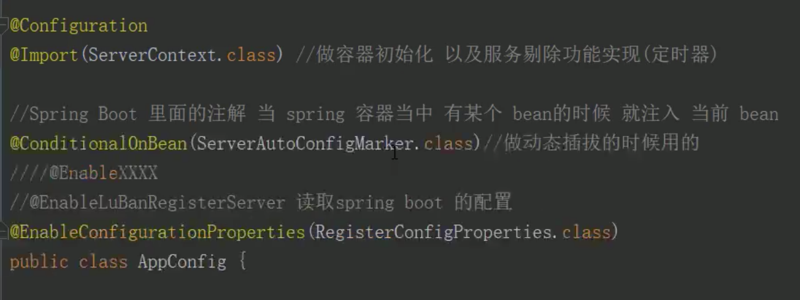

2. 自己项目的配置信息Bean类
   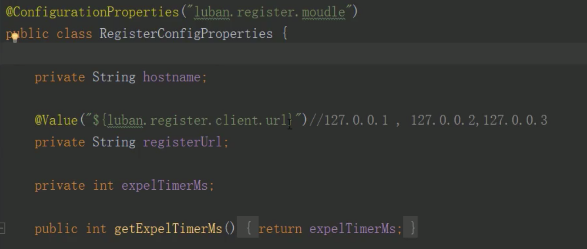

3. 在自己项目resource目录下创建META-INF/spring.factories文件，里面指定自定义的配置类的类名
   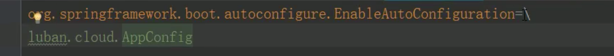

使用方式:

1. 加依赖
   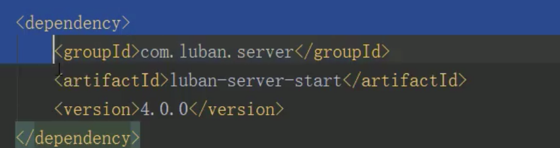

2. 添加自定义注解；通过操作该注解，便可以实现同自己原始的项目的动态插拔，注释掉便不会启动自己的原始项目。
   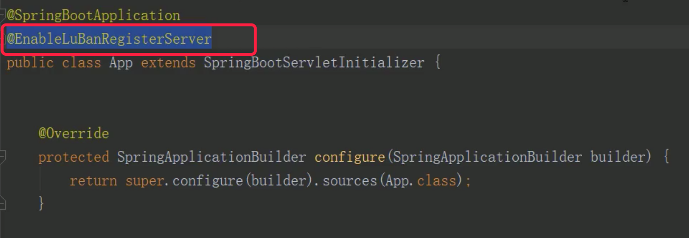

   下面是上面注解的实现，本质是在注解上引入了之前定义的配置标识类。 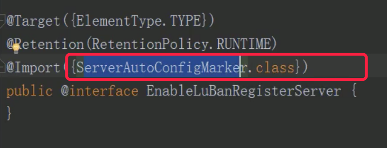

3. springBoot项目中加配置，由于有默认配置，这一步可以忽略。
   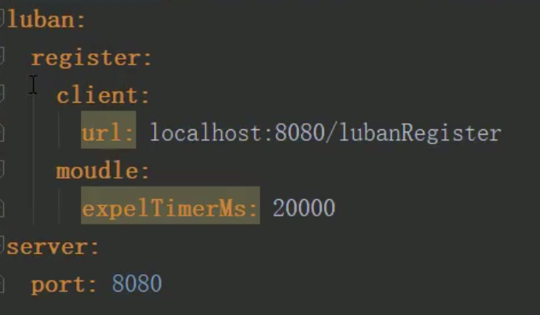
