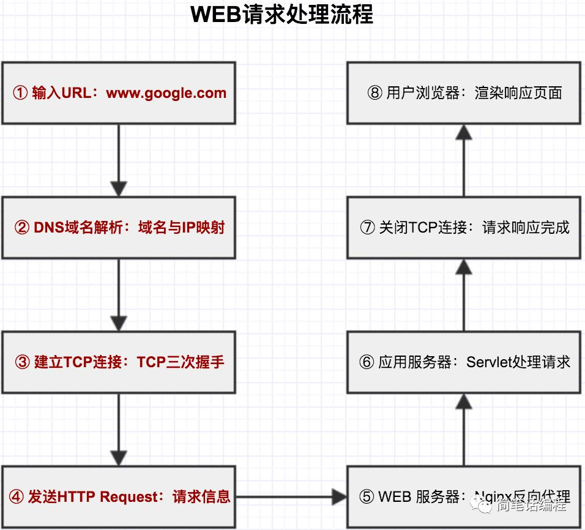
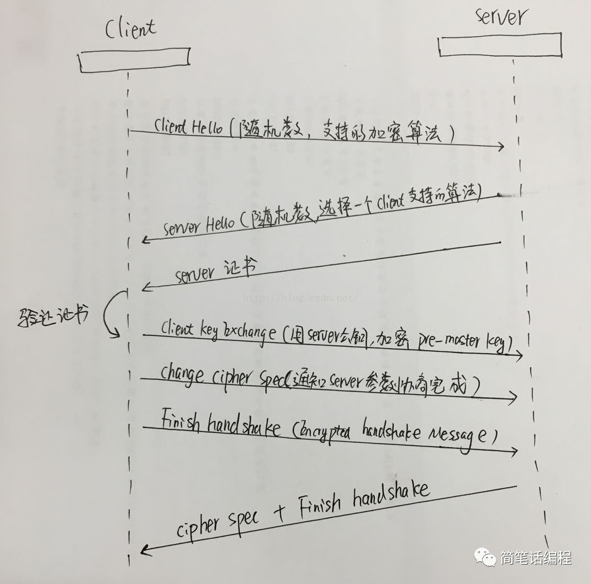
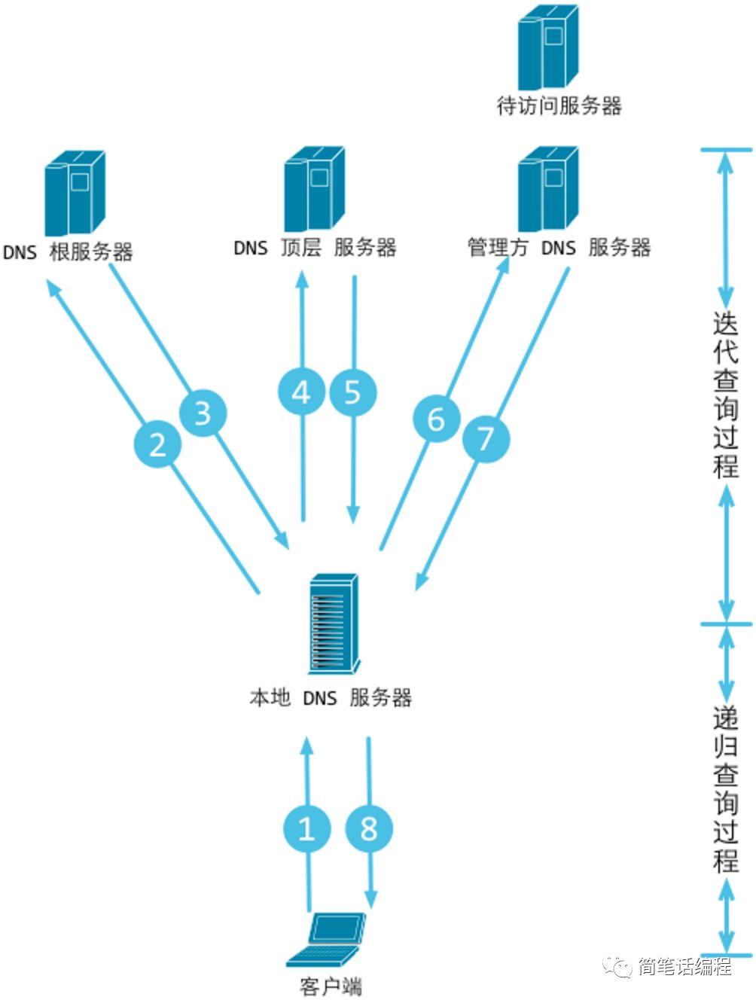
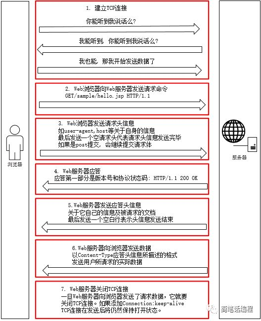
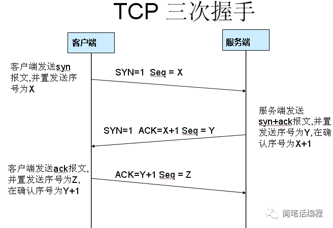
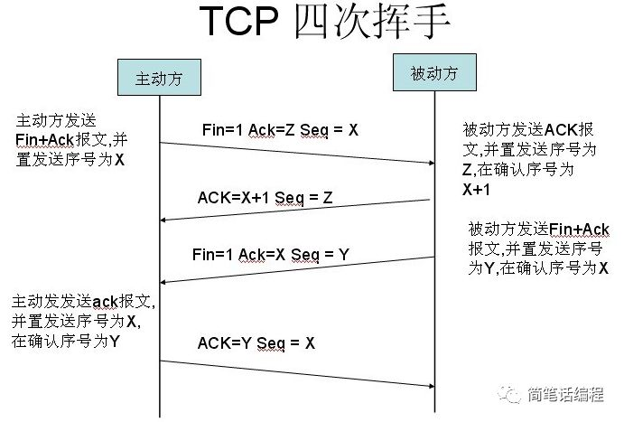
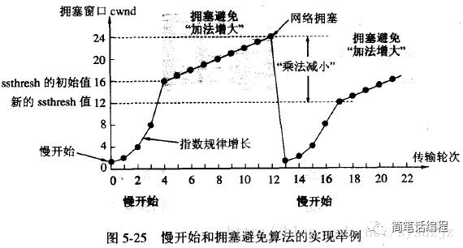

> 我是一个请求，下面是我对往昔的追忆！

## 请求处理流程

模拟场景：用户前端上传文件的操作

## Https        

我被通过post方式经过Https协议发送的Server端；         
下面我就要好好吐槽一下这个Https这个小伙伴了。
Https本质上并不是协议，而是Http协议和SSL/TLS协议的“私生子”，在Http下加入SSL层，就成了它，简单讲它是HTTP的安全版。         

Https在传输数据前需要进行一次握手，握手时采用非对称加密和Hash算法，握手后数据用对称加密传输。    

握手过程如下： 

- 非对称加密算法：- RSA,DSA/DSS    
- 对称加密算法 ：AES、RC4、3DES    Hash算法 - MD5、SHA1、SHA256

参考博文：https://blog.csdn.net/hherima/article/details/52469674 

## DNS
DNS（域名系统）：一个映射域名和IP地址的分布式数据库。DNS协议运行在UDP协议上，使用端口53.
DNS会有一些策略将静态的东西直接返回给浏览器分层式DNS域名服务器。

## TCP连接 

### 三次握手

### 四次挥手

慢启动&拥塞控制&快速重传&快速恢复&ssthresh：

假设设定初始发送报文数为1，慢启动增长倍数为2倍，初始ssthresh值为16，拥塞控制每次加1慢启动：从初始cwnd开始，每次发送都是上一次的n倍，达到ssthresh后改为拥塞控制算法拥塞控制：cwnd每次加一定数量，直到发生超时或重复确认。发生超时时将ssthresh减半，并将cwnd重置为初始大小，重新进入慢启动阶段；若发生重复确认，则将ssthresh减半，将cwnd设置为ssthresh的大小，重发所丢包，重新进入拥塞控制阶段！

- 慢启动阈值：超过阈值则使用拥塞避免算法，不超过则使用慢启动算法 cwnd：
- 发送窗口大小：每次发送多少数据包 
