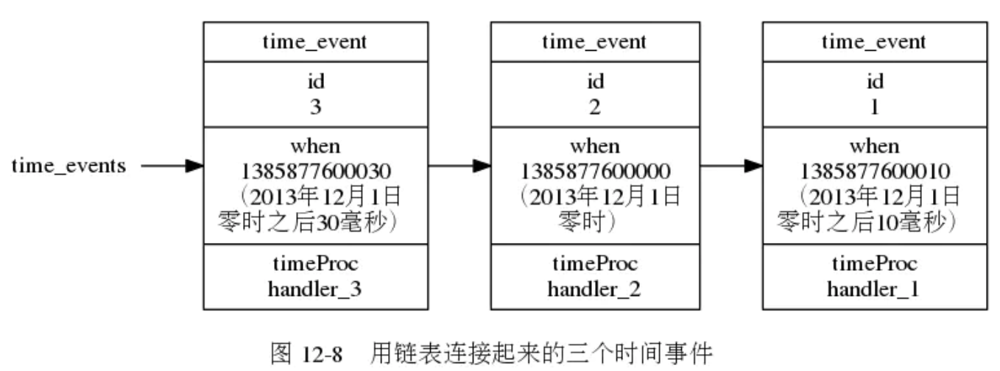
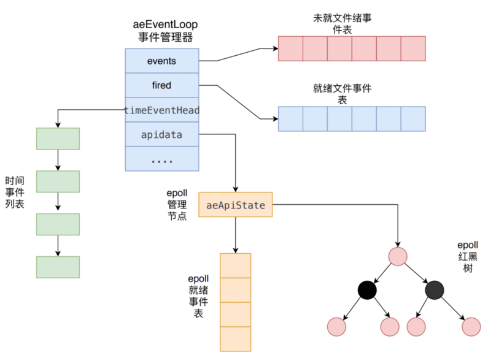

> - Redis服务器是一个`事件驱动`的程序，事件分为两类：文件事件和时间事件。
> - 文件事件和时间事件之间的关系？
>   文件事件和时间事件之间是合作关系，服务器会轮流处理这两种事件，并且处理事件的过程中也不会进行抢占。
> - 为什么作者不使用已有的成熟的事件驱动模型相关库，比如 Libevent 或 Libev？
>   下面从源码入手介绍下 Redis 中封装的 ae 库及其内部机制。

#### 文件事件

> 是对服务器对套接字操作的抽象。

##### 文件事件处理器

- Redis基于`Reactor模式`开发了自己的网络事件处理器，这个处理器被称为文件事件处理器。
- 文件事件处理器以`单线程`方式运行。文件事件处理器使用`IO多路复用技术`，同时监听多个套接字，并为套接字关联不同的事件处理函数。当套接字的可读或者可写事件触发时，就会调用相应的事件处理函数。

##### 文件事件处理器的构成

四个组成部分：socket，I/O多路复用程序，文件事件分派器，以及事件处理器。


每当一个套接字准备好执行连接应答，写入，读取，关闭等操作时，就会产生一个文件事件。尽管多个文件事件可能会并发的出现，但I/O多路复用程序总是将所有产生事件的套接字都放到一个`队列`里面，然后通过这个队列，`有序、同步、每次一个套接字`的方式传送套接字给文件事件分派器。当上一个套接字产生的事件处理完毕后，I/O多路复用程序才会向文件事件分派器传送下一个套接字。

##### I/O多路复用程序的实现

> “多路”指的是多个网络连接，“复用”指的是复用同一个Redis处理线程。多个描述符的I/O操作都能在一个线程内并发交替地顺序完成，这就叫I/O多路复用，
> Redis 使用的IO多路复用技术主要有：`select、 epoll、 evport和 kqueue`等。每个IO多路复用函数库在Redis 源码中都对应一个单独的文件，比如aeselect.c，aeepoll.c， ae_kqueue.c等。Redis 会根据不同的操作系统，按照不同的优先级选择多路复用技术。

##### 文件事件处理器

套接字产生AE_READABLE事件（读事件）和AE_WRITABLE（写事件)。 如果一个套接字可读又可写的话，服务器将会先读套接字，后写套接字。

- 连接应答处理器
  服务器初始化时，会将连接应答处理器同套接字的AE_READABLE事件关联起来。 当客户端连接服务器时，会产生AE_READABLE事件，引发连接应答处理器执行，即：调用acceptTcpHandler()。
- 命令请求处理器
  当客户端成功连接到服务器后，服务器会将命令请求处理器同客户端套接字的AE_READABLE事件关联起来。当客户端发送请求时，会产生AE_READABLE事件，引发命令请求处理器执行，即：调用readQueryFromClient()。在客户端连接服务器的整个过程中，一直会为客户端套接字的AE_READABLE事件关联命令清求处理器。
- 命令回复处理器
  当服务器有命令回复需要传给客户端时，会将命令请求处理器同客户端套接字的AE_WRITABLE事件关联起来。但客户端准备接收时，会产生AE_WRITABLE事件，引发命令回复处理器执行，即：调用sendReplyToClient()。当发送完会解除AE_WRITABLE事件同命令回复处理器的关联。

#### 时间事件

> 是服务器对定时操作的抽象。比如:serverCron函数

##### 分类

- 定时事件：让一段程序在指定的时间之后执行一次。比如说，让程序X在当前时间的30毫秒之后执行一次。
- 周期性事件：让一段程序每隔指定时间就执行一次。比如说，让程序Y每隔30毫秒就执行一次。
  注：截止redis3.0,只使用周期性事件，而没有使用定时事件

#### 实现

服务器将所有时间事件都放在一个`无序链表`(这里的无序指的是没有按事件执行时间来排序)中，每当时间事件执行器运行时，它就遍历整个链表，查找所有已到达的时间事件，并调用相应的事件处理器。



> - 这样做是否存在性能问题？
>   正常模式下的redis服务器只使用serverCron一个时间事件，在benchmark模式下，服务器也只使用两个时间事件。故因为节点少，所以不必多虑。

#### serverCron函数

- Redis服务器以周期性时间的方式来运行serverCron()。每隔一段时间，就会执行一次，直到服务器关闭为止。
- 用户可以通过修改`hz选项`来调整serverCron()的每秒执行次数。
- 默认规定serverCron每秒运行10次，`平均每间隔100ms运行一次`。

#### `事件的调度与执行`

```
//事件处理器的主循环
void aeMain(aeEventLoop *eventLoop)
{
    eventLoop->stop = 0;

    while (!eventLoop->stop)
    {

        // 如果有需要在事件处理前执行的函数，那么运行它
        if (eventLoop->beforesleep != NULL)
            eventLoop->beforesleep(eventLoop);

        // 开始处理事件
        aeProcessEvents(eventLoop, AE_ALL_EVENTS);
    }
}
```

对文件事件和时间事件的处理，都在aeProcessEvents()中。

```
# ae.c/aeProcessEvents函数的伪代码
def aeProcessEvents(aeEventLoop *eventLoop,int flags):

    # 获取到达时间离当前时间最接近的时间事件
    time_event = aeSearchNearestTimer()

    # 计算最接近的时间事件距离到达还有多少毫秒
    remaind_ms = time_event.when - unix_ts_now()

    # 如果事件已到达，那么remind_ms的值可能为负数，将它设定为0
    if remaind_ms < 0:
        remaind_ms = 0

    # 根据remaind_ms的值，创建timeval结构
    timeval = create_timeval_with_ms(remaind_ms)

    # 阻塞并等待文件事件产生，最大阻塞时间由传入的timeval结构决定
    # 如果remaind_ms的值为0，那么aeApiPoll调用之后马上返回，不阻塞
    aeApiPoll(timeval)

    # 处理所有已产生的文件事件
    processFileEvent()

    # 处理所有已到达的时间事件
    processTimeEvent()
```

说明:

事件的调度和执行规则：

1. 调用aeApiPoll()时将阻塞，直到有事件发生，或者超时。aeApiPoll()的最大阻塞时间由`到达时间最接近当前时间的时间事件`决定，这个方法既可以避免服务器对时间事件进行频繁的轮询（忙等待），也可以保证aeApiPoll函数不会阻塞过程时间。
2. 因为文件事件是随机出现的，如果等待并处理完一次文件事件之后，仍未有任何时间事件到达，那么服务器将`再次等待并处理文件事件`。随着文件事件的不断执行，时间会逐渐向时间事件设置的到达时间逼近，并最终来到到达时间，这是服务器就可以开始处理到达的时间事件了。
3. 对文件事件和时间事件的处理都是同步、有序、原子的执行的，服务器`不会中途中断事件处理`，也不会对事件进行抢占，因此，不管是文件事件的处理器，还是时间事件的处理器，它们都会尽可能`减少程序的阻塞`时，并在有需要的时候主动让出执行权，从而降低造成事件饥饿的可能性。
4. 因为时间事件在文件事件执行之后执行，并不会对文件事件进行抢占，所以`时间事件的实际处理时间通常会比所设定的时间稍晚一些`。

#### 事件管理器

> 推荐： [Redis 事件机制详解](https://mp.weixin.qq.com/s?__biz=MzAxNjM2MTk0Ng==&mid=2247488082&idx=2&sn=d5c19f5644726bac652b17257d6d5061&chksm=9bf4a2e7ac832bf11307485f99a72835f0b71ad915759e5c324b5580d14d04ea3eacf3a05a04&scene=0&xtrack=1&key=b140a6be34d1999deed46db2754764885e092429154a895a07e1268182461d7d6760f8f70aab713c3801e0e499da20603b6fb4532759720625ee28bf82fcf56eb8faa653955890cecc7353247733571a&ascene=14&uin=MTEzNTIyMDA2MQ%3D%3D&devicetype=Windows+10&version=62060833&lang=zh_CN&pass_ticket=5iUmwF%2BJ2obIG1HadEwYK4QeNcb%2FNaizARARQ49yM%2BKVwWRV8vYm0CeuXKP4E3kh)

事件管理器aeEventLoop是整个事件驱动的核心，它管理着文件事件表和时间事件列表，不断地循环处理着就绪的文件事件和到期的时间事件。

##### 创建事件管理器

服务器在初始化函数initServer中，创建一个事件管理器aeEventLoop对象。调用aeCreateEventLoop()，初始化 aeEventLoop的各个属性值，比如 events、 fired、 timeEventHead和 apidata。

##### 创建文件事件

创建来事件管理器后、接下来就可以把具体的事件插入到事件管理器中。主要将事件插入到未就绪表中，还需要把事件插入到具体的io复用中。

##### io复用之epoll库的实现

> 在上阐述事件的调度与执行时，aeApiPoll()就是上文所说的I/O多路复用程序。由于Redis 基于的底层 I/O 多路复用库有多套，下面的是 epoll下的实现。其核心操作就是调用 epoll的 epoll_ctl函数来向 epoll注册响应事件。

- epoll内部使用红黑树维护每一个事件。当应用层注册一个文件事件时，会将事件插入到红黑树中。应用层删除一个事件时，也相应会从红黑树中删除一个事件节点。

- 

- aeApiPoll内部调用epoll系统调用，如果有事件发生则eploo_wait返回非0，如果为超时，则返回0。

- 当有事件发生时，内核会把所有发生的事件由内核层拷贝到应用层epoll就绪表中，之后aeApiPoll会把epoll就绪表state->events中的就绪事件拷贝到fired就绪表中。
  
- 当aeApiPoll()函数返回时，已就绪表中存储了所有就绪事件。

##### 新建事件

因此创建一个事件时、将会发生下面3个操作

1. 创建事件并给事件赋值
2. 将事件插入到未就绪事件表
3. 将事件插入到epoll维护的红黑树中。

##### 删除事件

删除的过程可以总结为以下几个步骤

1. 根据fd(fd指的是具体的soket套接字)在未就绪表中查找到事件
2. 取消该fd对应的相应事件标识符
3. 通知内核，内核会将红黑树上的相应事件也给取消。

### 参考

https://draveness.me/redis-eventloop

http://remcarpediem.net/article/1aa2da89/
