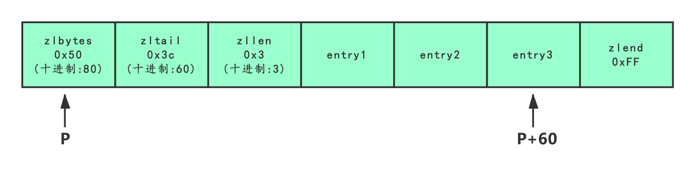
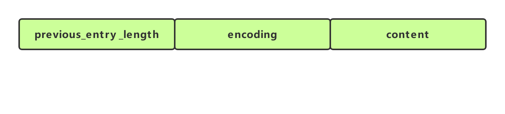
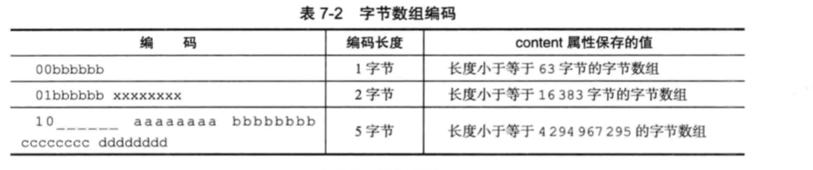
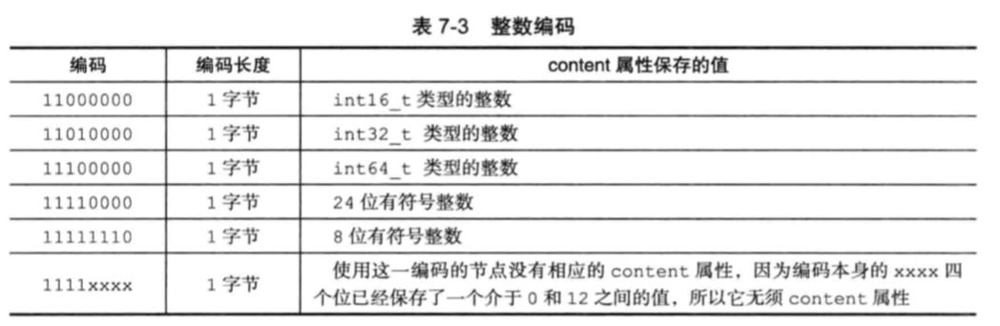
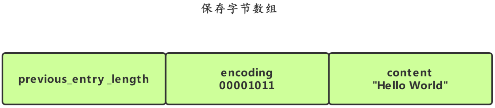
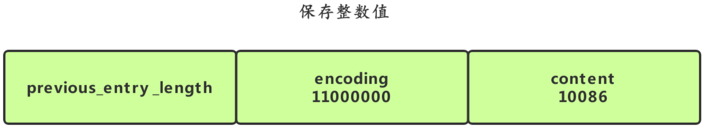
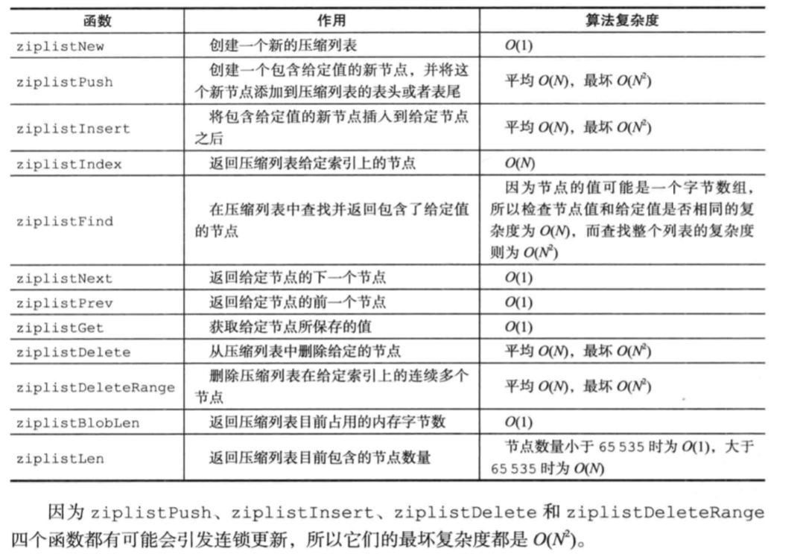

#### 定义
压缩表没有数据结构代码定义，完全是通过一系列特殊编码的连续内存块组成的顺序性数据结构。它为了节约内存而而开发的。
即：通过特殊的编码方式将数据存储在连续的内存中。

#### 用途
- 在3.2之前是列表键的底层实现之一，在3.2之后被quicklist替代。
- 是有序集合键的底层实现之一。
- 是哈希键的底层实现之一。（ 当一个哈希只包含少量键值对,并且每个键值对的键和值要么就是小整数值,要么就是长度比较短的字符串）

#### 数据结构
一个压缩列表可以包含任意多个节点(entry),每个节点可以保存一个字节数组或者一个整数数。
##### 压缩列表结构
 
示例：
下图，展示了一个总长为80字节，包含3个节点的压缩列表。如果我们有一个指向压缩列表起始地址的指针p，那么表为节点的地址就是P+60。

##### 压缩列表节点结构
每个压缩列表节点可以保存一个字节数组或者一个整数值。
字节数组可以是以下三种长度中的一种。
- 长度小于等于63(2^6-1)字节的字节数组;
- 长度小于等于16383(2^14-1)字节的字节数组
- 长度小于等于4294967295(2^32-1)字节的字节数组

整数值可以是以下6种长度中的一种:
- 4位长,介于0至12之间的无符号整数
- 1字节长的有符号整数
- 3字节长的有符号整数
- int16_t类型整数
- int32_t类型整数
- int64_t类型整数

previous_entry_length属性：以字节为单位,记录了压缩列表中前一个节点的长度。 previous_entry_length属性的长度可以是1字节或者5字节。
- 如果前一节点的长度小于254字节,那么 previous_entry_length属性的长度为1字节，前一节点的长度就保存在这一个字节里面。
- 如果前一节点的长度大于等于254字节,那么 previous_entry_length属性的长度为5字节:其中属性的第一字节会被设置为0xFE(十进制值254),而之后的四个字节则用于保存前一节点的长度.
注：压缩列表的从表尾到表头的遍历，就是利用了该属性而实现的。

encoding属性：记录了节点的content属性所保存数据的类型以及长度。
- 值的最高位以00、01或者10开头代表字节数组编码，字节数组的长度由编码除去最高两位之后的其他位记录；
- 值的最高位以11(1字节)开头的是整数编码。整数值的类型和长度由编码除去最高两位之后的其他位记录。

content属性：负责保存节点的值,节点值可以是一个字节数组或者整数,值的类型和长度由节点的encoding属性决定。
示例：

- 编码的最高两位00表示节点保存的是一个字节数组；
- 编码的后六位001011记录了字节数组的长度11；
- content属性保存着节点的值"hello world"；

保存整数：

- 编码11000000表示节点保存的是一个int16_t类型的整数值；
- content属性保存着节点的值10086；

##### 连锁更新 　　
> 由于压缩列表的'previous_entry_length'属性可能是1字节或5字节，若在一个压缩列表中，有多个连续的、长度介于250字节到253字节之间的节点，则添加新节点或删除节点都有可能会引发多个节点的连续多次空间扩展，这种现象称之为“连锁更新”。
- 因为连锁更新在最坏情况下需要对压缩列表执行N次空间重分配操作， 而每次空间重分配的最坏复杂度为O(N)， 所以连锁更新的最坏复杂度为O(N^2)。但“连锁更新”发生的概率是很低的，所以不必担心其会影响压缩列表的性能。
- ziplist的连锁更新是一个一个异步进行校验，直到遍历完整个ziplist或遇到不需要更新的枚举为止。

##### 操作API

#### 小结
1. ziplist是一种为节约内存而开发的顺序型数据结构；
2. ziplist保存着尾节点的偏移量，可以方便的拿到头尾节点；
3. 每一个entry都保存着前一个entry的长度，可以很方便的从尾遍历；
4. ziplist可以包含多个节点，每个节点可以保存一个字节数组或整数值；
5. 不同类型和大小的数据有不同的编码方式，添加和删除节点可能会引发连锁更新，极端情况下会更新整个ziplist，但是概率很小；

> 参考： https://www.cnblogs.com/hunternet/p/11306690.html
http://czrzchao.com/redisSourceZiplist#
