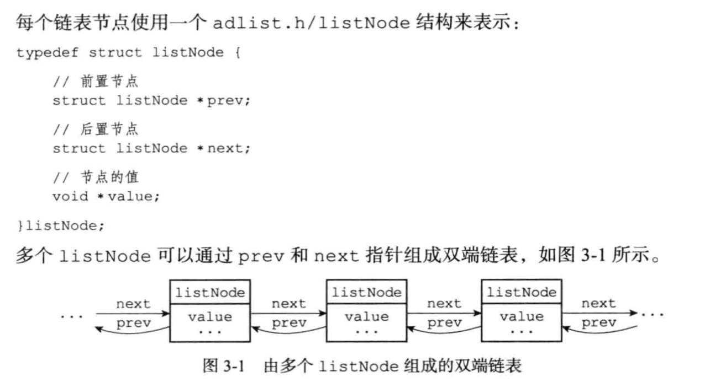
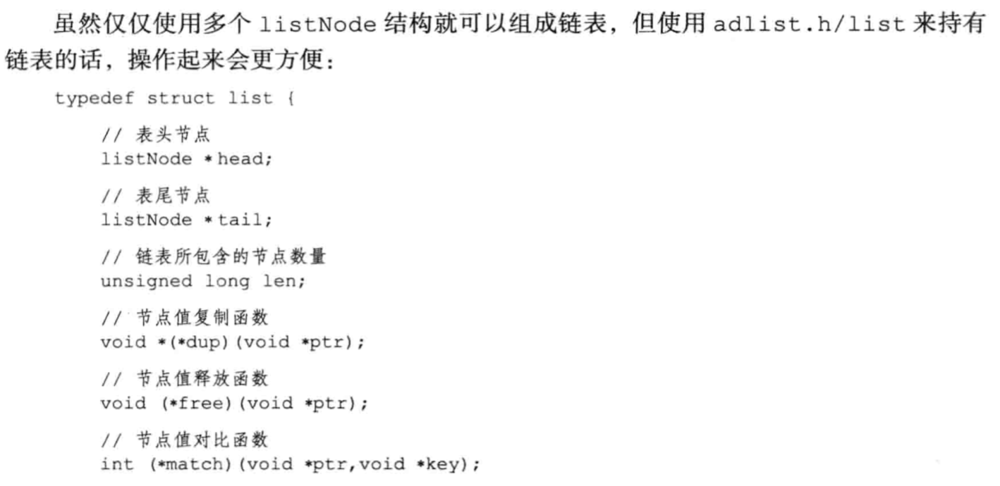
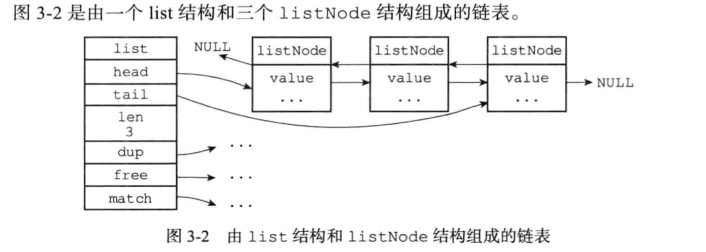

>  Redis使用C语言并没有内置中这种数据结构，所以Redis构建了自己的链表实现。

#### 用途
1. 在3.2之前是列表键的底层实现之一，在3.2之后被quicklist替代。
2. 发布与订阅、慢查询、监视器等功能
3. Redis服务器使用链表保存多个客服端的状态信息
4. 构建客户端输出缓冲区(outpub buffer)

#### 数据结构

每个链表使用一个list结构来表示；
表头的前置节点和表尾的后置节点都可以指向NULL,因此Redis实现的是`无环链表`。
 

 

 

