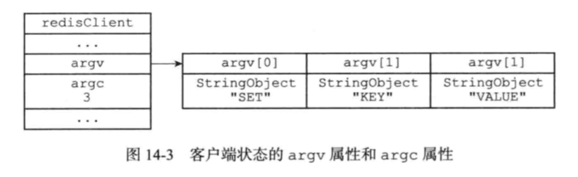
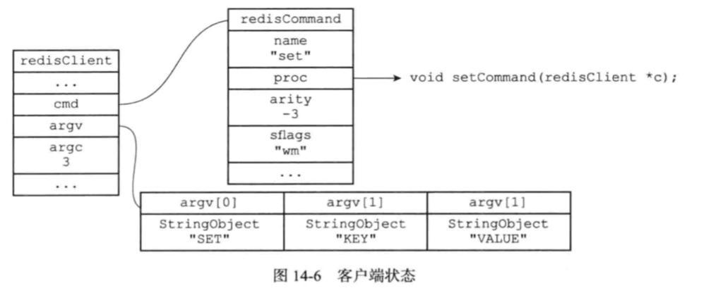

> Redis服务器是一对多服务器程序，对于每个与服务器连接的客户端，服务器都为这些客户端建立了相应的redisClient结构，保存了客户端的状态信息。

#### 客户端分类
普通客户端
Lua脚本的伪客户端
AOF文件的伪客户端


#### 客户端通用属性
包括下面这些信息：
```
int flags：套接字描述符
robj* name：名字
int flags：标志
sds querybuf：输入缓冲区
robj **argv：命令与命令参数
int argc：命令参数的个数
struct redisCommand *cmd： 命令的实现函数
char buf[]: 固定大小的输出缓冲区，默认16KB
int bufpos: 记录buf数组已使用的字节数量
authenticated：身份验证标识
time_t ctime：创建客户端的时间
time_t lastinteraction：客户端与服务器最后一次进行互动的时间
time_t obuf_soft_limit_reached_time：输出缓冲区第一次到达软性限制的时间
```
##### 套接字描述符fd
- 伪客户端 ： fd = -1
- 普通客户端： fd > -1
``` bash
redis> CLIENT list
addr=127.0.0.1:53428 fd=6 name= age=1242 idle=0 ...
addr=127.0.0.1:53469 fd=7 name= age=4 idle=4 .
```

##### 名字
如果客户端没有为自己设置名字，那么客户端状态的name属性指向NULL指针，当客户端执行了*CLIENT setname*命令之后，服务器会给该客户端设置名字，并把名字保存在redisClient结构体的name属性中。


##### 标志
- flags属性，`记录了客户端的角色，以及客户端所处的状态`。
- flags可以表示单个标志，也可以表示多个标志比如flags= flag1 | flag2 | ...。

该属性有下列枚举值：参考[redis客户端状态实现原理](https://baijiahao.baidu.com/s?id=1644126347209525874&wfr=spider&for=pc)
其中： 例如：`PUBSUB命令`和`SCRIPT LOAD命令`就是通过
使用REDIS_FORCE_AOF标志，强制服务器将当前命令写入AOF文件。

##### 输入缓冲区
客户端状态的输入缓冲区用于保存客户端发送的命令请求。
缓冲区大小根据输入内容动态扩大或缩小，`默认1G`。超过限制，否则服务器会采取保护措施关闭客户端。


##### 命令与命令参数
在服务器将客户端发送的命令请求保存到输入缓冲区之后， 服务器将对命令请求的内容进行分析， 并将得出的命令参数以及命令参数的个数分别保存到客户端状态的 argv 属性和 argc 属性。




##### 命令的实现函数
当服务器从协议内容中分析并得出 argv 属性和 argc 属性的值之后， 服务器将根据项 argv[0] 的值， 在命令表中查找命令所对应的命令实现函数。




##### 输出缓冲区
###### 分类
缓冲区有两种：
- 固定长度（`默认16K`）的缓存区:用来存储长度较小的回复.
- `动态长度的缓存区`：用来回复长度比较大的命令，但是为了避免缓冲区过来占用太多资源。

###### 限制方式
服务器使用两种模式来限制缓冲区大小：
1. 硬性限制：当缓冲区大小超出硬性限制大小之后，服务器马上关闭客户端。
2. 软性限制：当缓冲区大小超出软性限制大小之后，但没有超出硬性限制，服务器通过obuf_soft_limit_reached_time属性记录客户端到达软性限制的起始时间，之后服务器会持续监视客户端，`如果输出缓冲区一直超出软性限制，并且持续时间超过服务器设定的时长，那么服务器将关闭客户端；相反地如果输出缓冲区在指定时间内不再超出软性限制，那么客户端不会被关闭，并且obuf_soft_limit_reached_time属性值也会被清零。`

###### 设置软性限制和硬性限制
client-output-buffer-limit选项可以为普通客户端、从服务器客户端、执行发布与订阅功能的客户端设置不同的软性限制和硬性限制，该选项格式为client-output-buffer-limit <class> <hard limit> <soft limit> <soft seconds>，以下是三个设置示例：
```
//对普通客户端不限制输出缓冲区大小；
client-output-buffer-limit normal 0 0 0 
//从服务器客户端硬性显示为256M，软性限制为64M，软性限制时长60s；  
client-output-buffer-limit slave 256mb 64mb 60 
//发布订阅客户端硬性限制32M，软性限制8M，软性限制时长60s;
client-output-buffer-limit pubsub 32mb 8mb 60
```

##### 身份验证
客户端状态的 authenticated 属性用于记录客户端是否通过了身份验证.
0：客户端未通过身份验证
1：客户端已通过身份验证
当客户端 authenticated 属性的值为 0 时， 除了 AUTH 命令之外， 客户端发送的所有其他命令都会被服务器拒绝执行。
注意：authenticated属性只有在服务器启用了身份验证功能时使用。

##### 时间
typedef struct redisClient{
　　time_t  ctime;//创建客户端的时间
　　time_t  lastinteraction;//客户端与服务器最后一次进行互动的时间,
　　time_t  obuf_soft_limit_reached_time;//输出缓冲区第一次到达软性限制的时间
}


#### 命令请求的执行过程
1. 客户端将命令请求发送给服务器；
2. 服务器读取命令请求，并分析命令参数。
3. 命令执行器根据参数查找命令的实现函数，然后执行函数并得出命令回复；
4. 服务器将命令回复返回给客户端；

#### 初始化服务器过程
1. 初始化服务器状态；
2. 载入服务器配置；
3. 初始化服务器数据结构；
4. 还原数据库状态
5. 执行事件循环