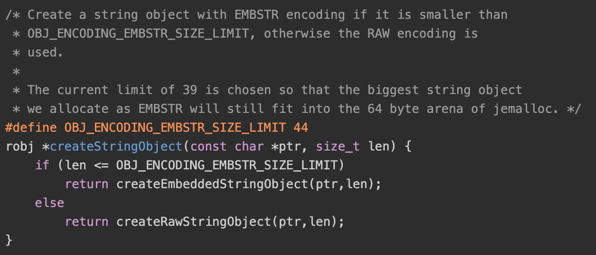

> Redis并没有直接使用这些数据结构来实现键值对数据库,而是基于这些数据结构创建了一个对象系统,这个系统包含字符串对象、列表对象、哈希对象、集合对象和有序集合对象这五种类型的对象,而每种对象又通过不同的编码映射到不同的底层数据结构。

> 查看redis内部数据结构实现
    127.0.0.1:6379> lpush lst 123 456
    (integer) 2
    127.0.0.1:6379> object encoding lst
    "quicklist"

### 引言
- 字符串：sds
- 列表：quicklist
注：在3.2之前，list是根据元素数量的多少采用ziplist或者adlist作为基础数据结构，3.2之后统一改用quicklist
- 哈希: ziplist、dict（数量多or元素长）
- 集合：intset（当集合元素都是整数且元素数量不多时使用），dict
- 有序集合：ziplist、skiplist


### 对象系统
#### 对象定义
``` c
#define LRU_BITS 24
typedef struct redisObject {  
    unsigned type:4;    // type 用于标识 string、hash、list、set、zset 五种数据类型,4bit
    unsigned encoding:4;    // 用于标识底层数据结构,4bit
    unsigned lru:LRU_BITS; /* lru time (relative to server.lruclock) */ // 用于保存对象的LRU时钟，24bit
    int refcount;   // 对象的引用计数，redisObject都是通过简单的引用计数法进行垃圾回收
    void *ptr;  //  保存了指向各种底层数据实例的指针
} robj;
```
通过这两个字段的组合，同一种数据类型也有多种实现方式，一个完整的映射关系如下表：
| 类型 type|	编码 encode|	描述|
| --- | --- | --- |
| OBJ_STRING	| OBJ_ENCODING_INT	|使用整数实现的字符串对象|
| OBJ_STRING	| OBJ_ENCODING_EMBSTR	|使用embstr编码实现的字符串对象|
| OBJ_STRING	| OBJ_ENCODING_RAW	|使用raw实现的字符串对象|
| OBJ_LIST	| OBJ_ENCODING_QUICKLIST	|使用quicklist实现的列表对象|
| OBJ_HASH	| OBJ_ENCODING_ZIPLIST|	使用压缩表实现的hash对象|
| OBJ_HASH	| OBJ_ENCODING_HT	| 使用字典实现的hash对象 |
| OBJ_SET	| OBJ_ENCODING_INSET	| 使用整数集合实现的集合对象|
| OBJ_SET	| OBJ_ENCODING_HT	|使用字典实现的集合对象
| OBJ_ZSET	| OBJ_ENCODING_ZIPLIST	|使用压缩列表实现的有序集合对象
| OBJ_ZSET	| OBJ_ENCODING_SKIPLIST|	使用跳跃表实现的有序集合对象|

- LRU属性: redisObject中的lru属性专门用来记录对象的被访问情况，lru保存了`最近一次对象被正常访问的时间`。在每次正常访问数据时，都会更新对应数据的lru时
- 如果 redis 设定了maxmemory数值，且maxmemory-policy设置为allkeys-lru或volatile-lru时，redis 会根据对象中的lru属性对DB中的数据进行淘汰。
注意：object命令比较特殊，这个命令可以查看key对应的对象的状态：引用计数、编码和lru时钟和系统时钟的时差。这个命令在访问数据的时候并不会更新lru时钟，因为其直接对DB进行查找操作，并没有通过db.c封装的函数进行访问。

#### 对象创建
 
 基础的创建对象函数很简单，申请一个object的空间，记录type和具体数据的指针，并将引用计数置1。针对不同的数据类型 redis 又封装了不同的函数

#### string
##### 选取规则
- string有3种编码方式，分别是OBJ_ENCODING_INT（int字符串）、OBJ_ENCODING_EMBSTR（embstr字符串）和OBJ_ENCODING_RAW（raw字符串）。
- 当一个字符串能被转换为long时，将会采用OBJ_ENCODING_INT
 
 注：其中shared是server的共享数据，主要是保存一些常用数据，用户在使用这部分数据时不用新申请内存直接用shared中的object即可。
- 当字符串长度小于44时，会采用OBJ_ENCODING_EMBSTR否则就会采用OBJ_ENCODING_RAW

- embstr字符串和raw字符串的不同点在于：`embstr的sds空间和object的存储空间是同时申请的，是连续的。`这样做将原本的一个string对象的两次内存申请优化到了一次，并且在释放的时候也只需要一个free。由于embstr的所有数据都保存在连续的内存中，可以更好的利用缓存带来的优势。

- 对于embstr，redis没有提供任何修改的函数。例如：当一个embstr被执行APPEND命令时，会被先转换为raw字符串，再进行拼接。


> 那么这个44是怎么来的呢？


- 根据注释可以看出，主要是因为使用了jemalloc，想将embstr类型的字符串限定在64byte。 object结构体需要占用16byte，当字符串小于44时sds会采用sdshdr8保存字符串，sdshdr8结构体需要3byte，因此44+16+3=63，最后再加上sds字符串末尾的\0，就是64byte了。
- 为何注释写的又是39,这个是由于历史原因，之前在sds解读中提及到了3.2和3.0的sds结构体做了较大的变动。在3.0版本sdshdr需要8个字节，因此embstr只能保存39个字符。而在版本升级后，并没有将注释变更，可以作为良好编程习惯的反面例子了。


#### list
在3.2.9中quicklist取代了之前的linkedlist和ziplist。
list对象的创建就是对quicklistCreate的简单调用，由于只有一种编码，也就没有编码转换等繁琐的操作。相关的api也都是对quicklist的简单封装，就不对其源码进行解读了。


#### hash
- 当hash对象的所有键值对都小于64byte且hash对象的键值对数量少于512时会采用ziplist编码，否则会采用dict编码
- 当采用ziplist编码时，键值对按照先后顺序存储，每个键值对中field和value连续存储
- 64和512都是redis默认的限制，可以通过配置文件中的 hash-max-ziplist-entries 和 hash-max-ziplist-value 对hash对象进行配置

#### set
- 当set对象的所有元素`都是数字且元素数量少于512`时会采用intset编码，否则会采用dict编码
- 512是redis默认的限制，可以通过配置文件中的 set-max-intset-entries 对set对象自定义进行配置


#### zset
- 当zset对象的所有元素都数据`长度小于64byte且元素数量少于128`时会采用ziplist编码，否则会采用skiplist编码
- 128和64都是redis默认的限制，可以通过配置文件中的 `zset-max-ziplist-entries` 和 `zset-max-ziplist-value` 两个配置项对zset对象自定义进行配置

##### 创建基于ziplist编码对象
调用createZsetZiplistObject函数，createZsetZiplistObject和其他对象创建函数相同，将一个ziplist指针赋值给object的ptr属性。

##### 创建基于skiplist编码对象
调用createZsetZiplistObject函数，创建了一个zset结构体，持有一个skiplist指针和一个dict指针，。通过skiplist和dict两种数据结构可以同时高效满足zset的范围需求和精确操作需求

- skiplist是有序存储的数据结构，可以通过skiplist可以很简单的完成范围操作, 但是如果需要获取确定数据的分值，例如：ZSCORE命令，如果只用skiplist结构存储数据，时间复杂度为O(logN)。则可以通过dict将时间复杂度降为O(1)。通过利用两种数据结构存储数据，提升操作的性能和效率。
- dict和skiplist的元素数据为共享的，并不会保存两份数据。hashTable的key为元素数据，value为元素的分值。

#### 对象销毁
- redis 采用了简单的`引用计数`，主要是因为所有对象都是由 redis 自己创建和维护的，不会出现复杂的循环引用场景。
- 通过redisObject结构体中的refcount对对象的引用进行计数，当引用计数为0时就将对象销毁。
- 计数规则：
  当创建一个对象时，引用计数会被初始化为1
  当对象被重复使用时，会对引用计数进行加一
  当对象不再被使用时，会对引用计数进行减一
  引用计数为0时，对象所占的内存你会被释放


#### 共享对象
在 redis 中有一种特殊的对象，在server初始化的时候创建很多常用的数据，用于全局共享。这部分数据不会被销毁，主要用于server的各种运行标识和用户数据存储，从而起到节省内存目的。

##### shared.integers
在string对象中，在创建一个数字时，会判断是否在shared.integers的范围中，如果命中就不进行对象创建，直接使用对应的共享对象，并将引用计数加一。
shared.integers的默认范围为0-9999


##### 字符串常量
如用于共享存储数据的shared.integers，还有很多用于redisServer运行的字符串常量，想要了解更多，可以自行查看server.c中的createSharedObjects函数。


#### 思考
> 问题1： Redis中的对象，大都是通过多种数据结构来实现的，为什么会这样设计呢？用一种固定的数据结构来实现，不是更加简单吗？
Redis这样设计有两个好处：
- 可以自由改进内部编码，而对外的数据结构和命令没有影响，这样一旦开发出更优秀的内部编码，无需改动外部数据结构和命令，例如Redis3.2提供了quicklist，其结合了ziplist和linkedlist两者
的优势，为列表类型提供了一种更为优秀的内部编码实现，而对外部用户来说基本感知不到。 这一点比较像程序设计中的分层架构。
- 多种内部编码实现可以在不同场景下发挥各自的优势，从而优化对象在不同场景下的使用效率。例如ziplist比较节省内存，但是在列表元素比较多的情况下，性能会有所下降，这时候Redis会根据配置选项将列表类型的内部实现转换linkedlist。 (后续文章将根据具体对象介绍)


### 小结
- string有3种编码方式，当一个字符串能被转换为long时，将会采用int编码，当字符串长度小于44时，会采用empstr字符串否则就会采用raw字符串；embstr的sds空间和object的存储空间是同时申请的，是连续的，这样可以便于创建和销毁。
- hash对象阈值：键值对都小于64byte且hash对象的键值对数量少于512；- ziplist | dict
- set对象阈值：都是数字且元素数量少于512；- intset | dict
- zset对象阈值: 都是长度小于64byte且元素数量少于128； - ziplist | skiplist
- redis 采用了简单的`引用计数`策略，进行对象销毁；

### 参考
http://czrzchao.com/redisSourceObject#
