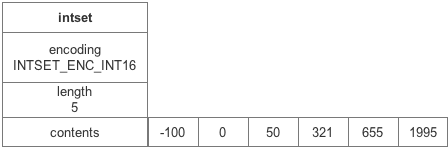
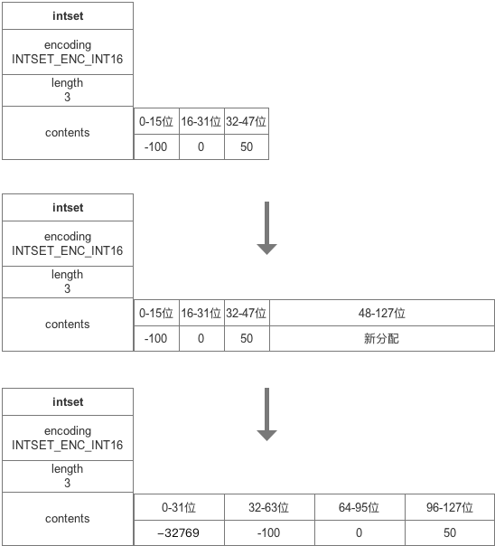

#### 用途

整数集合是`集合键（外数据结构set）的底层实现之一`（当集合元素都是整数且元素数量不多时使用），它可以保存整数值，并且保证集合中不会出现重复元素。

#### 数据结构

inset结构体定义如下：

```C
typedef struct intset {
    uint32_t encoding;  // 编码方式，一个元素所需要的内存大小
    uint32_t length;    // 集合长度
    int8_t contents[];  // 集合数组
} intset;
```

- encoding为inset的编码方式，有3种编码方式，分别对应不同范围的整型：
    #define INTSET_ENC_INT16 (sizeof(int16_t))  // -32768~32767
    #define INTSET_ENC_INT32 (sizeof(int32_t))  // -2147483648~2147483647
    #define INTSET_ENC_INT64 (sizeof(int64_t))  // -2^63~2^63-1
  intset的编码是由最大的一个数决定的，如果有一个数是int64，那么整个inset的编码都是int64。
- length是inset的整数个数
- contents整数数组intset的内存是连续的，所有的数据增删改查操作都是在内存地址偏移的基础上进行的，并且整数的保存也是有序的.
  一个保存了5个int16的intset的内存示意图如下：

##### 新增元素

新增过程会涉及到了intset的升级、查找和插入。

如果待插入数据的编码大于当前intset的编码，就需要先进行升级。
为了确保intset元素的唯一性，再插入之前会进行一次查找，利用intset有序的特性，通过二分法对目标value进行查找。
当查不到对应value时，会在原有内存的基础上进行realloc，多申请一个元素的内存。由于intset的内存为连续，因此插入时，比value大的元素都要依次向后移动。
注：由于移动的操作是在原有内存地址基础上进行的，因此在这里不能用memcpy进行内存拷贝，需要用memmove。

##### 升级操作

那么当插入的value大于当前intset的encode时就需要对intset进行升级，以适应更大的值。
首先当需要对原有intset进行升级时，插入的元素一定是大于当前intset的最大值或者小于当前intset的最小值的，因此带插入的value一定是在首尾，只需判断其正负即可。


> 升级的好处:
>
> 1. 提升灵活性
> 2. 节约内存

#### 小结

intset主要有以下特性：

- 内存连续，数值存储有序、无重复
- 有三种编码方式，通过升级的方式进行编码切换
- `不支持降级`
- 小端存储

> 参考：http://czrzchao.com/redisSourceIntset
