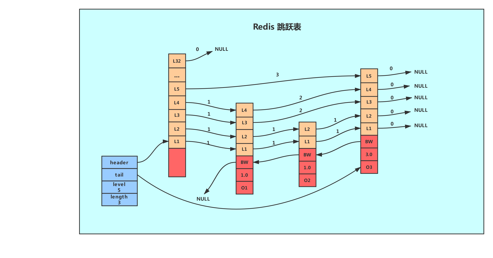
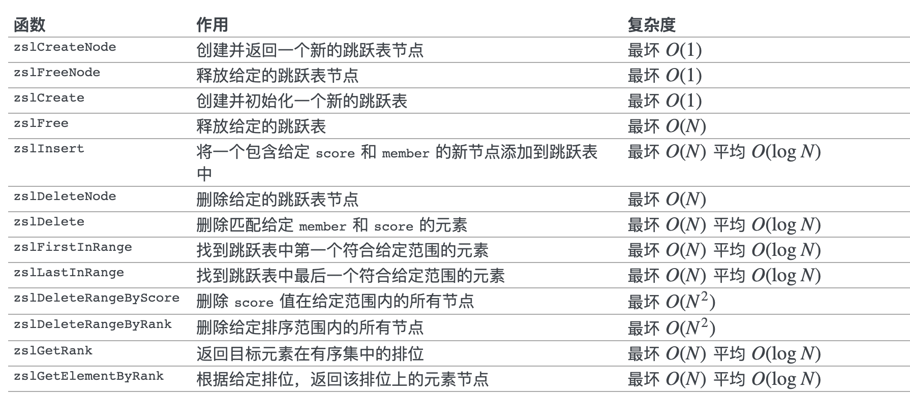

> 什么是跳跃表？ 看笔记"跳跃表(skiplist) ",本文主要介绍跳跃表在 Redis 的应用、核心数据结构和 API 。


#### 用途
说真的，跳跃表在 Redis 中使用不是特别广泛，只用在了两个地方。
1. 作为有序集合键实现之一（如果一个有序集合包含的元素数量比较多，又或者有序集合中元素的成员(member)是比较长的字符串时，Redis就会使用跳跃表来作为有序集合键的底层实现。）
2. 集群节点中用作内部数据结构。


#### 数据结构

- 这样的结构，获取表头、表尾节点，表长，以及表中最高层数的复杂度均为O(1)。
- 位于图片最左边的是zskiplist结构，由 redis.h/zskiplist 定义：
``` C
typedef struct zskiplist {

    // 头节点，尾节点（指向跳跃表的表头节点，表尾节点）
    struct zskiplistNode *header, *tail;

    // 节点数量-记录跳跃表的长度，也即是跳跃表目前包含节点的数量（表头节点不计算在内）
    unsigned long length;

    // 目前表内节点的最大层数-记录目前跳跃表内，层数最大的那个节点的层数(表头节点的层数不计算在内)
    int level;

} zskiplist;
```
因此, `redis 的跳跃表底层为双向链表，并持有尾指针方便从尾遍历`

- 位于zskiplist结构右方的是四个zskiplistNode结构， 
由 redis.h/zskiplistNode 定义：
``` C
typedef struct zskiplistNode {

    // member 对象
    robj *obj;

    // 分值
    double score;

    // 后退指针
    struct zskiplistNode *backward;

    // 层
    struct zskiplistLevel {

        // 前进指针
        struct zskiplistNode *forward;

        // 这个层跨越的节点数量
        unsigned int span;

    } level[];

} zskiplistNode;
```

注：具体属性含义可参考https://blog.csdn.net/belalds/article/details/93876483


#### 实现细节
##### 改造
为了满足自身的需求，Redis 基于 William Pugh 论文中描述的跳跃表进行了修改，包括：
1. score 值可重复。
2. 对比一个元素需要同时检查它的 score 和 memeber 。
3. 每个节点带有高度为 1 层的后退指针，用于从表尾方向向表头方向迭代。

##### 创建及插入
- 跳跃表的创建就是一些基本的初始化操作，需要注意的是 redis 的跳跃表最大层数为32，是为了能够足够支撑优化2^32个元素的查找。

- redis 的跳跃表出现在上层索引节点的概率为0.25，在这样的概率下跳跃表的查询效率会略大于O(logN)，但是索引的存储内存却能节省一半。

#### 操作API
api定义在z_set.c中。除了增删改查外，reidis还提供了跳跃表的各种Range操作api，可以自行查看其实现细节。.


#### 小结
1. 跳跃表是一种有序的链表，持有多层索引，利用空间换取时间，平均查找效率为O(logN)，获取表头、表尾节点，表长，以及表中最高层数的复杂度均为O(1)；
2. redis 的跳跃表底层为双向链表，并持有尾指针方便从尾遍历；
3. reids 的跳跃表最大索引层数为32层，用于支持2^32个元素的索引建立；
4. 出于节省内存的目的，redis 的跳跃表每个元素到上一层索引的概率为0.25；

> 参考：http://czrzchao.com/redisSourceSkiplist
>  http://czrzchao.com/redisSourceSkiplist

 
