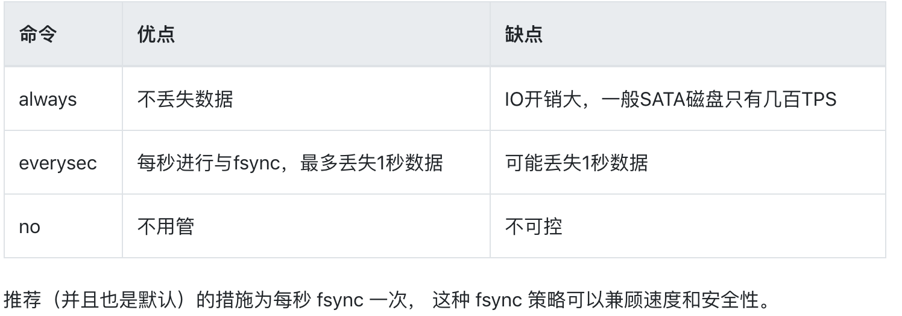
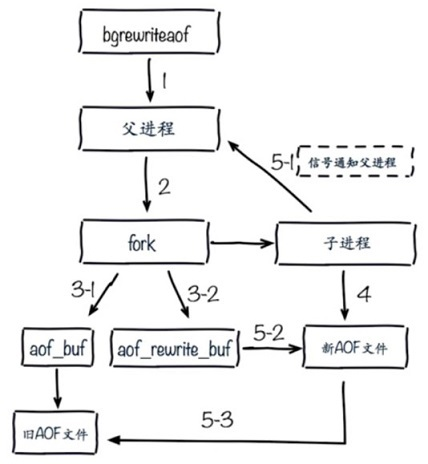

> 当redis server启动时，如果没有开启AOF模式，则加载AOF文件，否则将加载RDB文件。
如果redis中数据发生变化，那么不会直接写到硬盘里，而是先写到AOF缓冲区aof_buf中。

### AOF

#### 定义

AOF是append-only file的简称。
`通过保存Redis服务器所执行的写命令来记录数据库状态。`
注意：
`PUBSUB命令`和`SCRIPT LOAD命令`虽然没有修改数据库，但是也会将这两个命令写入AOF文件中。
因为，PUBSUB命令行频道的所有订阅者发送消息的行为带有副作用，接收到消息的客户端可能会因此发生改变。同理SCRIPT LOAD命令，它修改了数据库状态，也是一个带有副作用的命令。


#### 相关配置
```
# 开启AOF持久化方式
appendonly yes

# AOF持久化文件名
appendfilename appendonly-<port>.aof

# 每秒把缓冲区的数据同步到磁盘
appendfsync everysec

# 数据持久化文件存储目录
dir /var/lib/redis

# 是否在执行重写时不同步数据到AOF文件
# 这里的 yes，就是执行重写时不同步数据到AOF文件
no-appendfsync-on-rewrite yes

# 触发AOF文件执行重写的最小尺寸
auto-aof-rewrite-min-size 64mb

# 触发AOF文件执行重写的增长率
auto-aof-rewrite-percentage 100
```

#### AOF持久化实现
- AOF持久化需要三个过程：
1. 命令追加：写到aof_buf中；
2. 写入文件：执行write操作；
3. 同步文件：同步到磁盘中。

- Redis进程是一个事件循环，如果发现有写命令，那么这些命令会以Redis通信协议的格式添加到aof_buf中（命令追加），并调用flushAppendOnlyFile()，考虑是否将aof_buf中数据写入保存到AOF文件中（写入和同步）。
``` c
while(1){
     processFileEvents(); // 处理文件事件
     
     processTimeEvents(); // 处理时间事件
    
     flushAppendOnlyFile(); // 是否将aof_buf中的内容写入和同步到AOF文件里面
}
```
flushAppendOnlyFile()的行为由服务器的`appendfsync配置项`决定。
| appendfsync选项 | flushAppendOnlyFile函数行为 |
| --- | --- |
| always | 将aof_buf中的内容`写入并同步`到AOF文件中 |
| everysec | 将aof_buf中内容写入AOF文件中，如果上次同步AOF文件的时间距离现在`超过1s`，那么再次同步AOF文件。这个操作是由一个线程专门负责执行的 |
| no | 将aof_buf中的内容写入到AOF文件中，但并不对AOF同步，何时`同步交给OS`【即：当用户调用write函数，并不会直接写入磁盘，而是<u>将数据暂存在内存缓冲区</u>中，等缓冲区被填满或者超过指定时限后，会将数据同步到磁盘中（flush）】 |
注：appendfsync选项默认值为everysec。
appendfsync选项对比：


#### AOF文件重写
> 当满足一定条件时，AOF重写可由 Redis 自行触发，也可通过bgrewriteaof 命令手动触发重写操作。

`实际上，AOF文件重写并不需要对现有文件进行任何读取、分析或者写入操作；而是通过读取服务器当前的数据库状态来实现的。`

- AOF重新通过bgRewriteAOF命令来完成，这时会`fork一个子进程`，这样主进程还可以继续处理命令。除此之外，子进程带有主进程的数据副本，可以在避免锁的情况下，保证数据的安全性。

- 面临的问题：数据不一致
在重写期间，主进程继续处理命令，而新的命令有可能还会对现在有数据进行修改，这会导致当前数据库中的数据和生成的AOF文件不一致。
解决方案：
Redis增加了一个`AOF重写缓冲区`rewrite_buf，主进程接收到新的写命令之后，会把这个命令的协议内容追到rewrite_buf中。
这样主进程在处理命令的时候，一面将命令追加到aof_buf中，一面将写命令追加到rewrite_buf中。也就是说在<u>重写的时候，也会更新旧文件，这是为了防止重写AOF失败</u>。
当子进程重写完毕之后，会给父进程发送一个信号，父进程接受到这个信号以后，会调用一个信号处理函数，完成以下工作：
<u>1. 将rewrite_buf中的数据全部写到新的AOF文件中。
2.）修改新的AOF文件的文件名（主进程会短暂阻塞），覆盖旧的文件。</u>

整体流程：


### AOF 和 RDB对比

#### 如何选择使用哪种持久化方式？
- 一般来说， 如果想达到足以媲美 PostgreSQL 的数据安全性， 你应该同时使用两种持久化功能。
- 如果你非常关心你的数据， 但仍然可以承受数分钟以内的数据丢失， 那么你可以只使用 RDB 持久化。
- 有很多用户都只使用 AOF 持久化， 但并不推荐这种方式： 因为定时生成 RDB 快照（snapshot）非常便于进行数据库备份， 并且 RDB 恢复数据集的速度也要比 AOF 恢复的速度要快


#### 如何选择使用哪种持久化方式？
1. 只做缓存，如果你只希望你的数据在服务器运行的时候存在，你也可以不使用任何持久化 2.同时开启两种持久化方式
在这种情况下，当redis重启的时候会优先载入AOF文件来恢复原始的数据，因为在通常情况下AOF文件保存的数据集要比RDB文件保存的数据集要完整。
RDB 的数据不实时，同时使用两者时服务器重启也只会找AOF文件。

> 那要不要只使用AOF呢?
- 建议不要，因为RDB更适合用于备份数据库(AOF在不断变化不好备份)，快速重启，而且不会有 AOF可能潜在的Bug，留着作为一个万一的手段。


#### 性能建议
1. 因为RDB文件只用作后备用途，建议只在Slave上持久化RDB文件，而且只要15分钟备份一次就够 了，只保留 save 900 1 这条规则。
2. 如果Enable AOF ，好处是在最恶劣情况下也只会丢失不超过两秒数据，启动脚本较简单只load自 己的AOF文件就可以了。
代价：
①带来了持续的IO 
②AOF rewrite 的最后将 rewrite 过程中产生的新数据写到新文件造成的阻塞几乎是不可避免的。只要硬盘许可，应该尽量减少AOF rewrite 的频率。AOF重写的基础大小默认值64M太小了，可以设到5G以上，默认超过原大小100%大小重写可以改到适当的数值。
- 如果不使用AOF ，仅靠 Master-Slave Repllcation 实现高可用性也可以，能省掉一大笔IO，也 减少了rewrite时带来的系统波动。代价是如果Master/Slave 同时倒掉，会丢失十几分钟的数据， 启动脚本也要比较两个 Master/Slave 中的 RDB文件，载入较新的那个，微博就是这种架构。
### 混合持久化

> Redis4.0开始允许使用RDB-AOF混合持久化的方式结合了两者的优点通过 ==aof-use-rdb-preamble== 配置项可以打开混合开关。

AOF在进行文件重写时，先以RDB格式写入全量数据再追加增量日志。

也就是说AOF文件的前半段是RDB格式的全量数据后半段是redis命令格式的增量数据。

​			 	      

#### 开启混合持久化：

```  bash
aof-use-rdb-preamble yes  
```

#### 优势

1. 可以提高aofrewrite和恢复速度
2. 可以减少文件大小


### 参考
https://segmentfault.com/a/1190000016021217

