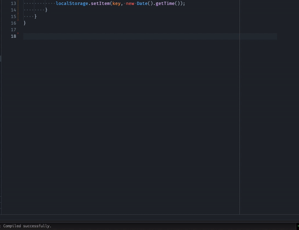
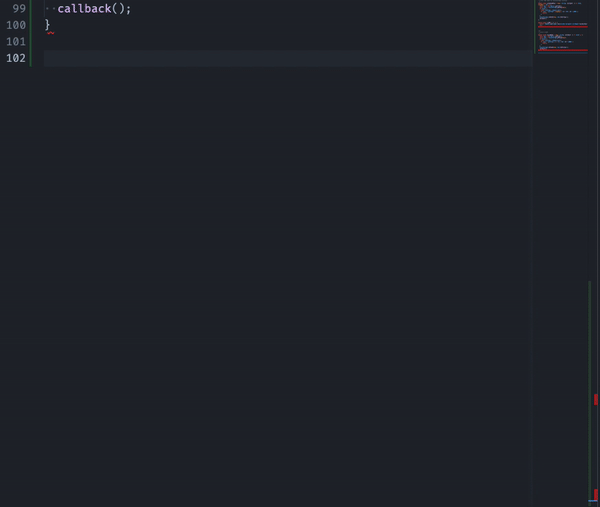
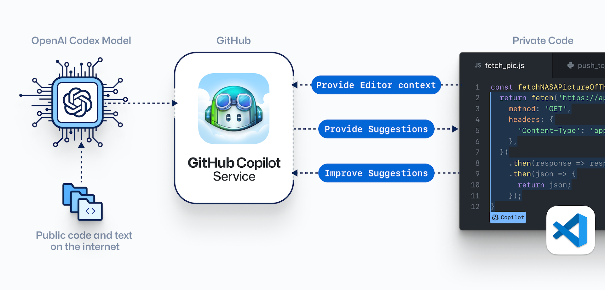

# 引言

## 英语小课堂

- pilot 读音 `[ˈpaɪlət]` 飞行员
- copilot 读音 `[ˈkoˌpaɪlət]` 飞机副驾驶员

`co-` 前缀，是 `com-` 前缀的变体，表示 辅助、共同、互补，类似的单词还有：

- operation 操作
- cooperation 合作、联合

## [Copilot](https://copilot.github.com/)


GitHub Copilot 由 OpenAI Codex 提供支持，这是一个由 OpenAI 创建的生成性预训练语言模型，作为一个人工智能编程伙伴，让需要的知识触手可及， 可以帮助您更快、更少地编写代码，节省时间并帮助人保持专注。

## OpenAI


OpenAI 是一个**非营利的人工智能（AI）研究组织**，创始人**伊隆·马斯克**以及萨姆·奥特曼的动机是出于对强人工智能潜在风险的担忧。组织目标是通过与其他机构和研究者的“自由合作”，向公众开放专利和研究成果；促进和发展友好的人工智能，使人类整体受益。

OpenAI 成立于 2015 年底，总部坐落于旧金山的米慎区，与伊隆·马斯克的另一座公司 Neuralink 在同一办公室大楼。2019 年 7 月 22 日**微软投资 OpenAI 10 亿美元**，双方将携手合作替 Azure 云端平台服务开发人工智能技术。2020 年 6 月 11 日宣布了 GPT-3 语言模型，**微软于 2020 年 9 月 22 日取得独家授权**。

# 功能

它从注释和代码中提取上下文，以便立即建议单个行和整个函数。

特点：

- 编辑器、ide 的扩展插件
- 懂几乎所有的编程语言和框架
- 你是主驾驶，copilot 提供建议，并贴近你的代码风格

## 根据注释补全代码

输入

```plain
// 邮箱正则

// 检查邮箱
```



我输入

```plain
/**
 * once a week
 */
```

后自动补全


## 根据函数名补全代码

我输入

```javascript
const bubbleSort
```



## 根据上下文补全代码

在某个 Service 类中需要请求接口，它参考了我的其他代码，逐行补全了我要写的内容


## 猜下一行代码是什么

在一个 `utils` 文件内，我输入了 `const` 后，它猜测我下一步代码


# 工作机制



# 小结

总而言之 Copilot 是一款非常好用的代码生成工具，适合生成通用的工具代码、leetcode 算法、单元测试等场景的高频代码，带来的最大的价值是节省你查阅文档的时间。而对业务代码可能不够准确，并且可能有数据安全风险。

## 参考

[Copilot FAQ](https://github.com/features/copilot/)

https://docs.github.com/zh/copilot/quickstart
