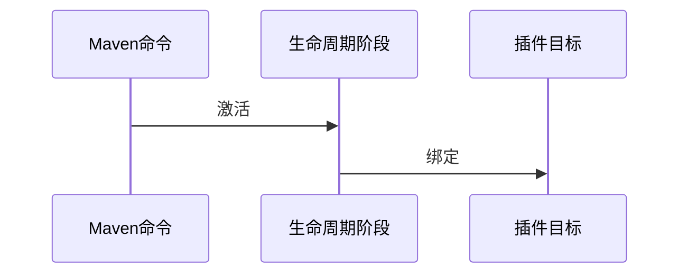

> 《maven 实战》记得是从二手网店淘到的，已经买了有小半年，还只看了个目录； 打算用个端午的一天时间给它啃下来。。

## maven 规范

默认情况下：

1. 项目主代码位于 src/main/java 目录下，,编译后在 target/classes 下
2. 项目测试代码位于 src/test/java ,编译后在 target/test-class 下。
3. Maven 构建的所有输入都在 target/目录下。
4. 自动访问 Maven 的中央仓库， http://repol.maven.org/maven2
5. 默认打包类型 jar, 主代码打包根据 artifact-version.jar 规则命名打包输出到 target/目录下。
6. 在项目根目录下放置 pom.xml

注： 如 pom.xml 中的 scope（依赖的范围），默认值是 compile; 如果你看到指定为 test，即：该依赖只对测试代码有效，若在主代码中使用，会造成编译错误。

### mvn clean compile

背后的执行过程：

- 先执行 clean:clean 任务，展出 target/目录。
- 再执行 resources:resources 任务，处理项目资源。
- 最后执行 compiler:compile 任务，将项目主代码编译至 target/classes 目录。注：上文提及的如 clean:clean ...指的是 Maven 的插件和目标，eg: compiler:compile 是 compiler 插件的 complie 目标。

### mvn clean test

背后的执行过程：注： 在执行 test 之前，Maven 先自动执行项目主资源处理、主代码编译、测试资源处理、测试代码编译等工作，是就是 Maven 生命周期的特征。即，会先执行 mvn clean compile 背后的命令操作。

- 先执行 resources:testResources 任务
- 再执行 compiler:testCompile 任务
- 最后执行 surefire:test 任务，执行测试并输出测试报告。注：上文提及的如 clean:clean ...指的是 Maven 的插件和目标，eg: compiler:compile 是 compiler 插件的 complie 目标。

### mvn clean package

背后的执行过程：执行 jar:jar 任务，负责打 jar 包。

### mvn clean install

作用：将项目输出的 jar 包安装到 Maven 本地仓库中，供其他 Maven 项目使用。

### mvn archetype:generate

使用 Archetype 生成项目骨架，背后的执行过程： Maven2 并不建议用改命令，这可能不是安全的，Maven2 会自动下载最新版本 Archetype 插件，可能不稳定。而 Maven3 会自动下载最新最稳定的版本，所以可以放心使用。Maven2 建议手动指定，命令格式为：mvn groupId:artifactId:version:goal[插件目标], eg：mvn org.apache.maven.plugins:maven-archetype-plugin:2.0-alpha-5:generate

## 常见问题

### 1.为什么 pom.xml 都需要手动配置 compiler 插件呢？

```xml
例如：
<project>
...
<bulid>
    <plugins>
        <plugin>
            <groupIdorg.apache.maven.plugins
            </groupId>
            <artifactId>
            maven-compiler-plugin
            </artifactId>
            <configuration>
                <source1.8  </source>
                <target1.8 </target>
            </configuration>
        </plugin>
    </plugins>
</build>
...
</project>
```

解： 由于历史原因，Maven 的核心插件之一 compiler 插件默认只支持 Java 1.3，因此需要配置该插件使其支持当前的 JDK 版本。

### 2.如何生成可执行的 jar 文件？

注： 默认生成的 jar 包不能直接运行，因为没有将 main 方法的类信息添加到 manifest 中[在 jar 文件中 META-INF/MANIFEST.MF 文件中没有 Main-Class 的配置]。需要借助 maven-shade-plugin 插件。

```xml
<plugin
<groupId>org.apache.maven.plugins</groupId>
      <artifactId>maven-shade-plugin</artifactId>
      <version>3.1.1</version>
      <executions>
        <execution>
          <phase>package</phase>
          <goals>
            <goal>shade</goal>
          </goals>
          <configuration>
                <!-- 打成可执行的jar包 的主方法入口--
                <transformer  implementation="org.apache.maven.plugins.shade.resource.ManifestResourceTransformer"
                <mainClass>com.golden.MainTest</mainClass
                </transformer>
          </configuration>
        </execution>
      </executions>
    </plugin>

```

## 坐标

> 坐标是依赖管理的基础，是构建的唯一标识。

组成元素： 使用**groupId、artifactId、version、packaging、classifier**标签即可定义一组坐标规定：groupId,artifactId,version 是必须定义的， packaging 的定义是可选的，classifier 是不能直接定义的，而是以后附加的插件帮助生成的。

```xml
<groupId> org.sonatype.nexus </groupId>
<artifactId> nexus-indexer </artifactId>
<version> 2.0.0 </version>
<packaging> jar </packaging>
```

### groupId: 定义了 Maven 项目隶属的<u>实际项目</u>。

groupId 命名误区：

- Maven 项目不一定和实际项目一一对应。实际项目可能被划分为多个 Maven 项目
- 不应该定义到项目隶属的组织或公司级别，因为组织或公司可能有多个项目。
- 与 java 包名命名方式相似，通常以域名反向对应。

### artifactId: 定义了下实际项目的一个<u>Maven 项目</u>

- 建议使用实际项目名作为 artifactId 的前缀。
- 一般来说，项目中 Java 类的包都应该基于项目的 groupId 和 artifactId.

### version: 定义了 Maven 项目当前所处的版本。

### packaging: 定义了 Maven 项目的打包方式。

打包方式通常与所生成构件扩展名对应，但是不是绝对的，而且打包方式会影响构建的生命周期。

### classifier: 定义了构建输出的一些附属构件。如：在包中生成的文档或源代码。

## 依赖

```xml
        <dependency>
            <groupId>javax.validation</groupId>
            <artifactId>validation-api</artifactId>
            <version>1.1.0.Final</version>
            <scope>provided</version>
            <optional>true</optional>
              <exclusions>
                <exclusion>
                    <groupId>XXXX</groupId>
                    <artifactId>XXX</artifactId>
                </exclusion>
        </dependency>
```

每个依赖包含的元素有：

- groupId,artifactId,version: 依赖的基本坐标
- type: 依赖的类型，对应定义坐标时的 packaging,默认值为 jar.
- scope: 依赖的范围
- optional: 当前依赖是否可选
- exclusions: 用来排除传递性依赖

### 依赖范围【scope】

Maven 有三种 classpath，分别供编译时（编译项目主代码）、测试时（编译和执行测试代码）、运行时（项目实际运行时）使用。依赖范围： 用来控制依赖同三种 classpath 的关系，即：是否将依赖引入相应的 classpath 中。

| 依赖范围（scope） | 编译 classpath 生效 | 测试 classpath 生效 | 运行时 classpath 生效 | 栗子                           |
| ----------------- | ------------------- | ------------------- | --------------------- | ------------------------------ |
| compile           | Y                   | Y                   | Y                     | spring-core                    |
| test              | N                   | Y                   | N                     | JUit                           |
| provided          | Y                   | Y                   | Y                     | N                              |
| runtime           | N                   | Y                   | Y                     | JDBC 驱动实现                  |
| sytem             | Y                   | Y                   | N                     | 除本地的 Maven 仓库外的 jar 包 |

- 依赖范围不仅可以控制依赖和 classpath 的关系，还对传递性依赖产生影响
- 可选依赖不能被传递！！！

扩展： 为什么要使用可选依赖属性（optional）呢？ eg: 项目 B 进入了 X、Y 的两个可选依赖，一般由业务形态决定的，业务上存在互斥性，用户不可能同时使用 X、Y 的功能。理想情况，其实是不应该使用可选依赖的，本着“单一职责”设计原则，最好分离开来设计。

### 传递性依赖

|          | compile | test   | provided | runtime  |
| -------- | ------- | ------ | -------- | -------- |
| compile  | compile | 不传递 | 不传递   | runtime  |
| test     | test    | 不传递 | 不传递   | test     |
| provided | provied | 不传递 | provied  | provided |
| runtime  | runtime | 不传递 | 不传递   | runtime  |

注： 左边第一列是第一直接依赖，最上边一行是第二直接依赖。

### 依赖调解

当产生重复依赖冲突时，采用以下原则解决：

- 第一原则： 依赖路径最近者优先 eg: 路径 1： A -> B -> C -> X（version:1.0) 路径 2： A -> D -> X（version:2.0) 因此原则，传递性依赖 X（version:2.0)将会被项目引用。

- 第二原则： 路径长度相同，将由 pom.xml 总依赖声明的顺序决定。 eg: 路径 1： A -> B -> Y（version:1.0) 路径 2： A -> C -> Y（version:2.0) 若 C 的引入顺序在 B 的前面，则 传递性依赖 Y（version:2.0)将会被项目引用。

### 最佳实践

- 排除依赖： 使用 exclusion 标签定义。

- 归类依赖： 运用 Maven 属性，使用 properties 元素定义 Maven 属性，并引用即可。

- 优化依赖：

  ```
  mvn dependency:list  (以列表方式展示项目依赖列表，包含传递性依赖)
  mvn dependency:tree  (以树形结构展示项目依赖列表)
  ```

## 仓库

坐标和依赖是一个构件在 Maven 世界中逻辑表示方式，而构件的物理表示方式就是文件而已，仓库就是统一管理这些文件的地方。

### 仓库类别

- 本地仓库
- 远程仓库: 中仓仓库（自带的默认远程仓库）、私服（一种特殊的远程仓库）、其他

### 仓库路径与坐标的关系

简而言之，具体的路径根据坐标计算获得；

```
通过坐标大致对应的仓库路径如下：
groupId/artifactId/version/artifact-version.packaging
注：阅读Maven源码得出。。
```

### 本地仓库

位置： 在本地机器当前用户目录下 .m2/repository 文件夹中。注：当用户输入第一条命令后，Maven 才会创建本地仓库。每个用户只有一个本地仓库。

### 私服

#### 存在的意义

1.节省外网带宽和减少 Maven 构建的时间 2.部署第三方构件 3.提高稳定性、增强控制

#### 作用

代理所有的外部的远程仓库

### 中央仓库

安装的 Maven 自带了中央仓库配置，Maven3 中配置位于$M2_HOME/lib/maven-model-builder-3.0.jar 里的/org/apache/maven/model/pom-4.0.0.xml 的文件中，所有的 Maven 项目都会继承这个超级 POM,配置如下：

```xml
<repositories>
    <repository>
        <id>central </id>   <!-- 唯一标识 -->
        <name> Maven Repository Switchboard </name> <!-- 仓库名称 -->
        <url>http://repo1.maven.org/maven2<url><!-- 仓库地址 -->
        <layout>default</layout> <!-- 设置布局 -->
        <snapshots>
            <enabled> false </enabled>  <!-- 能否从仓库下载快照版本的构件 -->
        </snapshorts>
    </repository>
</repositories>
```

### 仓库配置

> 关键点： 仓库的 ID 的指定, 它是多个配置能关联起来的的纽带。

仓库配置： 在项目的 pom.xml 中配置仓库认证配置： 在本地 Maven 的 setting.xml 中配置仓库镜像配置：在本地 Maven 的 setting.xml 中配置

#### 仓库配置

举个例子：

```xml
<project>
...
<repositories>
    <repository>
        <id>jboss </id>   <!-- 唯一标识 -->
        <name> JBoss Repository </name> <!-- 仓库名称 -->
        <url>http://repository.jobss.com/maven2<url><!-- 仓库地址 -->
        <layout>default</layout> <!-- 设置布局 -->
         <releases>
            <enabled> true </enabled>  <!-- 能否从仓库下载发布版本的构件 -->
        </releases>
        <snapshots>
            <enabled> false </enabled>  <!-- 能否从仓库下载快照版本的构件 -->
            <updatePolicy> daily </updatePolicy><!- 设置从远处仓库检查更新频率，默认值：daily； 可选值：daily,never,always,interval:X -->
            <checksumPolicy> ignore </checksumPolicy><!-- 设置Maven验证 *校验和文件*的策略，默认值：warn； 可选值：warn,fail,ignore (下载构件时，Maven会验证构件的*校验和文件*，若验证失败改如何处理呢？即使用该配置处理) -->
        </snapshorts>
    </repository>
</repositories>
...
</project>
```

要特别注意：如果仓库的 ID 命名重复了，新的会覆盖老的仓库配置。

> 扩展： 可以使用命令行-U 参数强制让 Maven 检查更新，如 mvn clean install -U ；Maven 就会暂时忽略仓库 updatePolicy 元素的配置。

#### 仓库认证配置

举个例子：

```xml
<servers>
 <server>
   <id>jboss</id>
   <username>root</username>
   <password>123456</password>
 </server>
</servers>
```

#### 镜像配置

举个例子：

```xml
 <!-- 阿里云镜像 -->
  <mirror>
      <id>nexus-aliyun</id>
      <name>Nexus aliyun</name>
      <url>http://maven.aliyun.com/nexus/content/groups/public</url>
      <mirrorOf>*</mirrorOf>   <!-- 镜像仓库所代理仓库的范围，支持指定被镜像的仓库名和排除某些仓库 -->
  </mirror>
```

啥是镜像仓库？ 如果仓库 X 可以提供仓库 Y 所存储的所有内容，就可以认为仓库 X 是 Y 的一个镜像。

注意： 由于镜像仓库 X*完全屏蔽*了被镜像的仓库 Y，因此即使镜像仓库 X 挂了，你就废了，懂不，这里被镜像的仓库没吊毛关系的。

部署至远程仓库： **mvn clean deploy**

```xml
在需要上传的工程中的pom.xml文件中加入下面的配置

<distributionManagement>
   <repository>  <!-- 发布版本仓库 -->
           <id>release</id>
           <name>Release Repository</name>
           <url>http://ip/nexus/content/repositories/releases</url>
   </repository>
   <snapshotRepository>  <!--快照版本仓库 -->
           <id>snapshot</id>
           <name>Snapshot Repository</name>
           <url>http://ip/nexus/content/repositories/snapshots</url>
   </snapshotRepository>
</distributionManagement>
或者
使用命令行方式
mvn deploy:deploy-file -DgroupId=groupId -DartifactId=artifactId -Dversion=version -Dfile=本地jar包路径 -DrepositoryId=releases/snapshots -Durl=仓库地址

举例：上传jmxri-1.2.1.jar，本地存放在D盘
mvn deploy:deploy-file -DgroupId=com.sun.jmx –DartifactId=jmxri -Dversion=1.2.1 -Dfile=d:/jmxri-1.2.1.jar -DrepositoryId=releases -Durl=http://ip/nexus/content/repositories/releases
```

> 规则： 快照版本部署到快照仓库中，其他部署到发布版本仓库中。

### 解密仓库解析依赖机制

#### 基础概念

- LATEST 版本：最新版本
- RELEASE 版本：最新发布版本

> 最新的版本号基于元数据：groupId/artifactId/maven-metadata.xml 计算出来的。

- SNAPSHOT 版本：最新的快照版本

> 最新的版本号基于元数据：groupId/artifactId/version/maven-metadata.xml 计算出来的。在解析前，要先通过元数据计算出最新版本号。

#### 解析机制

1. 当依赖范围是 system 时，Maven 会直接从本地文件系统解析构件。
2. 构件会先从本地寻找，本地不存在再从远程仓库下载。
3. 如果最后解析得到的构件版本是时间戳格式的快照，则要先转化为非时间戳格式，如：SNAPSHOT 格式，，然后使用非时间戳格式构件。
4. 当构件的版本不明晰时，如 RELEASE、LATEST,SNAPSHOT. Maven 采用最新策略，

> 1. 先基于更新远程仓库的策略来检查更新,决定更新后，需要检查仓库的元数据。
> 2. 读取所有远程仓库的元数据
> 3. 然后同本地元数据合并，计算并获得最新的 RELEASE、LATEST,SNAPSHOT 的值
> 4. 基于该值先从本地获取或者从远程仓库下载

### 中肯建议

- 不推荐在依赖声明中使用 LATEST 和 RELEASE 版本，特别是 LATEST 版本，存在一定的隐患。注：Maven3 已不在支持在插件配置中使用 LATEST 和 RELEASE，但如果不设置插件版本，其效果同 RELEASE 一样，Maven 只会解析最近的发布版本构件。

- 项目不应该依赖于任何组织外部的快照版本依赖。

## 生命周期&插件

Maven 的生命周期是抽象的，实际行为都有插件来完成，插件以独立的构件形式存在。一个插件往往能够完成多个任务。



### 生命周期

#### 目的

为了对所有的构建过程进行抽象和统一。

#### 作用

制定出通用的构建标准。抽象了构建的各个步骤，定义了它们的次序，但没有具体实现。类比：设计模式中模板方法

#### 插件机制

每个构建步骤都可以绑定一个或者多个插件行为，而且 Maven 为大多数构建步骤编写并绑定了默认插件。

#### 详解

- Mavan 有三套**互相独立**的生命周期，分别是 clean、default 和 site。
- 周期有阶段组成，阶段是有顺序的，并且后面阶段依赖于前面的阶段。

#### clean

- 目的： 清理项目
- 包含阶段： pre-clean、clean、post-clean

#### default

- 目的： 构建项目
- 包含的**重要阶段**
  - process-sources  
    **_处理项目主资源文件_**：通常是将<u>src/main/resources</u>目录的内容进行变量替换等工作后，复制到项目输出的主 classpath（一般是 target/classes 下）
  - compile **_编译项目的主代码_**：通常是将<u>src/main/java</u>目录的内容进行变量替换等工作后，复制到项目的主 classpath（一般是 target/classes 下）
  - process-test-source **_处理项目测试资源文件_**：通常是将<u>src/test/resources</u>目录的内容进行变量替换等工作后，复制到项目输出的测试 classpath(一般是 target/test-classes)
  - test-compile **_编译项目的测试代码_**：通常是将<u>src/test/java</u>目录的内容进行变量替换等工作后，复制到项目的主 classpath（一般是 target/test-classes 下）
  - test **_使用单元测试框架运行测试_**，但测试代码不会被打包或者部署。
  - package 接受编译好的代码，**_打包成可发布的格式_**，如 JAR。
  - install **_将包安装到本地仓库_**，供本地其他 Maven 项目使用。
  - deploy **_将最终的包复制到远程仓库_**，供其他 Maven 项目使用。

#### site

- 目的： 建立和发布项目站点，基于 POM 所包含的信息，自动生一个友好站点，用于团队交流和发布项目信息。
- 包含阶段： pre-site、site、post-site、site-deploy

### 插件

#### 插件目标

往往一个插件有多个目标，每个目标对应一个功能。

```bash
compiler:compile (compiler是插件前缀，commpile是插件目标。即：maven-compiler-plugin的compile目标)
```

#### 插件绑定

生命周期的阶段 与 插件的目标 互相绑定，已完成某个具体的构件任务。

#### 内置绑定

Maven 为主要的生命周期阶段 绑定了 很多插件的目标； eg:

| 生命周期阶段 | 插件目标                 |
| ------------ | ------------------------ |
| clean        | maven-clean-plugin:clean |
| site         | maven-site-plugin:site   |
| site-deploy  | maven-site-plugin:deploy |

由于项目的打包类型会影响构建的具体过程，defalut 生命周期与插件目标的绑定关系有项目打包类型决定。

> 注：defalut 还有很多阶段没有绑定任何插件，因此也没有任何实际行为。

#### 自定义绑定

自定义将某个插件的目标绑定到生命周期的某个阶段上，令在构建过程中执行更多更丰富的任务。自定义绑定：创建项目的源码 jar 包。需在 POM 添加如下配置信息：

```xml
<plugin>
	<groupId>org.apache.maven.plugins</groupId>
	<artifactId>maven-source-plugin</artifactId>
	<version>2.1.1</version>
	<executions>
		<execution>
			<id>attach-sources</id>  <!-- 任务ID -->
			<phase>verify</phase>  <!-- 要绑定的阶段 -->
			<goals>
				<goal>jar-no-fork</goal> <!-- 执行的插件目标 -->
			</goals>
		</execution>
	</executions>
</plugin>
验证： mvn verify
在日志中会发现该插件目标执行的信息，即证明配置已生效。
```

注： 如果你删除 phase 一行的配置，会发现执行依旧生效。 这种现象的原因是：很多插件在编写目标时已经定义了默认绑定阶段。

了解插件目标默认绑定的阶段：使用 maven-help-plugin 阶段，具体运行命令如下：

```
mvm help:describe -Dplugin = org.apache.maven.plugins:maven-source-plugin:2.1.1 -Ddetail
注：查看打印信息中”Bound to phase“这一项即可知道。
```

当多个插件目标绑定到同一个阶段时，插件们的声明顺序决定了目标的执行顺序。

#### 插件配置

#### 命令行插件配置

在 Maven 命令中使用-D 参数，并伴随 一个参数键=参数值 的形式，来配置插件目标的参数

```bash
mvn install -Dmaven.test.skip = true
```

注：参数-D 是 Java 自带的，其功能是通过命令行设置一个 Java 系统属性，Maven 重用了该参数，在准备插件时检查系统自带属性，变实现了插件参数的配置。

#### POM 中插件全局参数配置

在 POM 中全局配置 compiler 插件，告诉项目编译指定 JDK 版本源文件，生成指定 JDK 版本字节码文件。

```xml
      <plugin>
          <groupId> org.apache.maven.plugins
          </groupId>
          <artifactId>
          maven-compiler-plugin
          </artifactId>
          <configuration>
              <source> 1.8  </source>
              <target> 1.8 </target>
          </configuration>
      </plugin>
```

扩展： 在配置插件的时候，如果插件是 Maven 官方插件（即：groupId 为 **org.apache.maven.plugins** ）,可以省略 groupId 配置。Maven 解析插件时会自动补全。 【并不推荐】

#### POM 中插件任务配置

```xml
<plugin>
	<groupId>org.apache.maven.plugins</groupId>
	<artifactId>maven-source-plugin</artifactId>
	<version>2.1.1</version>
	<executions>
		<execution>
			<id>attach-sources</id>  <!-- 任务ID -->
			<phase>verify</phase>  <!-- 要绑定的阶段 -->
			<goals>
				<goal>jar-no-fork</goal> <!-- 执行的插件目标 -->
			</goals>
            <!-- 插件任务配置如下 -->
            <configuration>
            <tasks>
                <echo> I'm bound to validate phase. </echo>
            </tasks>
           </configuration>

		</execution>
	</executions>
</plugin>
```

#### 命令行调用生命周期、插件

命令行执行 Maven 任务方式：

- 调用 Maven 的生命周期阶段 【最主要的方式】 【内部机制：mvn 命令激活生命周期阶段，从而执行绑定在阶段上的插件目标。】

```bash
mvn clean  (调用的是clean生命周期的clean阶段，实际执行阶段为clean生命周期的pre-clean、clean阶段)
```

- 调用插件目标语法 1： mvn [groupId]:[artifactId]:[version]:[插件目标] 为了方便在命令行直接运行插件，Maven 引入插件前缀的概念，替换了原本的坐标。语法 2： mvn [插件前缀]:[插件目标]

```bash
# dependency 就是 org.apache.maven.plugins:maven-dependency-plugin:2.1的插件前缀
mvn dependency:tree
```

思考：

- 什么 Maven 要支持从命令行调用插件目标？主要是有些任务不太适合绑定在生命周期上，如描述构件信息(mvn help:descirbe -Dplugin=complier)、显示依赖树（mvn dependency:tree）等任务。

- Maven 引入插件前缀的概念，替换了原本的坐标。那 Maven 内部是如何解析插件前缀，获取插件的 groupId、artifactId、version 的呢？ 请往下看。。。

#### 插件解析机制

#### 插件仓库

1. 插件构件同样基于坐标存储在 Maven 仓库中。
2. Maven 会区别对待远程的依赖仓库和插件仓库,如当需要的插件不在本地仓库时，是不会去远程仓库查找的。
3. Maven 默认配置的插件中央仓库完全可以满足日常需要，但是也可以在 POM 或者 setting.xml 使用 <pluginRepositories> 和 <pluginRepository>配置自己的远程仓库，其子元素的配置同依赖的远程仓库配置完全一样。

#### 解析插件 version

首先 Maven 在超级 POM 中为所有**核心插件**设定了版本。

若用户在是使用某个插件时没有设定版本，怎么办呢？

1. 若插件属于核心插件范畴，使用 Maven 超级 POM 中的版本。
2. 若插件属于核心插件范畴，Maven 会检查所有仓库中可用的版本，然后做出选择。使用 Maven2 插件版本会被解析至 latest,使用 Maven3 插件版本会被解析至 release. 基于如上规则,在使用插件时，强烈建议显示指定版本。

#### 解析插件前缀

插件前缀是与坐标中的 groupId:artifactId 是一一对应的，其匹配关系存储在仓库元数据，这里的仓库元数据指的是仓库中的[groupId]/maven-metadate.xml 文件，这里的 groupId 默认使用 org.apache.maven.plugins 和 org.codehaus.mojo 两个 groupId ,当然也可以通过 setting.xml 配置其他的 groupId。命令行 mvn dependency:tree 的解析过程如下：

1. 基于默认的一个 groupId 归并所有插件仓库的元数据,如 org/apache/maven/plugins/maven-metadata.xml。
2. 检查元数据，若能获得对应的插件的 artifactId 值，结合之前所说解析插件 version 的方法获得到插件 version，就可以得到完整的插件坐标了。若没能或者，则检查其他 groupId 下元数据。直到得到结果。

#### 插件信息

#### 在线网站获取

- 基本主要的插件都来自 Apache 和 Codehaus. [Apache 插件信息](https://maven.apache.org/plugins/index.html)

#### maven-help-plugin 插件获取

> 语法 1： mvn help:describe -Dplugin=[groupId]:[artifactId]:[version] -Dgoal=[插件目标] -Ddetail

```
mvm help:describe -Dplugin = org.apache.maven.plugins:maven-source-plugin:2.1.1 -Ddetail
```

> 语法 2： mvn help:describe -Dplugin=[插件前缀] -Dgoal=[插件目标] -Ddetail

```bash
mvm help:describe -Dplugin = compiler
```

#### 小结

常用插件介绍： [https://www.cnblogs.com/crazy-fox/archive/2012/02/09/2343722.html](https://www.cnblogs.com/crazy-fox/archive/2012/02/09/2343722.html)

注意区分指定场景下仓库的元数据不同！！插件前缀-插件 仓库元数据（即： [groupId]/maven-metadate.xml 文件）依赖/插件版本 仓库元数据（即： [groupId]/[artifactId]/maven-metadate.xml 文件）

## 聚合&继承

聚合和继承是两个完全不同的概念

- 聚合主要是为了方便构建项目

- 继承主要是为了消除重复配置。相同点：除了 POM 之外都没有实际内容，<u>packaging 都必须是 pom</u>。为了方便，一个 POM 可以即是聚合 POM,又是用于继承的父 POM

  . 

### 聚合

1. 每个 module 的值都是一个当前 POM 的**相对目录名**。
2. Maven 构建输出日志中会显示各模块的名称，而不是 artifactId。因此为了让输出日志更清晰，需要在 POM 中 name 字段是为了给项目提供一个更容易阅读的名字。
3. 为了方便快速定位内容，模块所处的目录名称应当与 artifactId 一致，但是不是必须的。

```xml
<project>
    <modelVersion>4.0.0</modelVersion>
    <groupId>com.juvenxu.mvnbook.account</groupId>
    <artifactId>account-aggregator</artifactId>
    <version>1.0.0-SNAPSHOT</version>
    <packaging> pom </packaging>
    <name>Account Aggregator</name>
     <modules>
        <module>account-email</module>
        <module>account-persist</module>
     </modules>
</project>

```

### 继承

```xml
# 父POM如下：
<project>
    <modelVersion>4.0.0</modelVersion>
    <groupId>com.juvenxu.mvnbook.account</groupId>
    <artifactId> account-parent </artifactId>
    <version>1.0.0-SNAPSHOT</version>
    <packaging>pom</packaging>
    <name>Account Parent</name>
</project>

# 子POM如下：
<project>
    <modelVersion>4.0.0</modelVersion>

    < parent >
        <groupId>com.juvenxu.mvnbook.account</groupId>
        <artifactId> account-parent </artifactId>
        <version>1.0.0-SNAPSHOT</version>
        < relativePath >../account-parent/pom.xml</ relativePath>
    </ parent >

    <artifactId> account-email </artifactId>
    <name>Account Email</name>
  ...
</project>
```

注意： 1、子模块没有声明 groupId 和 version, 这两个属性继承至父模块。但如果子模块有不同与父模块的 groupId、version ，也可指定； 2、不应该继承 artifactId,如果 groupId ，version，artifactId 完全继承的话会造成坐标冲突；另外即使使用不同的 groupId 或 version，同样的 artifactId 也容易产生混淆。 3、使用继承后 parent 也必须像自模块一样加入到聚合模块中。

Maven 可继承的 POM 元素:

```
groupId ：项目组 ID ，项目坐标的核心元素；
version ：项目版本，项目坐标的核心元素；
description ：项目的描述信息；
organization ：项目的组织信息；
inceptionYear ：项目的创始年份；
url ：项目的 url 地址
develoers ：项目的开发者信息；
contributors ：项目的贡献者信息；
distributionManagerment ：项目的部署信息；
issueManagement ：缺陷跟踪系统信息；
ciManagement ：项目的持续继承信息；
scm ：项目的版本控制信息；
mailingListserv ：项目的邮件列表信息；
properties ：自定义的 Maven 属性；
dependencies ：项目的依赖配置；
dependencyManagement ：醒目的依赖管理配置；
repositories ：项目的仓库配置；
build ：包括项目的源码目录配置、输出目录配置、插件配置、插件管理配置等；
reporting ：包括项目的报告输出目录配置、报告插件配置等。
```

### 核心设计理念

提倡“约定大于配置“，遵循约定能够帮助用户遵守构建标准。

约定的由来：Maven 超级 POM(定义了仓库和构件仓库，项目的各种输出目录、构件名称格式，核心插件版本等。)

### 反应堆

#### 定义

反应堆指所有模块组成的一个构建结构。它包含了个模块之间**继承与依赖的关系**，从而能自动计算出合理的**模块构建顺序**。

#### 依赖关系与构建顺序

模块间的依赖关系将反应堆构成了一个 有向非循环图（DAG），依赖关系构成有向边。不允许出现循环。

#### 剪裁反应堆

输入 mvn -h 可以看到剪裁反应堆的

``` bash
-am  // alse-make 同时构建所列模块的依赖模块
-amd //alse-make-dependents 同时构建依赖于所列模块的模块，同am相反
-pl  <args>// projects 构建指定模块，模块用逗号分隔
-rf  <args>  //reusme-from 从指定的模板回复反应堆
```


## 搭建私服 Nexus
### 安装Nexus

下载地址：[https://www.sonatype.com/download-oss-sonatype](https://www.sonatype.com/download-oss-sonatype)

有两种安装包
-  包含Jetrt容器的Bundle包
-  不包含Webr容器的war包
#### 备份Nexus
Bundle包下有2个目录，注意当用户需要备份特定配置时，只需要备份sonatype-work/目录即可（包含了Nexus生成的配置文件、日志文件、仓库文件等）。nexus-webappp-x.x.x 下内容客户可以从安装包直接获得。而sonatype-work/目录是运行时自动生成的，不同的用户在不同机器上使用Nexus会有不同，因此备份它即可。
#### 常用命令与配置
##### 常用命令
``` bash
./nexus start
./nexus stop
./nexus restart
./nexus status
```
##### 配置
默认管理用户名与密码： admin/admin123
修改Nexus的端口：位置 conf/pluxus.properties 中的application-port属性值。


### 仓库与仓库组
#### 仓库类型
- group （仓库组）
- hosted（宿主仓库）
- proxy（代理仓库）
- vitual（虚拟仓库）- 作用：为了服务Maven1格式，动态将仓库内容格式转换。

仓库有个名为Policy（策略）的属性，决定该仓库是Release（发布）版本仓库还是Snapshot（快照）版本仓库。

 

#### 内置的仓库列表


 

####  新建宿主仓库页面：


 ####  新建代理仓库页面：


  ####  新建仓库组页面：


### 索引与搜索构件
### 从Nexus下载构件

1.  单独项目配置（仅对当前项目生效，在pom如下定义）
```xml
<repositories>
    <repository>
        <id>nexus</id>
        <name>Nexus</name>
        <url>http://localhost/nexus-2.11/content/groups/public/</url>
        <releases>
            <enabled>true</enabled>
        </releases>  
        <snapshots>
            <enabled>true</enabled>
        </snapshots>    
    </repository>
  </repositories>
  <pluginRepositories>
    <pluginRepository>
        <id>nexus</id>
        <name>Nexus</name>
        <url>http://localhost/nexus-2.11/content/groups/public/</url>
        <releases>
            <enabled>true</enabled>
        </releases>
        <snapshots>
            <enabled>true</enabled>
        </snapshots>
    </pluginRepository>
  </pluginRepositories>
  ````
  2、此电脑所有项目都默认从私服下载，需要改settings.xml<profiles>
  ```xml
   <profile>
        <id>nexus</id>
        <repositories>
            <repository>
                <id>nexus</id>
                <name>Nexus</name>
                <url>http://localhost/nexus-2.11/content/groups/public/</url>
                <releases>
                    <enabled>true</enabled>
                </releases>
                <snapshots>
                    <enabled>true</enabled>
                </snapshots>
            </repository>
        </repositories>
        <pluginRepositories>
            <pluginRepository>
                <id>nexus</id>
                <name>Nexus</name>
                <url>http://localhost/nexus-2.11/content/groups/public/</url>
                <releases>
                    <enabled>true</enabled>
                </releases>
                <snapshots>
                    <enabled>true</enabled>
                </snapshots>
            </pluginRepository>
        </pluginRepositories>
    </profile>
    <!-- 每次建立maven都默认是jdk1.5的，此配置可以让建立maven项目默认jdk为1.7 -->
    <profile>
        <id>jdk-1.7</id>
        <activation>
            <activeByDefault>true</activeByDefault>
            <jdk>1.7</jdk>
        </activation>
        <properties>
            <maven.compiler.source>1.7</maven.compiler.source>
            <maven.compiler.target>1.7</maven.compiler.target>
  <maven.compiler.compilerVersion>1.7</maven.compiler.compilerVersion>
        </properties>
    </profile>
  </profiles>
  <!-- 激活nexus的profile -->
  <activeProfiles>
    <activeProfile>nexus</activeProfile>
  </activeProfiles>
  ````
说明：这个配置已经能让本机所有的maven项目从Nexus下载构件，但Maven还会不时地访问中央仓库centeral，可以配置一个镜像，地址为私服，这样maven对任何仓库的构件下载请求都会转到私服中，如下配置
  ```xml
  <mirrors>
    <mirror>
        <id>nexus</id>
        <mirrorOf>*</mirrorOf>
        <name>Nexus</name>
        <url>http://localhost/nexus-2.11/content/groups/public/</url>
    </mirror>
  </mirrors>
  ````

### 部署构件至Nexus
两种方式：
1. 通过nexus网页手动上传（自行百度）适用于第三方jar上传到n exus，比如oracle驱动。
2. 配置方式（自己内部项目打成包上传到nexus，供其他项目使用）,下面介绍的就是这种方式

一.   先在settings.xml中配置私服用户名密码
```xml
<servers>
    <!--发布版 -->
    <server>
      <id>nexus-realease</id>
      <username>admin</username>
      <password>admin123</password>
    </server>
    <!--快照版 -->
    <server>
      <id>nexus-snapshots</id>
      <username>admin</username>
      <password>admin123</password>
    </server>
  </servers>
```
二.  在项目中pom定义如下<distributionManagement>
  ```xml
<distributionManagement>
    <!-- 发布版 -->
    <repository>
            <!—id与settings.xml发布版一致 -->
        <id>nexus-release</id>
        <name>Nexus Release Repository</name>
        <url>http://localhost/nexus-2.11/content/repositories/releases/</url>
    </repository>
    <!-- 快照版 -->
    <snapshotRepository>
            <!—id与settings.xml快照版一致 -->
        <id>nexus-snapshots</id>
        <name>Nexus Snapshots Repository</name>
        <url>http://localhost/nexus-2.11/content/repositories/snapshots/</url>
    </snapshotRepository>
    </distributionManagement>
  ```
  三.  发布方式：配置好后，运行maven的deploy命令即可打包上传到nexus。

### 权限管理
### 调度任务