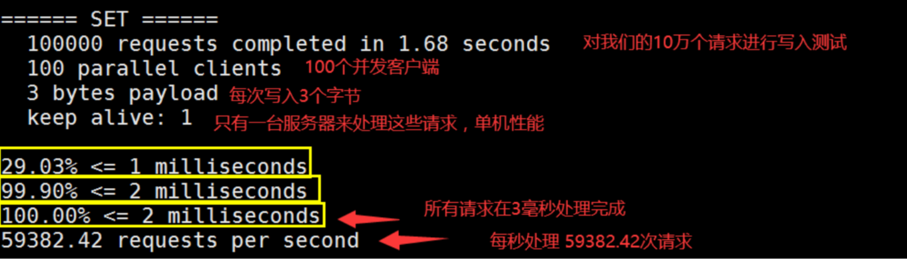
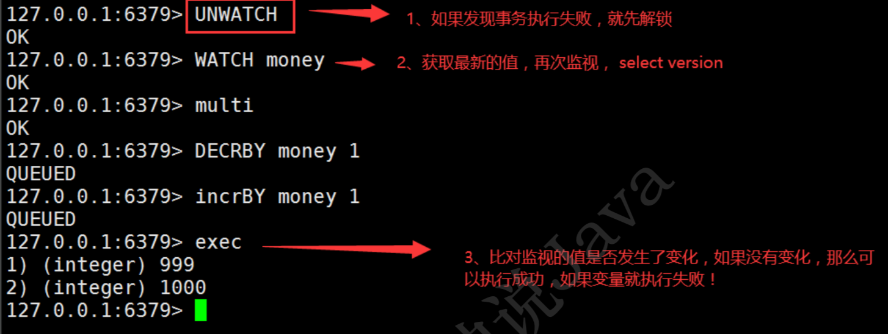
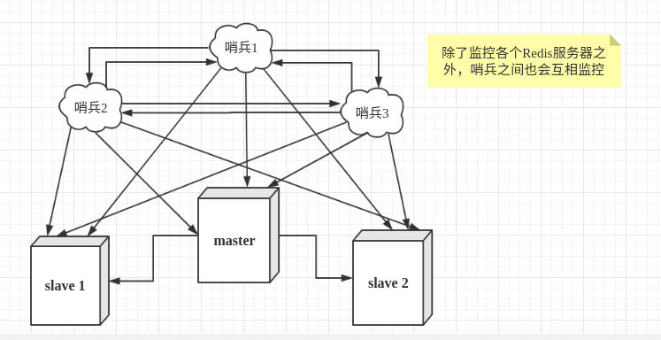

## 引言

> [Redis](http://www.redis.cn/)是一个开源的、高性能的（key-value）分布式内存数据库，基于内存上运行。
> **Redis是单进程多路IO复用模型每秒写8万次，读11万次。**

> Redis能干嘛？
> 可以用作数据库、缓存和消息中间件MQ。

1. 持久化数据
2. 缓存
3. 发布订阅系统
4. 计时器、计数器（浏览量）
5. 地图信息分析
6. ...
   **数据共享**

### 性能测试

redis-benchmark(官方自带的性能测试工具!)

```bash
 # 测试:100个并发连接 100000请求
 redis-benchmark -h localhost -p 6379 -c 100 -n 100000
```



## 命令

> 命令不区分大小写

```bash
#切换数据库
> select 1
#清空数据库
> flushdb
> flushall
#查看数据条数
> DBSIZE
#查看所有key
> keys *
#判断键是否存在
> exists <key>
# 查看当前key的一个类型!
> type name
```

### String

```bash
> set name kuangshen # 设置值
> get name # 获得值
> exists name # 判断当前的key是否存在
> move name 1 # 移除数据库1中指定key
> append name "hello" # 追加字符串，如果当前key不存在，就相当于setkey
> strlen name #获取字符串长度

# i++
# 步长 i+=
> incr view # 自增1
> incrby views 10 # 可以设置步长，指定增量
> dscr viwe #自减1
DECRBY views 5 #可以设置步长，指定减量

# 字符串范围 range
> getrange name0 3 # 获取字符串 [0,3]
> getrange name0 -1 # 获取全部字符串

# 替换
> setrange name 1 xx #替换指定位置开始的字符串

# setex (set with expire) # 设置过期时间
# setnx (set if not exist) # 不存在在设置 (在分布式锁中会常常使用!)
> EXPIRE name 10 # 设置key的过期时间，单位是秒
> ttl name #查看当前key的剩余时间
> setex name 30 "hello" # 设置name 的值为 hello,30秒后过期
> setnx name "hello" # 如果name不存在，创建name


# mset
# mget
> mset k1 v1 k2 v2 k3 v3 # 同时设置多个值
> mget k1 k2 k3 # 同时获取多个值
> msetnx k1 v1 k4 v4 # msetnx 是一个原子性的操作，要么一起成功，要么一起 失败!

 # 设置一个user:1 对象 值为 json字符来保存一个对象!
# 这里的key是一个巧妙的设计: user:{id}:{filed}
> mset user:1:name zhangsan user:1:age 2

#getset
> getset db redis # 查询并设置新的值；如果查询时不存在值，则返回nil; 如果存在值，返回原来的值；

```

> 使用场景:
> String类似的使用场景:value除了是我们的字符串还可以是我们的数字!
> 计数器
> 统计多单位的数量
> 粉丝数
> 对象缓存存储!

### List

> lpush
> rpush
> lrang
> lpop
> rpop

```bash
> lpush list one # 将一个值或者多个值，插入到列表头部 (左)
> rpush list righ # 将一个值或者多个值，插入到列表位部 (右)
> lrang list 0 -1 #获取list中所有值
> lrang list 0 1 #通过区间获取具体的值

> lpop list # 移除list的第一个元素
> rpop list # 移除list的最后一个元素
> lindex list 1 # 通过下标获得 list 中的某一个值
> llen list # 返回列表的长度

> lrem list 1 one # 移除list集合中指定个数的value，精确匹配
> ltrim mylist 1 2 # 通过下标截取指定的长度，这个list已经被改变了，截断了 只剩下截取的元素!
> rpoplpush mylist myotherlist # 移除列表的最后一个元素，将他移动到新的 列表中
> lset list 0 item #不存在时更新会报错
> linsert mylist before "world" "other" # 将某个具体的value插入到列中某个元素的前面或者后面!
```

如果移除了所有值，空链表，也代表不存在!

> 使用场景:
> 消息队列 (Lpush Rpop)， 栈( Lpush Lpop)!

### Set

```bash
> sadd myset "hello" # set集合中添加匀速
> smembers myset # 查看指定set的所有值
> sismember myset hello # 判断某个值是不是在set集合中
> scard myset # 获取set集合中的内容元素个数!
> srem myset hello # 移除set集合中的指定元素

> srandmember myset # 随机抽选出一个元素
> srandmember myset 2# 随机抽选出指定个数的元素

> spop myset # 随机删除一些set集合中的元素!

> smove myset myset2 "kuangshen" # 将一个指定的值，移动到另外一个set集 合!

> sdiff key1 key2 #差集
> sinter key1 key2 #交集
> sunion key1 key2 #并集

```

> 使用场景

- 推荐系统：微博，B站，共同关注!(并集) 数字集合类 差集 - 交集 - 并集
- 随机事件：抽奖 - srandmember命令
  注： 当数据较大时，成本高、效率低；生产中单独实例部署，避免影响其他操作；

### Hash

```bash
> hset myhash field1 kuangshen # set一个具体 key-vlaue
> hget myhash field1 # 获取一个字段值
> hset myhash field1 hello field2 world # set多个 key-vlaue
> hmget myhash field1 field2 # 获取多个字段值
> hgetall myhash # 获取全部数据
> hdel myhash field1 #删除指定key字段
> hlen myhash # 获取hash表的字段数量
> hexists myhash field1 # 判断hash中指定字段是否存在
> hkeys myhash # 只获得所有field
> hvals myhash # 只获得所有value
> hincrby myhash field3 1 #指定增量
> hsetnx myhash field4 hello # 如果不存在则可以设置,如果存在则不能设置
```

> 使用场景：
> **聚合场景**，更适合于对象的 存储 如：商品详情页、用户信息之类的，经常变动的信息!

### Zset

> 在set的基础上，增加了一个score值，用于比较排序。

```bash
> zadd myset 1 one # 添加一个值
> zadd myset 2 two 3 three # 添加多个值
> zrangeByScore salary -inf +inf # 从小到大排序
> zrangeByScore salary -inf 2500 withscores # 显示工资小于2500员工并且附带成绩
> zrangeByScore salary -inf +inf withscores # 显示全部的用户并且附带成绩
> zRevRange salary 0 -1 # 从大到进行排序

> zrem salary xiaohong # 移除有序集合中的指定元素
> zcard salary # 获取有序集合中的个数
> zcount myset 1 3 # 获取指定区间的成员数量
```

> 使用场景:

1. 普通消息，重要消息。
2. 取Top N 排行榜应用实现 or 评论排行（用时间做分值）

### 三种特殊数据类型

#### Geospatial

> Redis 的 Geo 在Redis3.2 版本就推出了! 这个功能可以推算地理位置的信息，两地之间的距离，方圆 几里的人!

> 官方文档:https://www.redis.net.cn/order/3685.html

> 可以查询一些测试数据:http://www.jsons.cn/lngcodeinfo/0706D99C19A781A3/

只有 六个命令:

```bash
# getadd 添加地理位置
# 规则:南北两级无法直接添加，我们一般会下载城市数据，直接通过java程序一次性导入!
# 有效的经度从-180度到180度。
# 有效的纬度从-85.05112878度到85.05112878度。
# 当坐标位置超出上述指定范围时，该命令将会返回一个错误。

#geoadd - 添加地理位置
> geoadd china:city 116.40 39.90 beijing
> > geoadd china:city 106.50 29.53 chongqi 114.05 22.52 shengzhen

#geopos - 获得当前定位:一定是一个坐标值!
> GEOPOS china:city beijing # 获取指定的城市的经度和纬度

#geodist - 两人之间的距离! 单位:
m 表示单位为米。 km 表示单位为千米。 mi 表示单位为英里。 ft 表示单位为英尺。
> geodist china:city beijing shanghai km # 查看上海到北京的直线距离 "1067.3788"

# georadius 以给定的经纬度为中心， 找出某一半径内的元素
> georadius china:city 110 30 1000 km # 以110，30 这个经纬度为中心，寻 找方圆1000km内的城市
> georadius china:city 110 30 1000 km withdist # 显示到中心的距离
> georadius china:city 110 30 1000 km withcoord # 显示他人的定位信息
> georadius china:city 110 30 500 km withdist withcoord count 1 # 筛选出指定个数的结果

# georadiusbymember 找出位于指定元素周围的其他元素
> GEORADIUSBYMEMBER china:city shanghai 400 km

#geohash 命令 - 返回一个或多个位置元素的 Geohash 表示,返回11个字符的Geohash字符串!

# 将二维的经纬度转换为一维的字符串，如果两个字符串越接近，那么则距离越近!
> geohash china:city beijing chongqi
1) "wx4fbxxfke0"
2) "wm5xzrybty0"
```

- **GEO 底层的实现原理其实就是 Zset!我们可以使用Zset命令来操作geo!**

```bash
> ZRANGE china:city 0 -1 # 查看地图中全部的元素
> zrem china:city beijing # 移除指定元素
```

#### Hyperloglog

> Redis 2.8.9 版本就更新了 Hyperloglog 数据结构!
> Redis Hyperloglog 基数(不重复的元素)统计的算法;
> 优点:占用的内存是固定，2^64 不同的元素的技术，只需要 12KB 内存!如果要从内存角度来比较的 话 Hyperloglog 首选!
> 缺点：有误差，0.81%! 如果允许容错，那么一定可以使用 Hyperloglog ! 如：统计UV任务!

```bash
> pfadd mykey a b c d e f g h i j # 创建第一组元素 mykey
> pfcount mykey # 统计 mykey 元素的基数数量
> pfadd mykey2 i j z x c v b n m # 创建第二组元素 mykey2
> pfmerge mykey3 mykey mykey2 # 合并两组 mykey mykey2 => mykey3 并集
```

使用场景：
网页的 UV (一个人访问一个网站多次，但是还是算作一个人!)

#### Bitmap

> 都是操作二进制位来进行记录，就只有0 和 1 两个状态
> 可以用两个状态区分的，都可以使用 Bitmaps!
> 统计用户信息，活跃，不活跃! 登录 、未登录! 打卡，365打卡! 365 天 = 365 bit 1字节 = 8bit 46 个字节左右!

```bash
> setbit sign 3 1 # 设置指定位置的值
> getbit sign 3 # 获取指定位置的值
> bitcount sign # 计数统计
```

## 架构

### 事务

**Redis事务没有没有隔离级别的概念!**
**Redis单条命令式保存原子性的，但是事务不保证原子性!**

> Redis 事务本质:一组命令的集合! 一个事务中的所有命令都会被序列化，在事务执行过程的中，会按照顺序执行!
> redis的事务:
> 开启事务(multi)
> 命令入队(......)
> 执行事务(exec)
> 取消事务(discard) //事务队列中命令都不会被执行!

编译型异常(代码有问题! 命令有错!) ：事务中所有的命令都不会被执行!
eg: 错误的命令格式
运行时异常： 如果事务队列中存在语法性，那么执行命令的时候，其他命令是可以正常执行的，错误命令抛出异常!
eg: value类型不对

### Watch监控 ==> 面试常问

- 悲观锁: 很悲观，认为什么时候都会出问题，无论做什么都会加锁!
- 乐观锁: 很乐观，认为什么时候都不会出问题，所以不会上锁! 更新数据的时候去判断一下，在此期间是否 有人修改过这个数据，获取version，更新的时候比较 version。

```bash
127.0.0.1:6379> set money 100
OK
127.0.0.1:6379> set out 0
OK
127.0.0.1:6379> watch money
OK
127.0.0.1:6379> multi # 事务正常结束，数据期间没有发生变动，这个时候就正常执行成功! OK
127.0.0.1:6379> DECRBY money 20
QUEUED
127.0.0.1:6379> INCRBY out 20
QUEUED

两种结果：
127.0.0.1:6379> exec
1) (integer) 80
2) (integer) 20

127.0.0.1:6379> exec # 执行之前，另外一个线程，修改了我们的值，这个时候，就会导致事务执行失 败!
(nil)
```

如果修改失败，获取最新的值就好



### Redis主从复制、读写分离

```bash
> info replication # 查看当前库的信息
> SLAVEOF 127.0.0.1 6379 # SLAVEOF host 6379 找谁当自己的老大! （真实的从主配置应该在配置文件中配置，这样的话是永久的，我们这里使用的是命令，暂时的!）
>  SLAVEOF no one 让自己变成主机!
```

> 测试主机

- 主机断开连接，从机依旧连接到主机的，但是没有写操作，这个时候，主机如果回来了，从机依旧可以直接获取到主机写的信息!
- 如果是使用命令行，来配置的主从，这个时候如果重启了，就会变回主机!只要变为从机，立马就会从主机中获取值!

- 复制3个配置文件，然后修改对应的信息
  1、端口
  2、pid 名字
  3、log文件名字
  4、dump.rdb 名字

> 复制原理

- Slave 启动成功连接到 master 后会发送一个sync同步命令
- Master 接到命令，启动后台的存盘进程，同时收集所有接收到的用于修改数据集命令，在后台进程执行完毕之后，master将传送整个数据文件到slave，并完成一次完全同步。
  全量复制: 而slave服务在接收到数据库文件数据后，将其存盘并加载到内存中。
  增量复制: Master 继续将新的所有收集到的修改命令依次传给slave，完成同步
  但是只要是重新连接master，一次完全同步(全量复制)将被自动执行! 我们的数据一定可以在从机中 看到!

### 哨兵模式

> (自动选举老大的模式)

这里的哨兵有两个作用

- 通过发送命令，让Redis服务器返回监控其运行状态，包括主服务器和从服务器。

- 当哨兵监测到master宕机，会自动将slave切换成master，然后通过发布订阅模式通知其他的从服 务器，修改配置文件，让它们切换主机。

  

- 假设主服务器宕机，哨兵1先检测到这个结果，系统并不会马上进行failover过程，仅仅是哨兵1主观的认 为主服务器不可用，这个现象成为主观下线。当后面的哨兵也检测到主服务器不可用，并且数量达到一 定值时，那么哨兵之间就会进行一次投票，投票的结果由一个哨兵发起，进行failover[故障转移]操作。 切换成功后，就会通过发布订阅模式，让各个哨兵把自己监控的从服务器实现切换主机，这个过程称为 客观下线。

#### 设置哨兵

1. 配置哨兵配置文件 sentinel.conf

```bash
# sentinel monitor 被监控的名称 host port 1
sentinel monitor myredis 127.0.0.1 6379 1
```

2. 启动哨兵
   > kconfig/sentinel.conf
   > 注：如果主机此时回来了，只能归并到新的主机下，当做从机，这就是哨兵模式的规则!

#### 优点:

1. 哨兵集群，基于主从复制模式，所有的主从配置优点，它全有
2. 主从可以切换，故障可以转移，系统的可用性就会更好 3、哨兵模式就是主从模式的升级，手动到自动，更加健壮!
   缺点:
3. Redis 不好啊在线扩容的，集群容量一旦到达上限，在线扩容就十分麻烦! 2、实现哨兵模式的配置其实是很麻烦的，里面有很多选择!

#### 哨兵模式的全部配置!

```bash
# Example sentinel.conf
# 哨兵sentinel实例运行的端口 默认26379
port 26379
# 哨兵sentinel的工作目录
dir /tmp
# 哨兵sentinel监控的redis主节点的 ip port
# master-name 可以自己命名的主节点名字 只能由字母A-z、数字0-9 、这三个字符".-_"组成。 # quorum 配置多少个sentinel哨兵统一认为master主节点失联 那么这时客观上认为主节点失联了 # sentinel monitor <master-name> <ip> <redis-port> <quorum>
sentinel monitor mymaster 127.0.0.1 6379 2
# 当在Redis实例中开启了requirepass foobared 授权密码 这样所有连接Redis实例的客户端都要提供 密码
# 设置哨兵sentinel 连接主从的密码 注意必须为主从设置一样的验证密码
# sentinel auth-pass <master-name> <password>
sentinel auth-pass mymaster MySUPER--secret-0123passw0rd
# 指定多少毫秒之后 主节点没有应答哨兵sentinel 此时 哨兵主观上认为主节点下线 默认30秒 # sentinel down-after-milliseconds <master-name> <milliseconds>
sentinel down-after-milliseconds mymaster 30000
# 这个配置项指定了在发生failover主备切换时最多可以有多少个slave同时对新的master进行 同步， 这个数字越小，完成failover所需的时间就越长，
但是如果这个数字越大，就意味着越 多的slave因为replication而不可用。
可以通过将这个值设为 1 来保证每次只有一个slave 处于不能处理命令请求的状态。
# sentinel parallel-syncs <master-name> <numslaves>
sentinel parallel-syncs mymaster 1
# 故障转移的超时时间 failover-timeout 可以用在以下这些方面:
#1. 同一个sentinel对同一个master两次failover之间的间隔时间。
#2. 当一个slave从一个错误的master那里同步数据开始计算时间。直到slave被纠正为向正确的master那 里同步数据时 。
#3.当想要取消一个正在进行的failover所需要的时间。 #4.当进行failover时，配置所有slaves指向新的master所需的最大时间。不过，即使过了这个超时， slaves依然会被正确配置为指向master，但是就不按parallel-syncs所配置的规则来了
# 默认三分钟
# sentinel failover-timeout <master-name> <milliseconds>

sentinel failover-timeout mymaster 180000
# SCRIPTS EXECUTION
#配置当某一事件发生时所需要执行的脚本，可以通过脚本来通知管理员，例如当系统运行不正常时发邮件通知 相关人员。
#对于脚本的运行结果有以下规则: #若脚本执行后返回1，那么该脚本稍后将会被再次执行，重复次数目前默认为10 #若脚本执行后返回2，或者比2更高的一个返回值，脚本将不会重复执行。 #如果脚本在执行过程中由于收到系统中断信号被终止了，则同返回值为1时的行为相同。 #一个脚本的最大执行时间为60s，如果超过这个时间，脚本将会被一个SIGKILL信号终止，之后重新执行。
#通知型脚本:当sentinel有任何警告级别的事件发生时(比如说redis实例的主观失效和客观失效等等)， 将会去调用这个脚本，这时这个脚本应该通过邮件，SMS等方式去通知系统管理员关于系统不正常运行的信 息。调用该脚本时，将传给脚本两个参数，一个是事件的类型，一个是事件的描述。如果sentinel.conf配 置文件中配置了这个脚本路径，那么必须保证这个脚本存在于这个路径，并且是可执行的，否则sentinel无 法正常启动成功。
#通知脚本
# shell编程
# sentinel notification-script <master-name> <script-path> sentinel notification-script mymaster /var/redis/notify.sh
# 客户端重新配置主节点参数脚本
# 当一个master由于failover而发生改变时，这个脚本将会被调用，通知相关的客户端关于master地址已 经发生改变的信息。
# 以下参数将会在调用脚本时传给脚本:
# <master-name> <role> <state> <from-ip> <from-port> <to-ip> <to-port>
# 目前<state>总是“failover”,
# <role>是“leader”或者“observer”中的一个。
# 参数 from-ip, from-port, to-ip, to-port是用来和旧的master和新的master(即旧的slave)通 信的
# 这个脚本应该是通用的，能被多次调用，不是针对性的。
# sentinel client-reconfig-script <master-name> <script-path>
sentinel client-reconfig-script mymaster /var/redis/reconfig.sh # 一般都是由运维来配 置!
```

## 其他

### SpringBoot整合

> 在 SpringBoot2.x 之后，原来使用的jedis 被替换为了 lettuce?

- jedis : 采用的直连，多个线程操作的话，是不安全的，如果想要避免不安全的，使用 jedis pool 连接 池! 更像 BIO 模式
- lettuce : 采用netty，实例可以再多个线程中进行共享，不存在线程不安全的情况!可以减少线程数据 了，更像 NIO 模式

### Redis发布订阅

> Redis 通过 PUBLISH 、SUBSCRIBE 和 PSUBSCRIBE 等命令实现发布和订阅功能。

```bash
> SUBSCRIBE kuangshenshuo # 订阅一个频道 kuangshenshuo
```

```bash
> PUBLISH kuangshenshuo "hello,kuangshen" # 发布者发布消息到频道!
```

> 发布和订阅机制的底层实现

- 通过 SUBSCRIBE 命令订阅某频道后，redis-server 里维护了一个字典，字典的键就是一个个 频道!， 而字典的值则是一个链表，链表中保存了所有订阅这个 channel 的客户端。SUBSCRIBE 命令的关键， 就是将客户端添加到给定 channel 的订阅链表中。

- 通过 PUBLISH 命令向订阅者发送消息，redis-server 会使用给定的频道作为键，在它所维护的 channel 字典中查找记录了订阅这个频道的所有客户端的链表，遍历这个链表，将消息发布给所有订阅者。

- Pub/Sub 从字面上理解就是发布(Publish)与订阅(Subscribe)，在Redis中，你可以设定对某一个 key值进行消息发布及消息订阅，当一个key值上进行了消息发布后，所有订阅它的客户端都会收到相应 的消息。这一功能最明显的用法就是用作实时消息系统，比如普通的即时聊天，群聊等功能。

#### 使用场景:

1. 实时消息系统!
2. 事实聊天!(频道当做聊天室，将信息回显给所有人即可!)
3. 订阅，关注系统都是可以的!
   稍微复杂的场景我们就会使用 消息中间件 MQ
