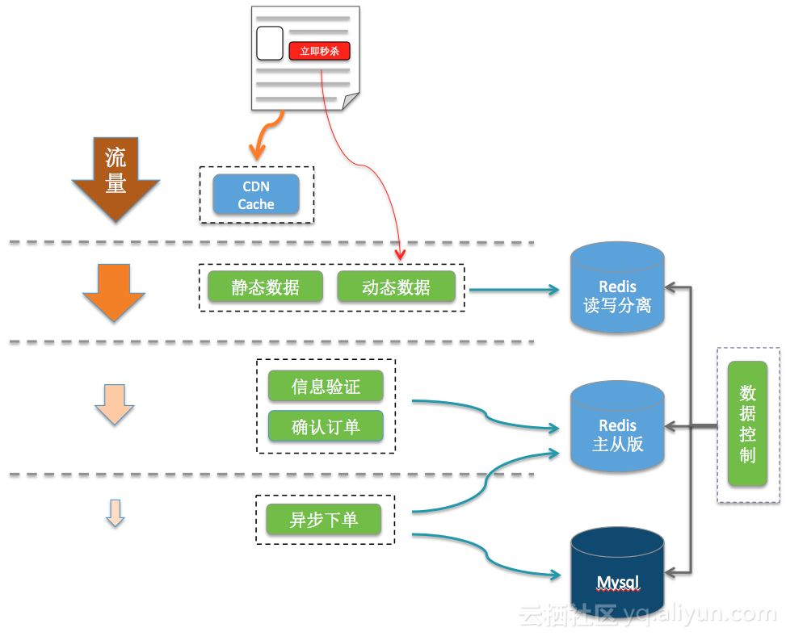
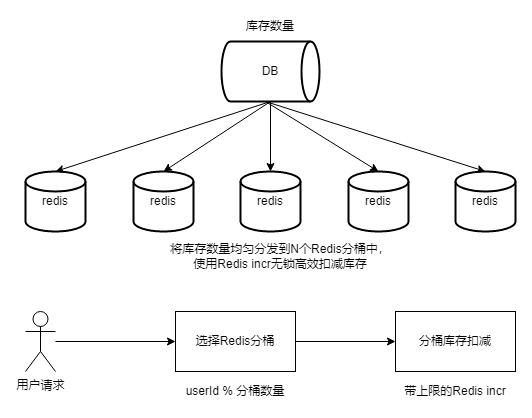
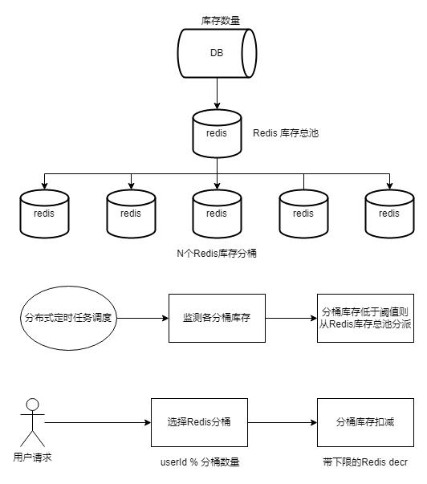

## 背景

秒杀活动对稀缺或者特价的商品进行定时定量售卖，吸引成大量的消费者进行抢购，但又只有少部分消费者可以下单成功。因此，秒杀活动将在较短时间内产生比平时大数十倍，上百倍的页面访问流量和下单请求流量。

秒杀活动可以分为 3 个阶段：

- 秒杀前：用户不断刷新商品详情页，页面请求达到瞬时峰值。
- 秒杀开始：用户点击秒杀按钮，下单请求达到瞬时峰值。
- 秒杀后：一部分成功下单的用户不断刷新订单或者产生退单操作，大部分用户继续刷新商 品详情页等待退单机会。消费者提交订单，如果简单利用数据库的行级锁，只有抢到锁的请求可以进行库存查询和下单操作。但是在高并发的情况下，数据库无法承担如此大的请求，往往会使整个服务 blocked，在消费者看来就是服务器宕机。

## 整体架构

利用 DB + Redis + MQ 设计高并发的秒杀系统！



> 利用系统的层次结构，在每个阶段提前校验，拦截无效流量，可以减少大量无效的流量涌入数据库。

### 利用浏览器缓存和 CDN 抗压静态页面流量

需要把秒杀商品详情页与普通的商品详情页分开。对于秒杀商品详情页尽量将能静态化的元 素静态化处理，除了秒杀按钮需要服务端进行动态判断，其他的静态数据可以缓存在浏览器和 CDN 上。这样，秒杀前刷新页面导致的流量进入服务端的流量只有很小的一部分。

### 利用读写分离 Redis 缓存拦截流量

CDN 是第一级流量拦截，第二级流量拦截我们使用支持读写分离的 Redis。在这一阶段我们 主要读取数据，读写分离 Redis 能支持高达 60 万以上 qps，完全可以支持需求。首先通过数据控制模块，提前将秒杀商品缓存到读写分离 Redis，并设置秒杀开始标记如下：

```
"goodsId_count": 100 //总数
"goodsId_start": 0   //开始标记
"goodsId_access": 0  //接受下单数
```

秒杀开始前，服务集群读取 goodsId_Start 为 0，直接返回未开始。数据控制模块将 goodsId_start 改为 1，标志秒杀开始。服务集群缓存开始标记位并开始接受请求，并记录 到 redis 中 goodsId_access，商品剩余数量为(goodsId_count - goodsId_access)；
当接受下单数达到 goodsId_count 后，继续拦截所有请求，商品剩余数量为 0。可以看出，最后成功参与下单的请求只有少部分可以被接受。但在高并发的情况下，会有稍微多的流量进 入，但是可以人为控制接受下单数的比例。

### 利用主从版 Redis 缓存加速库存扣量

成功参与下单后，进入下层服务，开始进行订单信息校验，库存扣量。为了避免直接访问数 据库，我们使用主从版 Redis 来进行库存扣量，主从版 Redis 提供 10 万级别的 QPS。使 用 Redis 来优化库存查询，提前拦截秒杀失败的请求，将大大提高系统的整体吞吐量。通 过数据控制模块提前将库存存入 Redis，将每个秒杀商品在 Redis 中用一个 hash 结构表示。

```  
  "goodsId": {
    "Total": 100,
    "Booked": 100
  }
```

扣量时，服务器通过请求 Redis 获取下单资格，通过以下 lua 脚本实现，由于 Redis 是单线程模型，lua 可以保证多个命令的原子性。

```bash
local n = tonumber(ARGV[1])
if not n or n == 0 then
    return 0
end
local vals = redis.call("HMGET", KEYS[1], "Total", "Booked");
local total = tonumber(vals[1])
local blocked = tonumber(vals[2])
if not total or not blocked then
    return 0
end
if blocked + n <= total then
    redis.call("HINCRBY", KEYS[1], "Booked", n)
    return n;
end
return 0
```

先使用 SCRIPT LOAD 将 lua 脚本提前缓存在 Redis，然后调用 EVALSHA 调用脚本，比直 接调用 EVAL 节省网络带宽：

```bash
redis 127.0.0.1:6379>SCRIPT LOAD "lua code"
"438dd755f3fe0d32771753eb57f075b18fed7716"
redis 127.0.0.1:6379>EVAL 438dd755f3fe0d32771753eb57f075b18fed7716 1 goodsId 1
```

秒杀服务通过判断 Redis 是否返回抢购个数 n，即可知道此次请求是否扣量成功。使用主从版 Redis 实现简单的消息队列异步下单入库扣量完成后，需要进行订单入库。如果商品数量较少的时候，直接操作数据库即可。如果秒杀的商品是 1 万，甚至 10 万级别，那数据库锁冲突将带来很大的性能瓶颈。因此，利用消息队列组件，当秒杀服务将订单信息写入消息队列后，即可认为下单完成，避免直接操作数据库。

### 数据控制模块管理秒杀数据同步

最开始，利用读写分离 Redis 进行流量限制，只让部分流量进入下单。对于下单检验失败和退单等情况，需要让更多的流量进来。因此，数据控制模块需要定时将数据库中的数据进行一定的计算，同步到主从版 Redis，同时再同步到读写分离的 Redis，让更多的流量进来。

## 热点库存扣减问题

常见的秒杀场景是一个相对简单的热点库存扣减问题，因为扣减的库存量不大。更加典型的热点库存扣减问题是春节红包雨，同一个资金池数亿人抢红包。对于春节红包雨介绍两种方案：

### 方案一



存在消耗不均问题：不同分桶之间，库存消耗不均，可能导致部分用户无法扣减库存，但其他用户可扣减库存，从而引发用户投诉。

### 方案二

> 小量多次地分派库存，从而缓解分桶库存消耗不均问题。



此外，将用户进入的时间打散，减少瞬时请求峰值，也是一个很好的技术思路。

### 设计细节

Q1：为何用定时任务调度主动分配库存，而不是在分桶库存不足时被动拉库存？

答：因为主动分配库存 QPS 比被动拉库存低几个量级。

Q2：Redis 库存总池为何不用某个 master 机器维护，而用定时任务调度随机挑选机器？

答：防单点。

Q3：如何应对超大流量？

答：流量不触达 DB、分桶、打散。

## 参考
[使用 Redis 搭建电商秒杀系统](https://mp.weixin.qq.com/s/qgGS7ODqdQIHFtKnVlvIDQ)